# chap0x02实验报告

## IEEE802.11 链路层数据帧
IEEE802.11 数据链路层有三种帧：管理帧、控制帧、数据帧。以下是部分帧的说明以及相应的WireShark过滤器。

### 管理帧(management frames) - wlan.fc.type==0x00
- 身份认证帧 (Authentication frame)
    - wlan.fc.type_subtype == 0x0b
    - 802.11认证开始时无线网卡发送认证帧给AP
    - 开放系统(open system)认证，无线网卡只发送一个单独的认证帧，AP返回接受/拒绝结果
    - 共享密钥(shared key)认证，在无线网卡发送初始认证请求后，AP返回一个包含挑战(chanllenge)的认证帧；无线网卡返回包含`加密了的挑战`的认证帧，AP解密确保挑战无误。该过程决定了无线网卡的认证状态。
- 关联请求帧 (Association request frame)
    - wlan.fc.type_subtype == 0x00
    - STA发送，确保AP定位资源和同步
    - 包含支持的速率、希望关联的SSID
- 关联响应帧(Association response frame)
    - wlan.fc.type_subtype==0x01
    - AP发送，包含接受/拒绝回应
- **信标帧 ([Beacon frame](https://en.wikipedia.org/wiki/Beacon_frame))**
    - wlan.fc.type_subtype == 0x08
    - AP周期性宣告自身的存在，并为无线网卡提供SSID和其他信息
- 解除认证帧 (Deauthentication frame)
    - wlan.fc.type_subtype == 0x0c
    - STA发送，希望终结认证
- 解除关联帧 (Disassociation frame)
    - wlan.fc.type_subtype == 0x0a
    - STA发送，清除内存并从AP关联表中删除该无线网卡
- **探测请求帧 (Probe request frame)**
    - wlan.fc.type_subtype == 0x04
    - STA发送，希望得到可关联的AP的回应和相关信息（指定SSID或广播）
- **探测响应帧 (Probe response frame)**
    - wlan.fc.type_subtype == 0x05
    - AP发送，包含接受/拒绝回应，还包含建立关联所需的信息
- 重新关联请求帧 (Reassociation request frame)
    - wlan.fc.type_subtype == 0x02
    - 当无线网卡离开AP的信号范围内，STA会发送该请求给同ESS的另一个信号更强的AP
- 重新关联响应帧 (Reassociation response frame)
    - wlan.fc.type_subtype == 0x03
    - AP发送，包含建立关联所需的信息
- action
    - wlan.fc.type_subtype == 0x0d

### 控制帧 (control frames) - wlan.fc.type == 1
- ACK帧 (Acknowledgement frame)
    - wlan.fc.type_subtype == 0x1d
    - 接收到数据后的确认帧
- RTS帧 (Request to Send frame)
    - wlan.fc.type_subtype == 0x1b
    - 为隐藏终端和AP之间的通信提供可选的减少碰撞的策略，在发送数据前STA先发送RTS帧
- CTS帧 (Clear to Send frame)
    - wlan.fc.type_subtype == 0x1c
    - 如果信道空闲，收到RTS的站将回复此帧

还有其他的控制帧，不一一赘述。

### 数据帧 (data frames) - wlan.fc.type == 2
- Data
    - wlan.fc.type_subtype == 0x20
- Null
    - wlan.fc.type_subtype ==0x24
- Qos Data
    - wlan.fc.type_subtype == 0x28
- Qos Null
    - wlan.fc.type_subtype == 0x2c

还有其他的数据帧，以及数据帧的组合，不一一赘述。

### 可能用到的wireshark过滤器
|FIELD NAME|DESCRIPTION|
|-|-|
|wlan.extcap.b25|SSID list|
|wlan.extcap.b48|UTF-8 SSID|
|wlan.ssid|SSID|
|wlan.fc.type|Type|
|wlan.fc.sub_type|Type/Subtype|
|wlan.sa|Source address|
|wlan.ta|Transmitter address|
|wlan.da|Destination address|
|wlan.addr|Hardware address|
|wlan.fixed.capabilities.privacy|Privacy|
|wlan.fixed.auth.alg|Authentication Algorithm|
|eapol|four-way handshake|

### 认证 - 无加密连接过程（开放系统 Open System）
1. AP以一定的频率广播Beacon帧
2. 客户端指定SSID的AP发送连接请求 (Probe Request) #也可以不指定，广播
3. AP对客户端的SSID连接请求进行应答 (Probe Response)
4. 客户端对目标AP请求进行身份认证 (Authentication Request)
5. AP对客户端的身份认证请求作出回应 (Authentication Response)
6. 客户端向AP发送连接请求 (Association Request)
7. AP对连接请求进行回应 (Association Response)
8. （可选?）四次握手

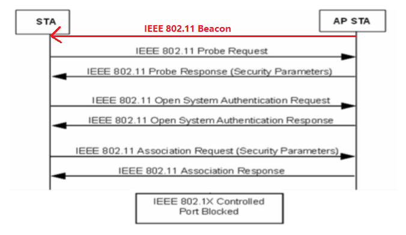

## 通过分析抓包保存的pcap文件回答问题
#### 数据统计
- WireShark - ToolBar - Statistics - Capture File Properities
- 总共抓取10077个包，大小为3988KB

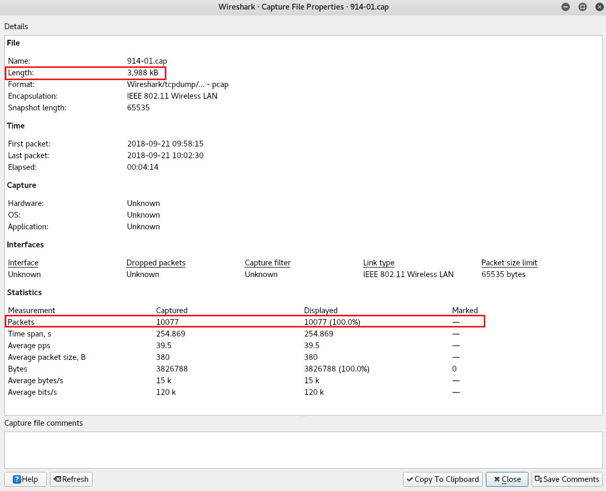


#### 数据整理 - 筛选出所有的SSID
##### 1. 根据Beacon帧获得SSID
使用tshark可以在控制台输出排序列表，将结果写入文件中

```bash
tshark -r 914-01.cap -Y wlan.fc.type_subtype==0x08 -T fields -e wlan.sa -e wlan.fixed.capabilities.privacy -e wlan.ssid | sort -d -u > beacon.list

# -Y 筛选器
# -T 输出格式
# -e 如果-T选择了field，此项用来选择

# -d 排序时，处理英文字母、数字及空格字符外，忽略其他的字符；
# -u 忽略相同行
```

beacon.list

```bash
00:23:89:6e:4f:d1	0	BISU
00:23:89:6e:4f:d2	1	BISU+
02:1a:11:fc:1d:60	1	������������
04:95:e6:54:37:30	1	Tenda_543730
06:14:4b:6d:b6:9d	1	niclab
06:74:9c:96:e8:a3	0	CUC-Guest
06:74:9c:97:78:4a	0	CUC-Guest
0a:74:9c:96:d4:12	1	CUC-WiFi
0a:74:9c:96:e8:a3	1	CUC-WiFi
0a:74:9c:97:78:4a	1	CUC-WiFi
0c:41:e9:86:f0:28	1	CU_Nhrx
0c:82:68:c4:97:e6	1	TP-LINK_C497E6
0c:da:41:22:2d:f0	0	ChinaNet
14:75:90:4f:a3:c4	1	4021
14:75:90:5e:52:40	1	6023
14:75:90:5e:53:f6	1	7020
14:75:90:64:f9:6e	1	5016
14:75:90:65:03:2c	1	7019
14:75:90:65:b0:dc	1	7023
14:a5:1a:87:30:78	1	HUAWEI-A4VZPD
20:6b:e7:80:fb:1d	1	TP-LINK_FB1D
20:6b:e7:ad:9d:2a	1	sophandrag
20:6b:e7:ad:9d:40	1	Akram
20:6b:e7:f3:2c:e2	1	1504������
28:2c:b2:9f:28:d0	1	A916
30:fc:68:84:12:e0	1	���������
30:fc:68:84:24:98	1	zhou654
30:fc:68:a7:5f:5c	1	CUC_ACM_2.4G
42:fc:68:84:24:98	1	TPGuest_2498
48:7d:2e:5e:d1:0b	1	HHHFFF
50:bd:5f:5f:34:15	0	TP-LINK_3415
50:fa:84:5a:46:22	1	TP-LINK_4622
52:1a:a9:c2:02:f6	0	CUC-Guest
52:1a:a9:c2:02:f7	1	CUC-WiFi
54:b1:21:43:ce:e9	1	Honor 9
58:69:6c:b2:7b:cb	1	inhand
5a:69:6c:b0:7b:cb	0	RuiYi-0002
62:fe:a1:d3:59:3c	1	CU_79ZA
70:89:cc:92:4a:f0	1	China Mobile A5
72:fe:a1:d3:62:56	1	CU_DMWH
74:1f:4a:b1:76:70	0	BISU
74:1f:4a:b1:76:71	1	BISU+
74:1f:4a:b1:76:72	0	BISUA
74:1f:4a:b1:76:90	0	BISU
74:1f:4a:b1:76:91	1	BISU+
74:1f:4a:b1:76:92	0	BISUA
78:11:dc:41:80:1d	1	Xiaomi_801C
80:89:17:ac:4f:b1	1	lilychen
80:f6:2e:dc:a9:d0	0	ChinaNet
86:89:17:ac:4f:b1	1	Guest_4FB1
88:25:93:2c:96:d4	1	baobaodandan
88:25:93:f7:59:14	1	TP-LINK_5914
88:36:6c:1d:5d:48	1	xxyeoneeee
88:44:77:ba:06:9c	1	Aliceding
88:44:77:ba:06:9d	1	
8c:ab:8e:f6:22:a0	1	wy
94:0c:6d:10:3e:4e	1	TP-LINK_103E4E
9c:6f:52:6d:fe:02	1	CU_SvUt
9c:6f:52:6e:68:b5	1	CU_X3ub
b0:95:8e:c5:51:41	1	TP-LINK_5141
b4:0f:3b:4f:6b:61	1	0815
bc:46:99:5f:3b:6c	1	pikachu
bc:46:99:73:bf:66	1	fkc
bc:d1:77:7c:9f:a6	1	TP-LINK_1901
c4:36:55:38:14:bd	1	360WiFi-805
c4:a8:1d:68:5a:b7	1	zbs35
d0:c7:c0:9b:9c:30	1	ywy
d2:1a:a9:c1:f9:1e	0	CUC-Guest
d2:1a:a9:c1:f9:1f	1	CUC-WiFi
d2:1a:a9:c2:00:de	0	CUC-Guest
d2:1a:a9:c2:00:df	1	CUC-WiFi
d4:ee:07:23:1b:b2	1	iipl_01
d4:ee:07:49:40:1c	1	danke_1704
d4:ee:07:4e:83:2c	1	danke_504
d4:ee:07:5c:c9:16	1	Danke-2501-���
d4:ee:07:5c:e0:3e	1	Danke2501
d4:ee:07:63:a5:f8	1	m1008
d4:ee:07:63:ba:3a	1	ziroom1104
d4:ee:07:67:c4:40	1	DanKe1508
d4:ee:07:69:eb:1e	1	ziroom2108-8
d6:ee:07:49:40:1d	1	
d6:ee:07:5c:c9:15	1	
d6:ee:07:5c:e0:3d	1	
d8:63:75:d5:ef:2f	1	������������������������
dc:fe:18:a9:40:1f	1	longdong120
f0:b4:29:3f:8c:6c	1	Xiaomi_SOPHI
```

##### 根据Probe Response获得SSID
选择Probe Response帧，将SSID列表写入文件中

```bash
tshark -r 914-01.cap -Y wlan.fc.type_subtype==0x05 -T fields -e wlan.sa -e wlan.fixed.capabilities.privacy -e wlan.ssid| sort -d -u > probres.list
```

probres.list

```bash
02:1a:11:fc:1d:60	1	������������
04:95:e6:54:37:30	1	Tenda_543730
06:74:9c:96:d4:12	0	CUC-Guest
06:74:9c:96:e8:a3	0	CUC-Guest
0a:74:9c:96:e8:a3	1	CUC-WiFi
0c:41:e9:86:f0:28	1	CU_Nhrx
0c:da:41:22:2d:f0	0	ChinaNet
14:75:90:65:03:2c	1	7019
14:a5:1a:87:30:78	1	HUAWEI-A4VZPD
20:6b:e7:80:fb:1d	1	TP-LINK_FB1D
20:6b:e7:ad:9d:40	1	Akram
28:2c:b2:9f:28:d0	1	A916
30:fc:68:84:24:98	1	zhou654
30:fc:68:a7:5f:5c	1	CUC_ACM_2.4G
50:bd:5f:5f:34:15	0	TP-LINK_3415
52:1a:a9:c2:02:f6	0	CUC-Guest
52:1a:a9:c2:02:f7	1	CUC-WiFi
54:b1:21:43:ce:e9	1	Honor 9
58:69:6c:b2:7b:cb	1	inhand
5a:69:6c:b0:7b:cb	0	RuiYi-0002
62:fe:a1:d3:59:3c	1	CU_79ZA
70:89:cc:92:4a:f0	1	China Mobile A5
74:1f:4a:b1:76:70	0	BISU
74:1f:4a:b1:76:71	1	BISU+
74:1f:4a:b1:76:72	0	BISUA
74:1f:4a:b1:76:90	0	BISU
74:1f:4a:b1:76:91	1	BISU+
74:1f:4a:b1:76:92	0	BISUA
78:11:dc:41:80:1d	1	Xiaomi_801C
80:89:17:ac:4f:b1	1	lilychen
80:f6:2e:dc:a9:d0	0	ChinaNet
86:89:17:ac:4f:b1	1	Guest_4FB1
88:25:93:f7:59:14	1	TP-LINK_5914
8c:ab:8e:f6:22:a0	1	wy
92:1a:a9:c2:0c:cb	1	CUC-WiFi
9c:6f:52:6d:fe:02	1	CU_SvUt
d0:c7:c0:9b:9c:30	1	ywy
d2:1a:a9:c1:f9:1e	0	CUC-Guest
d2:1a:a9:c1:f9:1f	1	CUC-WiFi
d2:1a:a9:c2:00:de	0	CUC-Guest
d2:1a:a9:c2:00:df	1	CUC-WiFi
d4:ee:07:23:1b:b2	1	iipl_01
d4:ee:07:4e:83:2c	1	danke_504
d8:63:75:d5:ef:2f	1	������������������������
dc:fe:18:a9:40:1f	1	longdong120
```

#### 3. 将Beacon、Probe Response中的SSID进行合并，同名SSID只取一个

```bash
sort -m probres.list beacon.list | sort -k3 -u > ssid.list

# -m 合并文件，不排序

# -k3 -u 根据第三列的值进行合并去重
```

ssid.list

```bash
88:44:77:ba:06:9d	1	
30:fc:68:84:12:e0	1	��������� #董雪梅
02:1a:11:fc:1d:60	1	������������ #小米手机
d8:63:75:d5:ef:2f	1	������������������������ #鲤鱼王的学习热点
b4:0f:3b:4f:6b:61	1	0815
20:6b:e7:f3:2c:e2	1	1504������ #1504小窝
c4:36:55:38:14:bd	1	360WiFi-805
14:75:90:4f:a3:c4	1	4021
14:75:90:64:f9:6e	1	5016
14:75:90:5e:52:40	1	6023
14:75:90:65:03:2c	1	7019
14:75:90:5e:53:f6	1	7020
14:75:90:65:b0:dc	1	7023
28:2c:b2:9f:28:d0	1	A916
20:6b:e7:ad:9d:40	1	Akram
88:44:77:ba:06:9c	1	Aliceding
88:25:93:2c:96:d4	1	baobaodandan
00:23:89:6e:4f:d1	0	BISU
00:23:89:6e:4f:d2	1	BISU+
74:1f:4a:b1:76:72	0	BISUA
70:89:cc:92:4a:f0	1	China Mobile A5
0c:da:41:22:2d:f0	0	ChinaNet
62:fe:a1:d3:59:3c	1	CU_79ZA
30:fc:68:a7:5f:5c	1	CUC_ACM_2.4G
06:74:9c:96:d4:12	0	CUC-Guest
0a:74:9c:96:d4:12	1	CUC-WiFi
72:fe:a1:d3:62:56	1	CU_DMWH
0c:41:e9:86:f0:28	1	CU_Nhrx
9c:6f:52:6d:fe:02	1	CU_SvUt
9c:6f:52:6e:68:b5	1	CU_X3ub
d4:ee:07:67:c4:40	1	DanKe1508
d4:ee:07:49:40:1c	1	danke_1704
d4:ee:07:5c:e0:3e	1	Danke2501
d4:ee:07:5c:c9:16	1	Danke-2501-��� #Danke-2501-新
d4:ee:07:4e:83:2c	1	danke_504
bc:46:99:73:bf:66	1	fkc
86:89:17:ac:4f:b1	1	Guest_4FB1
48:7d:2e:5e:d1:0b	1	HHHFFF
54:b1:21:43:ce:e9	1	Honor 9
14:a5:1a:87:30:78	1	HUAWEI-A4VZPD
d4:ee:07:23:1b:b2	1	iipl_01
58:69:6c:b2:7b:cb	1	inhand
80:89:17:ac:4f:b1	1	lilychen
dc:fe:18:a9:40:1f	1	longdong120
d4:ee:07:63:a5:f8	1	m1008
06:14:4b:6d:b6:9d	1	niclab
bc:46:99:5f:3b:6c	1	pikachu
5a:69:6c:b0:7b:cb	0	RuiYi-0002
20:6b:e7:ad:9d:2a	1	sophandrag
04:95:e6:54:37:30	1	Tenda_543730
42:fc:68:84:24:98	1	TPGuest_2498
94:0c:6d:10:3e:4e	1	TP-LINK_103E4E
bc:d1:77:7c:9f:a6	1	TP-LINK_1901
50:bd:5f:5f:34:15	0	TP-LINK_3415
50:fa:84:5a:46:22	1	TP-LINK_4622
b0:95:8e:c5:51:41	1	TP-LINK_5141
88:25:93:f7:59:14	1	TP-LINK_5914
0c:82:68:c4:97:e6	1	TP-LINK_C497E6
20:6b:e7:80:fb:1d	1	TP-LINK_FB1D
8c:ab:8e:f6:22:a0	1	wy
78:11:dc:41:80:1d	1	Xiaomi_801C
f0:b4:29:3f:8c:6c	1	Xiaomi_SOPHI
88:36:6c:1d:5d:48	1	xxyeoneeee
d0:c7:c0:9b:9c:30	1	ywy
c4:a8:1d:68:5a:b7	1	zbs35
30:fc:68:84:24:98	1	zhou654
d4:ee:07:63:ba:3a	1	ziroom1104
d4:ee:07:69:eb:1e	1	ziroom2108-8
```


#### 编码问题
从WireShark中可以看出有些SSID是以八进制UTF-8格式显示的，因此需要用其十六进制流进行转码，转码使用php内建函数`hex2bin()`
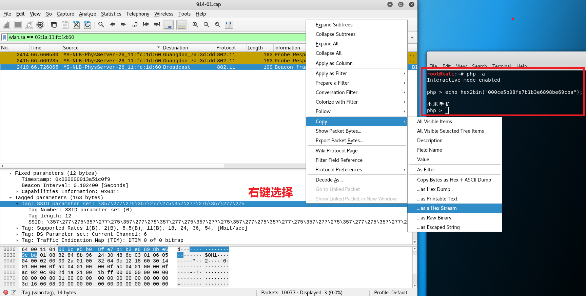

#### Q1: 查看统计当前信号覆盖范围内一共有多少独立的SSID？其中是否包括隐藏SSID？哪些无线热点是加密/非加密的？加密方式是否可知？

1. 统计得出共有68个不同的SSID
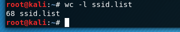

2. 显然SSID为空的即为隐藏SSID
- 分析ssid.list
    - 查看MAC地址为`88:44:77:ba:06:9d`的封包
    - SSID为空，但SSID字段长度为15，用0x00填充
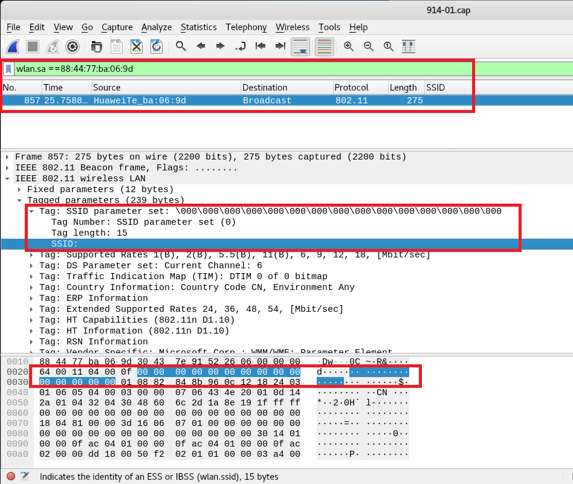

- 查看SSID为空的Beacon帧
    - 显示为Wildcard
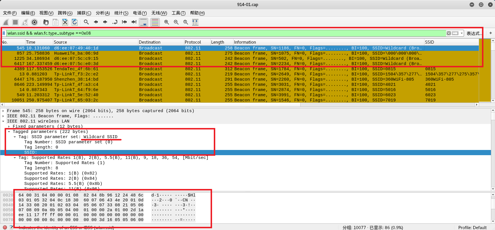
    - 科学搜索得知是匿名SSID
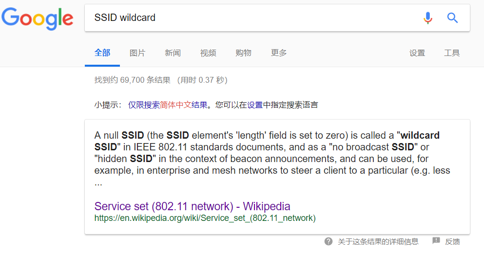
    - 用0x00填充，就是分析ssid.list得知的那个
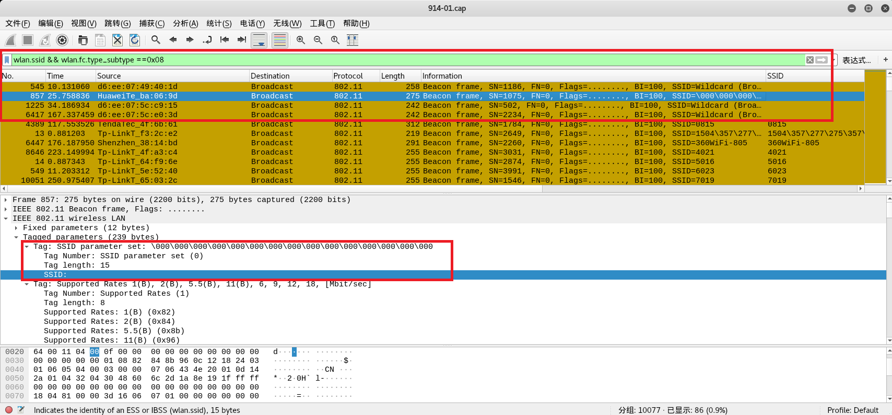

至此，推测这两个匿名SSID是独立的，所以上面统计SSID的方法就有问题（根据SSID名称去重），那么至少有**68+1=69**个独立SSID

3. 我理解的无线热点加密：连接时需要密码就是加密的
- 加密根据Beacon帧的wlan.fixed.capabilities.privacy判断
    - WEP 1加密 / 0未加密
    - 因此ssid.list中第二列为1的是加密的，为0的是未加密的
    - 比如CUC-WiFi需要验证，值为1；而CUC-GUEST是开放的，值为0
    ```bash
    06:74:9c:96:d4:12	0	CUC-Guest
    0a:74:9c:96:d4:12	1	CUC-WiFi
    ```
- 加密方式根据认证帧的wlan.fixed.auth.alg判断
    - 0 OpenSystem / 1 SharedKey
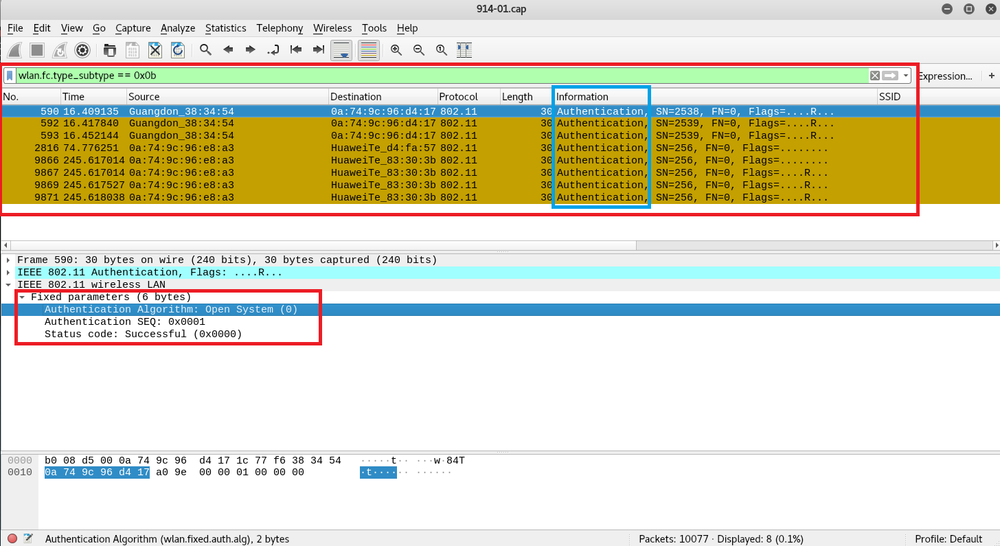

#### Q2: 如何分析出一个指定手机在抓包时间窗口内在手机端的无线网络列表可以看到哪些SSID？这台手机尝试连接了哪些SSID？最终加入了哪些SSID？

1. 列表SSID - Probe Response
- 手机搜寻无线热点时，会广播Probe Request帧，如果该手机在无线热点范围内，则会收到AP返回的Probe Response帧
- 用自己的手机进行实验发现并不能分析，用本机MAC地址只能搜索到Probe Request帧或数据帧，不知是否和随机MAC机制有关

2. 尝试连接 - Probe Request
- 根据手机MAC地址过滤Probe Request帧，就可以判断指定手机尝试连接哪些SSID，甚至有可能能知道该手机曾经连过哪些SSID
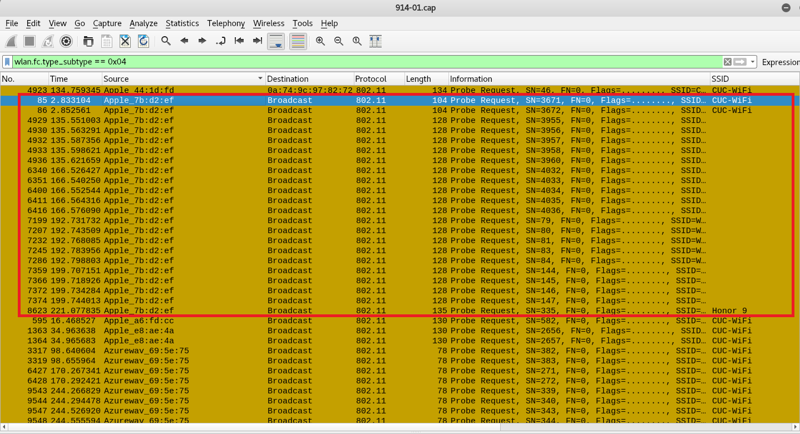

3. 最终加入的SSID - Association Response帧，数据帧
- 查找含有Association Response帧源地址的MAC地址的封包，可得知该手机是否成功加入了哪个SSID

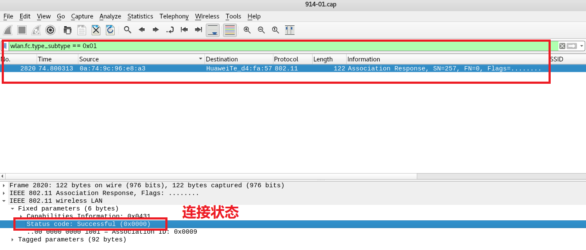

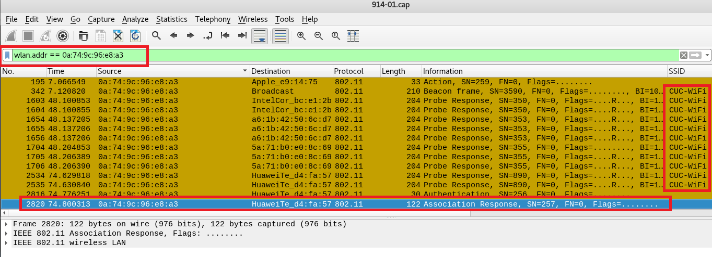

- 根据数据帧可以直接得知该手机到底在使用哪个SSID

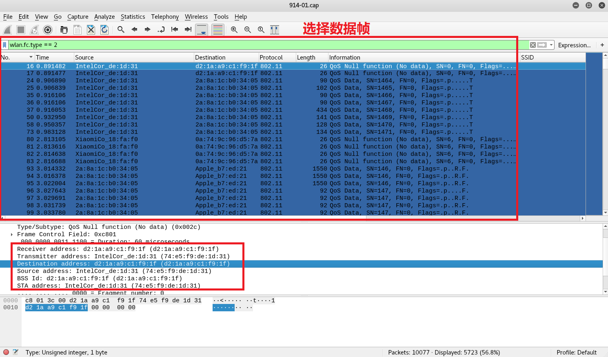

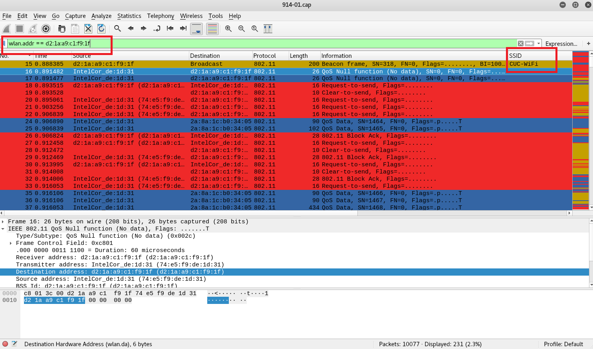

#### Q3: SSID包含在哪些类型的802.11帧？
- Beacon Frame √
- Probe Request √
- Probe Response √
- Association Response x
- Action x
- Authentication x
- Association Request √（查资料得知）
- Reassociation Request √（查资料得知）
- 控制帧 x
- 数据帧 x

>The Probe Response frame carries all the parameters in a Beacon frame, which enables mobile stations to match parameters and join the network. 
> [Chapter 4. 802.11 Framing in Detail](https://www.oreilly.com/library/view/80211-wireless-networks/0596100523/ch04.html)


### 其他
#### 数据帧的加密
有些STA和AP在认证之后还会有四次握手的过程
- 下图是四次握手的封包，白色线框表示一整个过程，有些四次握手只抓到了部分封包
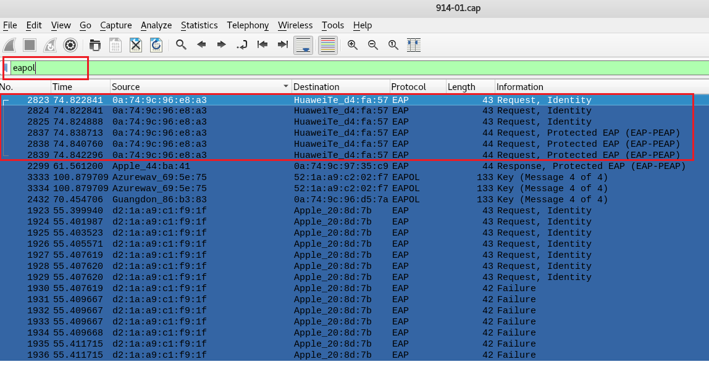
- 认证之后AP发起四次握手请求
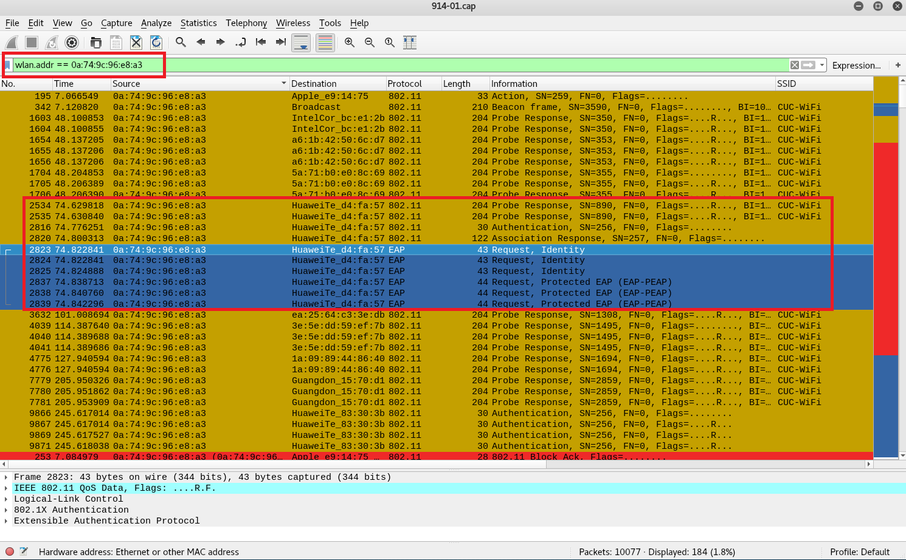

#### 连接建立的疑问
用自己的手机进行实验，打开wifi时自动连上CUC，而我用MAC地址过滤，只找到了数据帧
- 推测已经认证过的STA在重新连接AP时，建立连接的步骤会有所不同，具体情况暂未了解
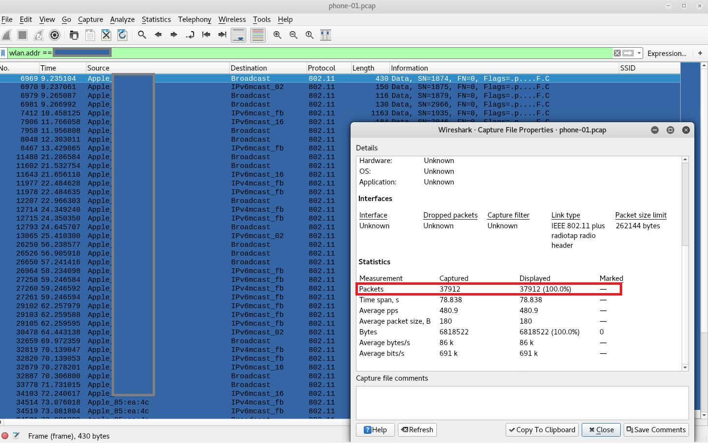

### 参阅
- [Wikipedia, Service set](https://en.wikipedia.org/wiki/Service_set_(802.11_network))
- [Wikipedia, IEEE802.11, Layer2–Datagrams](https://en.wikipedia.org/wiki/IEEE_802.11#Layer_2_%E2%80%93_Datagrams)
- [802.11 Mgmt : Authentication Frame](https://mrncciew.com/2014/10/10/802-11-mgmt-authentication-frame/)
- [Chapter 4. 802.11 Framing in Detail](https://www.oreilly.com/library/view/80211-wireless-networks/0596100523/ch04.html)
- [WLAN (IEEE 802.11) capture setup](https://wiki.wireshark.org/CaptureSetup/WLAN)
- [802.11 帧结构与Wireshark过滤器语法](https://sec.cuc.edu.cn/huangwei/textbook/mis/chap0x02/main.html#80211-%E5%B8%A7%E7%BB%93%E6%9E%84%E4%B8%8Ewireshark%E8%BF%87%E6%BB%A4%E5%99%A8%E8%AF%AD%E6%B3%95)
- [wireshark过滤器 - wlan.*](https://www.wireshark.org/docs/dfref/w/wlan.html)
- [Analyzing WLANs with Wireshark & AirPcap](https://sharkfestus.wireshark.org/sharkfest.09/BU5_Leutert_Analyzing%20WLANs%20with%20Wireshark%20&%20AirPcap.pdf)
- [KALI TOOLS - wireshark & tshark](https://tools.kali.org/information-gathering/wireshark)