## Android Stdio 实验

### ADB

#### 命令行

因为 Android 是基于 linux 内核开发，因此 linux 内置的一些命令是可以直接使用的，当然有时会有权限的限制。同时，不同版本的 Android 所支持的命令也有所差别。

```bash
# 基本命令
#  cd / ls / pwd / ps / grep /kill / cat / chmod /chown / mkdir /echo /
# touch / du / df / set / uptime / top / ifconfig / more

# 进阶命令
# su / iptables / iftop / lsof / mount / vmstat / wpa_cli / sqlite3
```

```bash
# 查看开启的模拟器
adb devices

# 连接模拟器终端
adb -s emulator-5554 shell

# 输出环境变量
echo $PATH

# Android5.1(API22): not found
uname -a

# 查看防火墙规则
iptables -nL
```

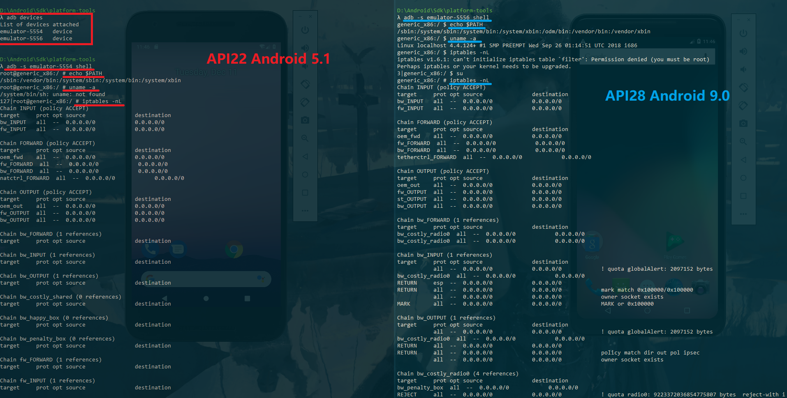

```bash
# 列出 SD 卡中文件和文件夹（软链接）
ls -l sdcard

# 列出用户信息（软链接）
ls -l /data/system/users
cat /data/system/users/userlist.xml # 所有用户信息

# 查看本机 MAC 地址
# Android5.1：no such file
cat /sys/class/net/wlan0/address

# 查看CPU信息
cat /proc/cpuinfo 
```

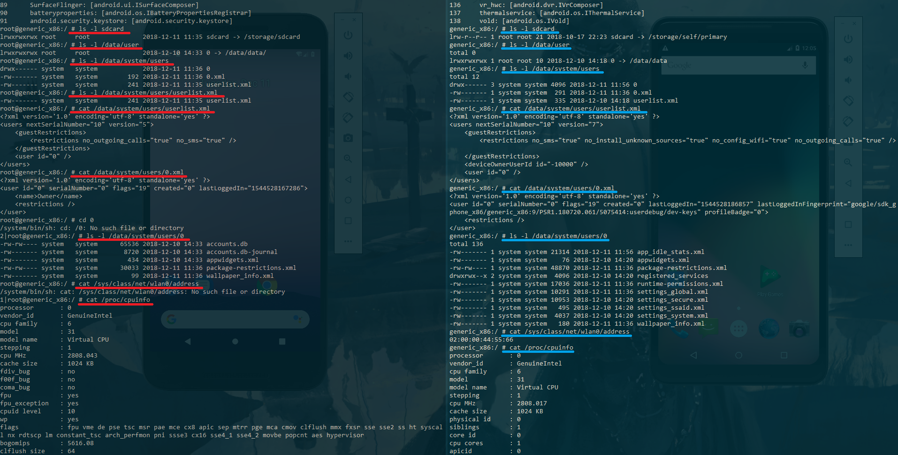


```bash
# 查看文件分区
df

# 显示用户 id (UID)、组 id (GID) 信息
id

# Android5.1(API22): 91    Android9.0(API28): 138
service list
```

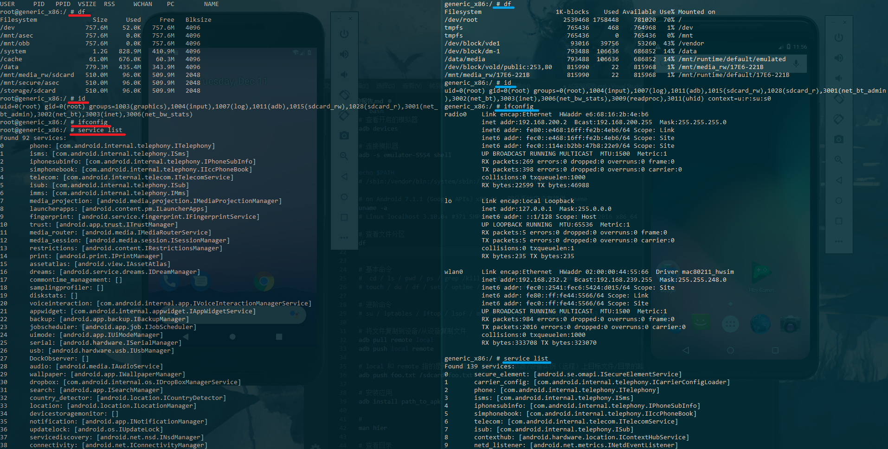


```bash
# 列出当前目录下的所有文件和文件夹
ls -l

# 查看运行在 root 权限下的进程
ps -ef | grep root

# Android5.1(API22): 使用 ps 即可
ps
```

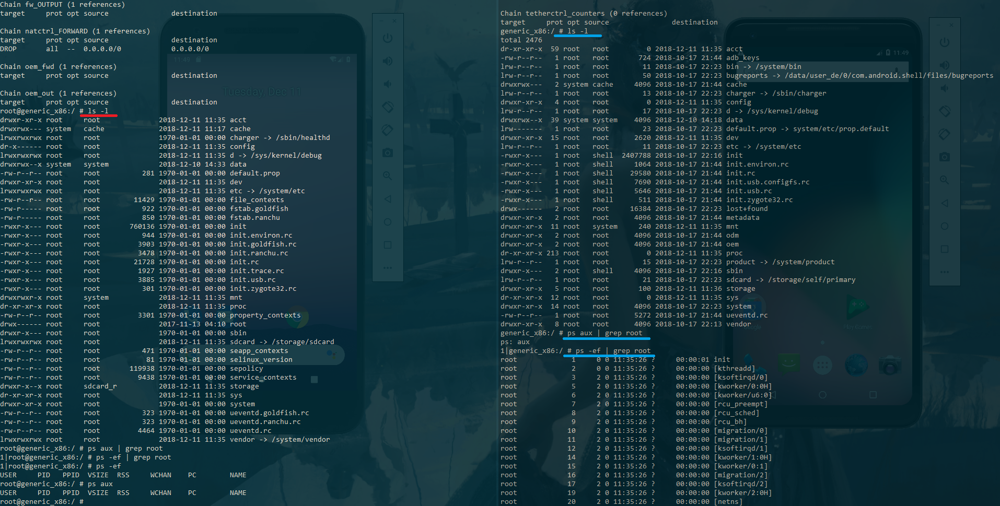

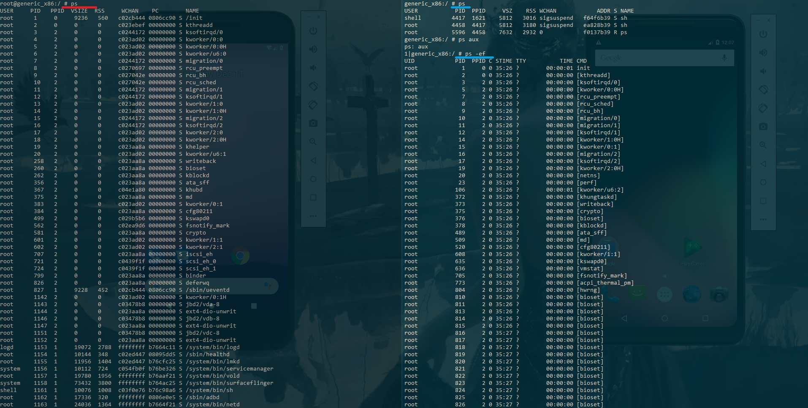

以下命令中省略了 `-s emulator-xxxx` 参数

```bash
# 将文件复制到设备/从设备复制文件
adb pull remote local
adb push local remote

# 复制文件到当前目录下
adb pull /proc/meminfo

# 安装应用，Android机器上的APK机器
adb install apk_path
```

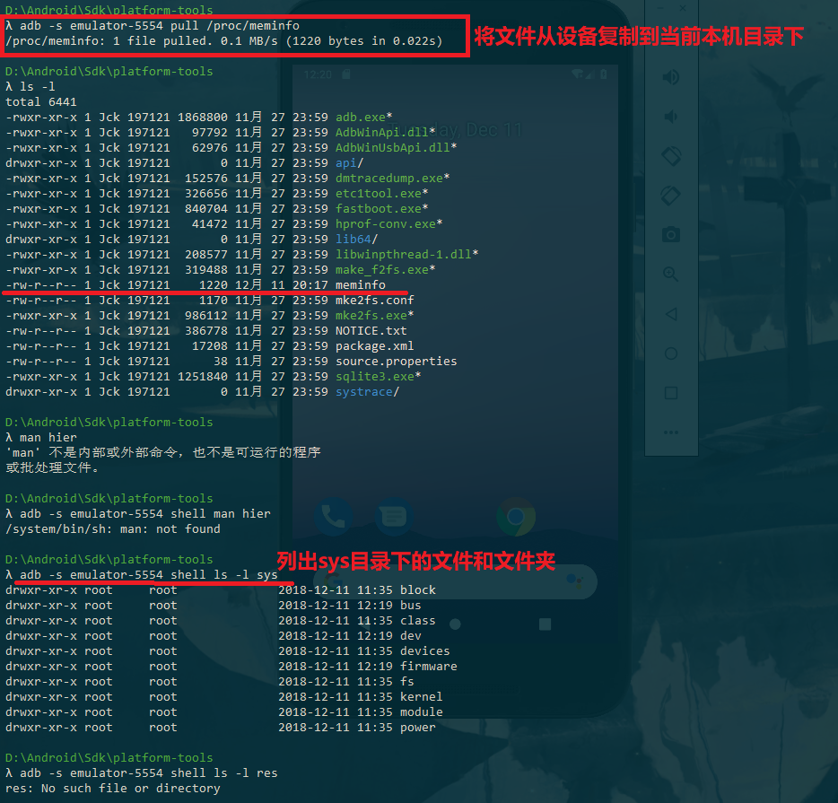

#### Activity Manager (am)

以下命令在连接至模拟器终端后使用
- 省略 `adb -s emulator-xxxx shell`

```bash
# 照相机的启动方法
# Android9.0(API28): not exist
am start -n com.android.camera/com.android.camera.Camera

# 浏览器的启动方法
# Android9.0(API28): not exist
am start -n com.android.browser/com.android.browser.BrowserActivity

# 启动浏览器访问网站
am start -a android.intent.action.VIEW -d  http://sec.cuc.edu.cn/

# 拨打电话
am start -a android.intent.action.CALL -d tel:10086
```


#### 软件包管理器 (pm)

以下命令省略 `-s emulator-xxxx` 参数

```bash
# 列出所有程序
adb shell pm list packages

# 将APK复制到模拟器中
adb push local/app-release.apk sdcard/app-release.apk

# 安装软件
adb shell pm install sdcard/app-release.apk
```


#### 其他

以下命令省略 `-s emulator-xxxx` 参数

```bash
# 截屏
adb shell screencap /sdcard/screen.png

# 将图像拉取到本地查看
adb pull /sdcard/screen.png C:/Users/Jck/Desktop/

# 常用的按键对应的 KEY_CODE
# 根据 API 的不同将会有差异
adb shell input keyevent 84 # 查找
adb shell input keyevent 66 # 回车键
adb shell input keyevent 4  # 返回键
adb shell input keyevent 3  # HOME键

# 输入文本
adb shell input text "MIS"

# 点击（与屏幕大小有关）
adb shell input tap 200 400
```


### 构建第一个 Android 应用

【启动另一个 Activity 】中，有个地方需要稍作更改才正确，其实是要根据 `activity_display_message.xml` 中的 id 编写该项 

```java
// DisplayMessageActivity.java
TextView textView = findViewById(R.id.textView2);

// activity_display_message.xml
android:id="@+id/textView2"
```

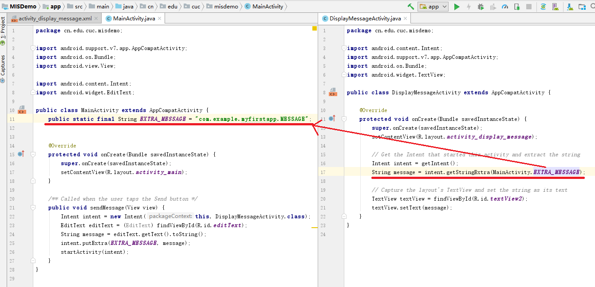

按照教程构建的项目如下


#### 签名
新建密钥库，选择 APK 即可
- 选择 Android App bundle 将生成 .aab 文件

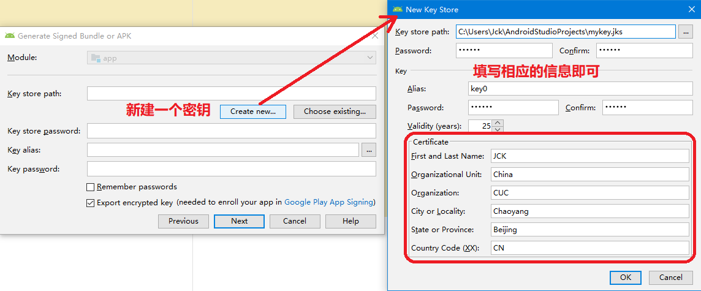

签署并发布 APK

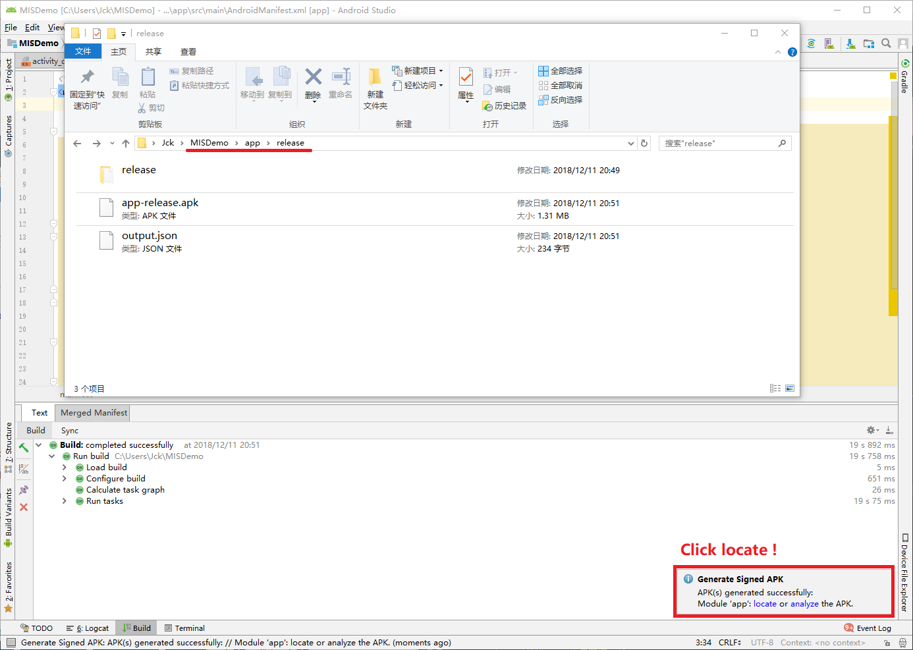


### HelloWorld v1

##### 按照向导创建的工程在模拟器里运行成功的前提下，生成的APK文件在哪儿保存的？
- 所有构建的 APK 保存在 `project_name/module_name/build/outputs/apk` 中
    - `MISDemo\app\build\outputs\apk\debug`
- 签署并发布的 APK 保存在 `project_name/module_name/release` 中
    - `MISDemo\app\release`
    - `MISDemo\app\release\release`
        - app.aab

查看 run 信息，得知APK文件应该在 `\MISDemo\app\build` 目录下，通过 Everything 查找在 `MISDemo\app\build\intermediates` 目录下

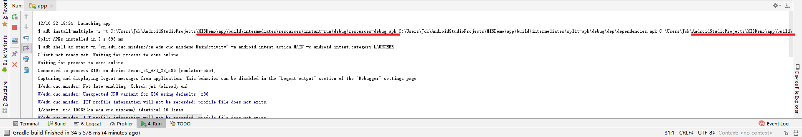

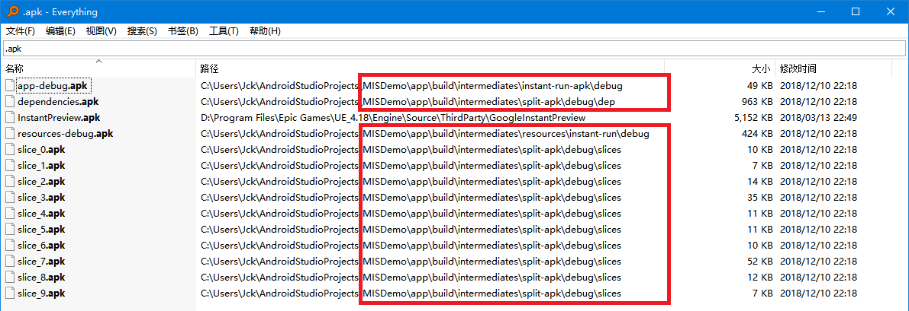

生成带签名的 APK 存放在 `MISDemo\app\release` 目录下，使用 AAB(Android App bundle) 密钥签名的APK文件在 `MISDemo\app\release\release` 目录下


##### 使用adb shell是否可以绕过MainActivity页面直接“唤起”第二个DisplayMessageActivity页面？是否可以在直接唤起的这个DisplayMessageActivity页面上显示自定义的一段文字，比如：你好移动互联网安全
- 可以，自定义显示“HI”

```bash
adb -s emulator-5554 shell am start -n cn.edu.cuc.misdemo/cn.edu.cuc.misdemo.DisplayM essageActivity --es "com.example.myfirstapp.MESSAGE" "HI"
```


##### 如何实现在真机上运行你开发的这个Hello World程序？
- 将 APK 复制到真机中，然后通过 pm 安装（我做实验的时候可能傻了）
- 直接将本地 APK 安装到真机中


##### 如何修改代码实现通过 adb shell am start -a android.intent.action.VIEW -d //sec.cuc.edu.cn/ 可以让我们的cuc.edu.cn.misdemo程序出现在“用于打开浏览器的应用程序选择列表”？
- app > manifests > AndroidManifest.xml
- 添加如下代码

```java
// AndroidManifest.xml  <activity android:name=".MainActivity">
<action android:name="android.intent.action.VIEW" />
<category android:name="android.intent.category.DEFAULT" />
<category android:name="android.intent.category.BROWSABLE" />
<data android:scheme="http" />
<data android:scheme="https" />
```


##### 如何修改应用程序默认图标？
- Project > app > res > mipmap > 新建 Image Assert

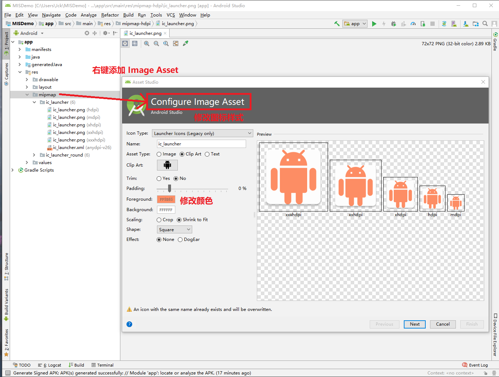

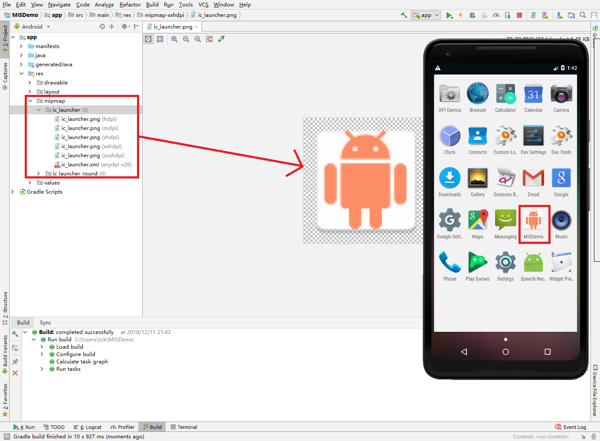

##### 如何修改代码使得应用程序图标在手机主屏幕上实现隐藏？

找了个 youtube 视频学习了一下，把代码移至 OnCreate 中实现自动隐藏，不过实际上会有一点延迟（启动程序后快速切换到程序界面可以看到图标消失的过程）
- app > res > MainActivity.java
- 添加如下代码

```java
// MainActivity.java onCreate
PackageManager packageManager = getPackageManager();
ComponentName componentName = new ComponentName(MainActivity.this, MainActivity.class);
packageManager.setComponentEnabledSetting(componentName,
        PackageManager.COMPONENT_ENABLED_STATE_DISABLED, PackageManager.DONT_KILL_APP);
```


### HelloWorld v2
尚待补充

### 参阅
- [KeyEvent 常量](https://developer.android.com/reference/android/view/KeyEvent)
- [ADB Shell Input Events](https://stackoverflow.com/questions/7789826/adb-shell-input-events)
- [构建您的第一个应用](https://developer.android.com/training/basics/firstapp/?hl=zh-cn)
- [安卓系统访问控制策略与机制 - 实验](https://sec.cuc.edu.cn/huangwei/textbook/mis/chap0x06/exp.html)
- [应用清单 资源值](https://developer.android.com/guide/topics/manifest/manifest-intro?hl=zh-cn)
- [签署您的应用](https://developer.android.com/studio/publish/app-signing)
- [Intent 和 Intent 过滤器](https://developer.android.com/guide/components/intents-filters#iobjs)
- [How to add my browser in the default browser selection list in android?](https://stackoverflow.com/questions/7394369/how-to-add-my-browser-in-the-default-browser-selection-list-in-android)
- [应用清单 图标和标签](https://developer.android.com/guide/topics/manifest/manifest-intro?hl=zh-cn#filec)
- [Hide app icon programmatically in Android Studio](https://www.youtube.com/watch?v=unkPNTBPs9w)
