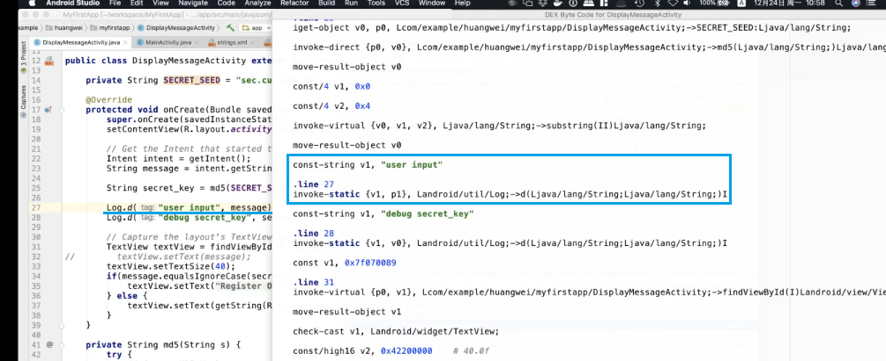
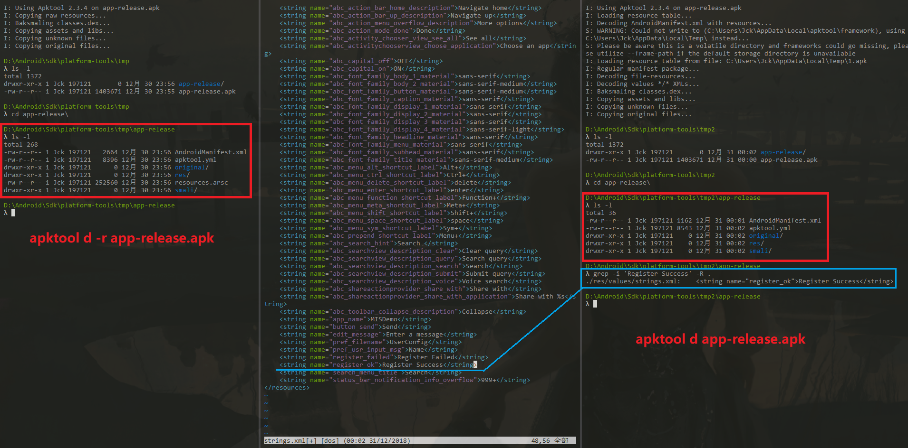

## 软件逆向系列实验

### Deliberately Vulnerable Android Hello World

下载源码并编译，遇到一些问题，控制台有提示信息，根据信息进行相应的修改即可。
- 下载 Android SDK Platform 25
- 修改 build.gradle (Project)，添加 `google()`
    -参阅：[Android Studio 3.2 - Could not find com.android.tools.build:aapt2:3.2.0-4818971](https://stackoverflow.com/questions/52541525/android-studio-3-2-could-not-find-com-android-tools-buildaapt23-2-0-4818971)


### Hello World v2

这部分实验中使用的是 Hello World v2 ，根据 DVAHW 进行修改而成（基本和 DVAHW 相同）

#### UserConfig.xml

`sharedpreferences` 持久化存储，保存的内容将在下次程序启动时读取
- Activity - 生命周期
- 完全退出后再次调用 OnCreate 方法读取数据

`UserConfig.xml` 缺省设置
- 用户/用户组可读可写
- 其他用户无法访问

```bash
# 显示模拟器设备
adb devices

# 只有一台设备，无需使用 -s 指定
adb shell

# linux
echo -n "sec.cuc.edu.cn" | md5

# 程序数据目录
cd /data/data/cn.edu.cuc.misdemo

# 查看当前所在路径
pwd

# 列出目录下所有文件
ls -l

# 存储目录
cd shared_prefs

# /data/data/.MISDEMO/shared_prefs/UserConfig.xml
cat UserConfig.xml

# 拉取到本地
adb pull /data/data/.MISDEMO/shared_prefs/UserConfig.xml

# push back 上传到模拟器
adb push UserConfig.xml /data/data/.MISDEMO/shared_prefs/UserConfig.xml
```


将其进行替换后，关闭程序再次打开则显示 hello
- 再次输入将会覆盖原有内容


#### APK Analyzer
将签名生成的 apk 拖入 Android Stdio
- ⽂件内部结构和资源占用信息
- （反汇编）DEX


对比 log 打印语句
- 行号相互对应



#### APKTool

使用 `apktool` 对 apk 进行反汇编
- `-r` 不解析资源文件
- apktool 生成，不是 apk 自带的资源文件
    - original
    - apktool.yml



对比 apktool 和 android studio 反汇编得出的结果，显然是相同的


#### 信息反馈 + 代码注入

仔细想想当时应该用“注册失败”这个条件进行逆向，不过反向查找的逻辑一样就是了


修改条件语句，使其取反


将文件重打包
- 重新生成的 apk 保存在 `\app-release\dist\` 目录下

提示没有签名
- 无法安装
- 对 apk 进行重签名

提示更新不兼容
- 同名版本号一样，不允许覆盖安装
- 卸载后再次安装


结果如图，判断逻辑被修改


#### tcpdump

开机时进行抓包
- 先将模拟器关机
- 随意访问一些网页


普通的抓包结果


### 参阅
- [Android Studio 3.2 - Could not find com.android.tools.build:aapt2:3.2.0-4818971](https://stackoverflow.com/questions/52541525/android-studio-3-2-could-not-find-com-android-tools-buildaapt23-2-0-4818971)