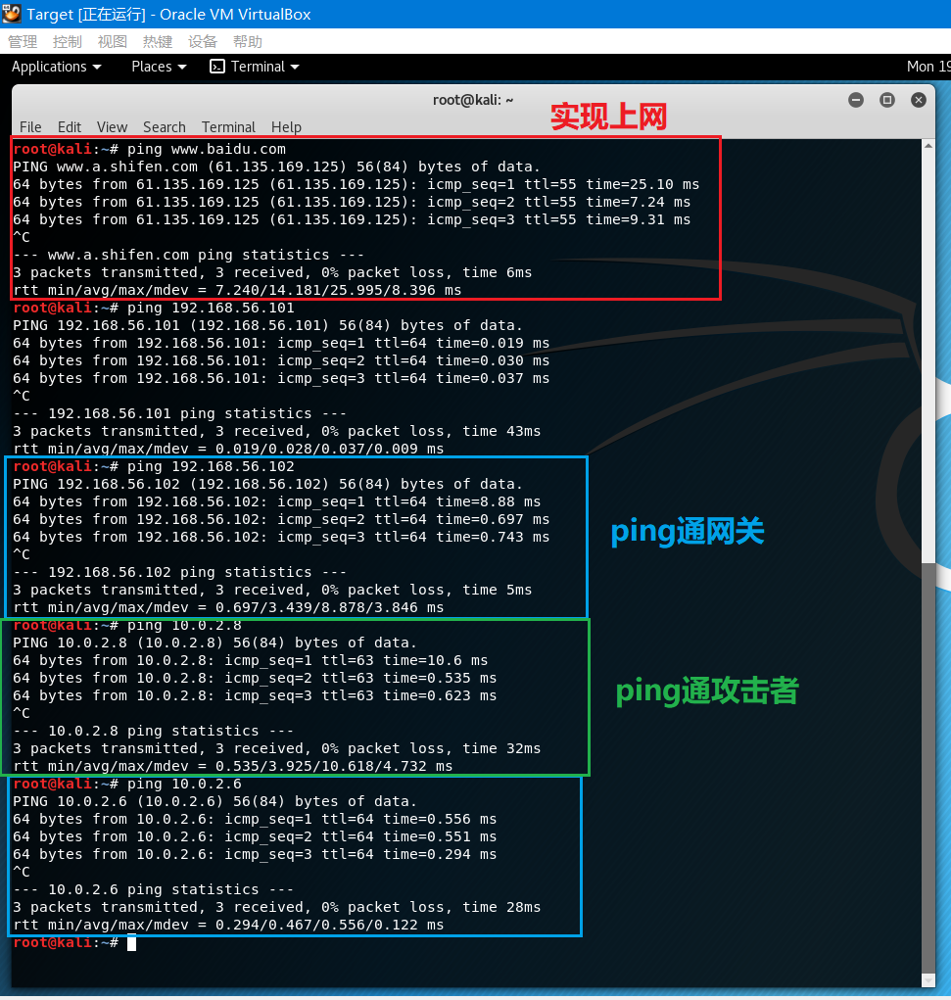

# chap0x01实验报告

## 实验要求
* [x] chap0x01 基于VirtualBox的网络攻防基础环境搭建实例讲解
    * 节点：靶机、网关、攻击者主机
    * 连通性
        * 靶机可以直接访问攻击者主机
        * 攻击者主机无法直接访问靶机
        * 网关可以直接访问攻击者主机和靶机
        * 靶机的所有对外上下行流量必须经过网关
        * 所有节点均可以访问互联网
    * 其他要求
        * 所有节点制作成基础镜像（多重加载的虚拟硬盘）

## 实验过程

### 网络拓扑


网络配置
- 靶机和网关的一个端口在同一个网段
- 攻击者和网关的另一个端口在同一个网段

### 虚拟硬盘多重加载
- 安装完虚拟机后，将系统更新并安装增强功能
- 将虚拟机关机，此时显示的是**已关闭**而不是已休眠
    - 查看虚拟机目录下有一个vdi文件
    - （可选）将vdi文件复制到另一个目录下，之后删除虚拟机可将整个文件夹删除（不用担心手滑把vdi也删了）
- 打开虚拟介质管理，将虚拟机的类型选为多重加载并应用（提示需要释放，确定即可）
- 打开虚拟机设置-存储，没有控制器也没有盘片，选择添加虚拟硬盘，使用现有的虚拟盘，选择刚才的vdi即可
- 之后新建虚拟机只需要使用现有虚拟盘，括号内会显示类型为多重加载


### 网卡及网络配置

#### 靶机(target)
- 一块网卡，内网(internal)模式
- 192.168.56.101的默认网关设置为192.168.56.102


#### 网关(gateway)
- 两块网卡，一个为内网(internal)模式，另一个为NAT network模式
- 网关的一个端口和靶机在同一个网段中，并作为其网关，可以相互ping通
- 将192.168.56.102的默认网关设置为10.0.2.6


- 因为配置了两块网卡，默认情况下是无法同时开启的，因此修改interfaces将eth0(NAT network)开启，ifconfig可以看出两块网卡都在工作，但是，右上角的网络连接就会异常，而且系统设置界面中只能看到和设置eth1(internal)
- 我的虚拟机启动时默认开启内网网卡，因此就设置了一下NAT网络网卡，显示问题暂未解决，两块网卡正常使用


#### 攻击者(attacker)
- 一块网卡，NAT network模式
- 和网关的一个端口在同一个网段


### 连通测试
靶机可以ping通网关，不能ping通攻击者，不能上网，靶机的流量都经过网关（默认网关的设置）


网关可以ping通靶机、攻击者，可以上网


网关配置端口转发后，靶机可以上网，也可以ping通攻击者



网关配置端口转发后，靶机可以上网，上下行流量都经过网关


攻击者一开始可以ping通网关，也可以上网，但不能ping通靶机

网关配置端口转发后，仍旧不能ping通靶机，因为路由无法将数据包转发到靶机


## 实验总结

### 虚拟机联网原理 - NAT & NAT网络

##### VirtualBox网络连接方式及其特点


##### NAT模式拓扑示意


##### NAT及NAT network原理
虚拟机中的NAT是通过虚拟路由器来实现的，如上图。NAT模式的一个弊端是外部主机不能访问虚拟机，除非设置了端口转发(port forwording)。

而NAT network模式是在NAT模式的基础上，实现了虚拟机之间的相互访问，同一NAT网络下的虚拟机之间可以相互访问。


> 6.3. Network Address Translation (NAT)
> Network Address Translation (NAT) is the simplest way of accessing an external network from a virtual machine. Usually, it does not require any configuration on the host network and guest system. For this reason, it is the default networking mode in VirtualBox.
>
> A virtual machine with NAT enabled acts much like a real computer that connects to the Internet through a router. The "router", in this case, is the VirtualBox networking engine, which maps traffic from and to the virtual machine transparently. In VirtualBox this router is placed between each virtual machine and the host. This separation maximizes security since by default virtual machines cannot talk to each other.
>
> The disadvantage of NAT mode is that, much like a private network behind a router, the virtual machine is invisible and unreachable from the outside internet; you cannot run a server this way unless you set up port forwarding (described below).
>
> The network frames sent out by the guest operating system are received by VirtualBox's NAT engine, which extracts the TCP/IP data and resends it using the host operating system. To an application on the host, or to another computer on the same network as the host, it looks like the data was sent by the VirtualBox application on the host, using an IP address belonging to the host. VirtualBox listens for replies to the packages sent, and repacks and resends them to the guest machine on its private network.
>
> The virtual machine receives its network address and configuration on the private network from a DHCP server integrated into VirtualBox. The IP address thus assigned to the virtual machine is usually on a completely different network than the host. As more than one card of a virtual machine can be set up to use NAT, the first card is connected to the private network 10.0.2.0, the second card to the network 10.0.3.0 and so on. If you need to change the guest-assigned IP range for some reason, please refer to Section 9.11, “Fine-tuning the VirtualBox NAT engine”.
>
> 6.4. Network Address Translation Service
> The Network Address Translation (NAT) service works in a similar way to a home router, grouping the systems using it into a network and preventing systems outside of this network from directly accessing systems inside it, but letting systems inside communicate with each other and with systems outside using TCP and UDP over IPv4 and IPv6.
>
> A NAT service is attached to an internal network. Virtual machines which are to make use of it should be attached to that internal network. The name of internal network is chosen when the NAT service is created and the internal network will be created if it does not already exist. 


### 防火墙配置
在防火墙设立规则，使用NAT建立转发。

默认情况下转发功能是关闭的，因此需要手动开启，而用echo的方法只能实现本次开启，虚拟机重启后就失效，需要修改配置文件使其开机自启。

> ```
> # IMPORTANT: Activate IP-forwarding in the kernel!
>
> # Disabled by default!
> $> echo "1" > /proc/sys/net/ipv4/ip_forward
>
> # Connect a LAN to the internet
> $> iptables -t nat -A POSTROUTING -o eth1 -j MASQUERADE
> 
> This command can be explained in the following way:
> 
> iptables:	 	the command line utility for configuring the kernel
> -t nat	 	select table "nat" for configuration of NAT rules.
> -A POSTROUTING	 	Append a rule to the POSTROUTING chain (-A stands for "append").
> -o eth1	 	this rule is valid for packets that leave on the second network interface (-o stands for "output")
> -j MASQUERADE	 	the action that should take place is to 'masquerade' packets, i.e. replacing the sender's address by the router's address.
> 
> # all packets from 192.168.x.x arriving at eth0:
> $> iptables -t nat -A PREROUTING -s 192.168.0.0/16 -i eth0 [...]
>```

##### 添加规则到iptables
```bash
iptables -t nat -L #选择NAT表并列出所有规则
iptables-save -c > iptables.rules #将规则写入iptables.rules
gedit iptables.rules #编辑
-A POSTROUTING -o eth0 -s 192.168.56.0/24 -j MASQUERADE #添加到COMMIT前
iptables-restore < iptables.rules #将规则写回iptables
```


##### 开机启动ipv4端口转发
将/etc/sysctl.conf文件中的`#net.ipv4.ip_forward=1`注释去掉，重启即可


### DNS服务器配置
NAT network模式下，DNS服务器会根据宿主机(host)的DNS服务器的改变而改变，而当虚拟机的DNS服务器和宿主机(host)的DNS服务器相同时，就可以正常上网了，默认为192.168.1.1
- 换了个网络环境，配置了NAT network网卡的虚拟机就不能上网了，在gedit中正打算手动更改DNS服务器时，弹出了reload的提示

internal模式下的虚拟机，需要和网关的DNS服务器相同或使用别的DNS服务器，反正默认192.168.1.1是不行的，除非host、网关的DNS服务器都是192.168.1.1
- 实验推论，不打包票

### 参考资料
- [VirtualBox Networking: an overview](http://bertvv.github.io/notes-to-self/2015/09/29/virtualbox-networking-an-overview/)
- [Chapter 6. Virtual networking](https://www.virtualbox.org/manual/ch06.html#network_nat)
- [Example: Connect a private subnet to the internet using NAT](https://www.karlrupp.net/en/computer/nat_tutorial)
- [iptables命令解释](https://wangchujiang.com/linux-command/c/iptables.html)
- [VirtualBox: two network interfaces](https://unix.stackexchange.com/questions/37122/virtualbox-two-network-interfaces-nat-and-host-only-ones-in-a-debian-guest-on)
- [ip forwarding in linux](https://linuxconfig.org/how-to-turn-on-off-ip-forwarding-in-linux)