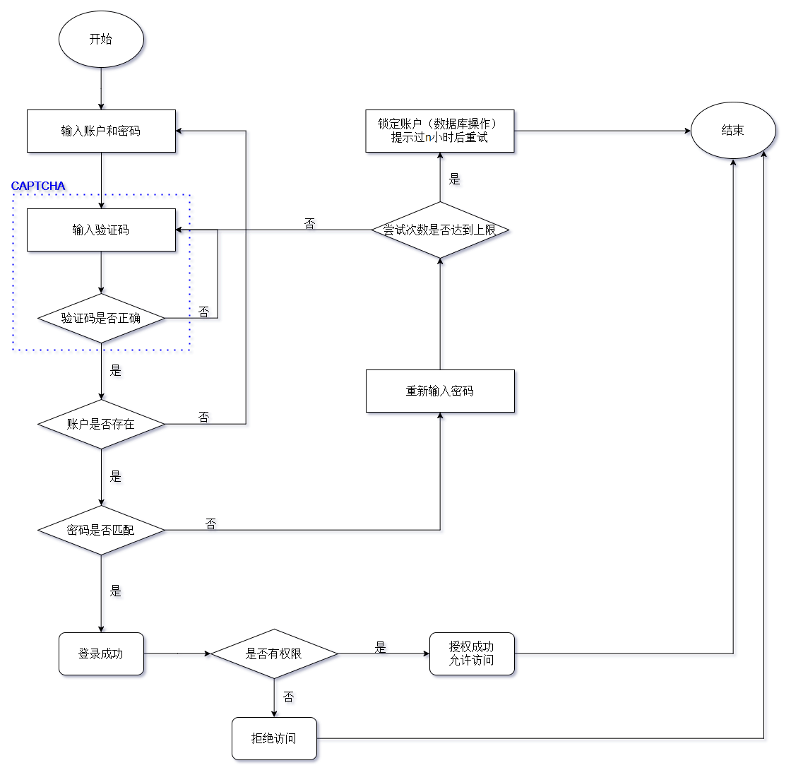
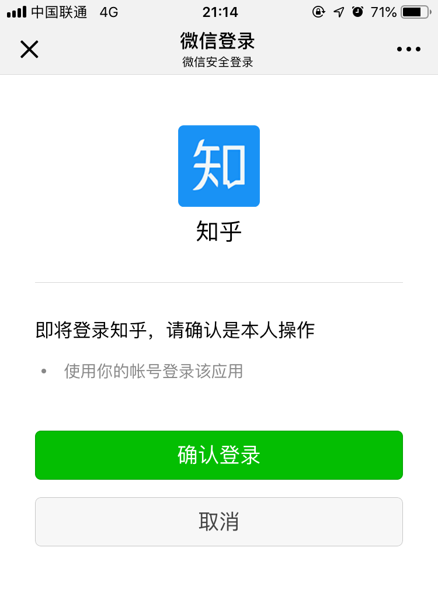

### 操作系统的访问控制设计实例研究

#### 实验环境 操作系统版本（如果是第三方应用，请给出精确版本号）、硬件设备型号、是否默认设置。
操作系统版本：IOS 12.0
硬件设备型号：iphone 6s (A1700)
是否默认设置：是
其他：一开始进行实验时是没有启用Siri的（因为平时不用），后来打开了Siri，同时一开始是不使用指纹解锁的，因实验要求开启了指纹解锁，因此认为实验是在默认设置下进行的

#### 实验结果
以 iOS 系统为研究对象
- 当系统处于锁屏状态下接收到新短信时，不解锁情况下
    - [x] 系统是否允许查看短信内容？
    - [x] 系统是否允许回复短信？
    - [ ] 安卓上的 App : 以 微信电话本 为例，在接管了系统短信功能和权限之后，是否会有一些不同的功能设定？
- 当系统处于锁屏状态下，使用系统内置（例如 iOS 的 Siri ）或第三方的语音助手可以完成以下哪些操作？
    - [ ] 访问通讯录
    - [x] 拨打电话
    - [ ] 访问相册
    - [ ] 查看短信收件箱
- 如果你的手机支持指纹识别解锁手机，请实验并分析指纹识别相比较于简单密码、复杂密码、图形解锁、人脸识别解锁、声纹解锁等解锁方式的安全性、便利性差异。
    - 安全性
        - 简单密码：通常来说指纹解锁的安全性是大于简单密码的，因为简单密码被暴力破解的可能性较大，而伪造指纹（或获取并复制指纹）的成本要更高一些
        - 复杂密码：暴力破解的可能性相较于简单密码要降低不少
        - 图形密码：简单图形密码也容易被穷举破解，图形密码和密码被偷窥窃取的几率基本上是一样的
        - 人脸识别解锁：人脸识别的准确率受到许多外部因素的影响，而且人脸本身也会发生一些改变，不排除使用高质量照片解锁的可能性
        - 声纹解锁：同人脸识别相似，对外界环境因素的影响很敏感，而且如果使用者声音发生变化（如感冒等），就大大影响了声纹解锁的准确率
        - 指纹解锁：如人脸识别可能用照片绕过，声纹识别可能被录音绕过，指纹解锁的破译=获取使用者的指纹，而使用者可以在各种地方留下指纹，但复制指纹需要一定的技术手段，因此我认为安全性是中等的
    - 便利性
        - 我认为指纹解锁是最为便利的一种方式，因为密码需要按键输入，图形密码需要在屏幕上滑动，人脸识别需要对着摄像头（甚至要找好光和角度），声纹识别对外界声音环境的要求比较苛刻，指纹解锁只需要按压传感器。
        - **经过约两周的指纹解锁功能的使用，当手指潮湿/受损时无法通过解锁，甚至有些时候莫名无法解锁（可能指纹沾灰？），只能用回密码解锁**

思考题：
- 以上设计实现方式属于我们课堂上讲过的哪种强制访问控制模型？Lattice/BLP？Biba？
    - 属于Biba模型
    - 对于刚接收的短信,所有客人用户（低安全等级）都可以对其查看，属于**下读**行为；可以回复短信，属于**上写**行为
- 系统或第三方应用程序是否提供了上述功能的访问控制规则修改？如果修改默认配置，是提高了安全性还是降低了安全性？
    - 是，但是第三方应用程序对安全性的影响基于用户的设置，如果设置不当就会降低安全性

更改设置后就不能实现锁屏回复短信等功能↓
- iphone设置中的通知设置，还可以可以关闭显示预览

### 课后题

#### 1. 生物特征身份认证方式有哪些？优缺点分析？应用场景举例。

##### 1. 指纹
- 优点：
    - 独一无二
    - 采集相对容易
    - 认证时方便迅捷

- 缺点：
    - 指纹随处可见，而且每一次使用指纹时都会在指纹采集头上留下用户的指纹印痕，而这些指纹痕迹存在被用来复制指纹的可能性
    - 容易被伪造出来，一旦被伪造就难以更改认证（指纹密码无法说改就改）
    - 需要利用电子压力传感器采集指纹

- 应用：
    - 疑犯指纹对比
    - 数码设备身份确认
    - 儿童指纹数据库
    - 银行借贷

##### 2. 虹膜
- 优点：
    - 几乎完全不会改变，作为识别对象更为准确唯一
    - 自然性不需要接触

- 缺点：
    - 用高质量的照片（脸/眼睛）可以绕过验证

- 应用：
    - 解锁数码设备
    - 考勤打卡

##### 3. 人脸
- 优点：
    - 自然性，不被被测个体察觉
    - 利用可见光获取人脸图像信息
    - 普及率较高，各种平台都提供了人脸识别

- 缺点：
    - 不同个体之间的区别不大，所有的人脸的结构都相似，甚至人脸器官的结构外形都很相似
    - 人脸的外形很不稳定，人可以通过脸部的变化产生很多表情，而在不同观察角度，人脸的视觉图像也相差很大
    - 人脸识别还受光照条件（例如白天和夜晚，室内和室外等）、人脸的很多遮盖物（例如口罩、墨镜、头发、胡须等）、年龄、拍摄的姿态角度等多方面因素的影响

- 应用：
    - 门禁系统
    - 摄像监视系统
    - 网络应用
    - 学生考勤系统
    - 相机
    - 智能手机
    - 人证核验一体机

##### 4. 声纹
- 优点：
    - 声音识别也是一种非接触的识别技术，用户可以很自然地接受

- 缺点：
    - 声音因为变化的范围太大，故而很难进行一些精确的匹配（声音会随着音量、速度和音质的变化（例如当你感冒时）而影响到采集与比对的结果）
    - 很容易用录在磁带上的声音来欺骗声音识别系统

- 应用：
    - 远程认证
    - 门禁系统
    - 娱乐应用
    - 考勤系统
    - 智能家居

##### 参阅
- [微软、谷歌为何力推虹膜技术，揭秘虹膜识别背后的价值链条](http://www.tmtpost.com/1486846.html)
- [讯飞声纹识别](https://www.xfyun.cn/services/isv)
- [Biometric Security advantages and disadvantages](https://www.slideshare.net/prabhjeet946/biometric-security-advantages-and-disadvantages)
- [Biometric Authentication Overview, Advantages & Disadvantages](https://www.cybrary.it/channelcontent/biometric-authentication-overview-advantages-disadvantages/)
- [从三星Note7谈谈，手机终端的虹膜识别是如何实现的](https://www.leiphone.com/news/201608/hpLHcqgLw3SBmKYI.html)

#### 2. “找回口令功能”和“忘记密码”在访问授权机制中的意义？请尝试设计几种安全的“找回口令功能”，详细描述找回口令的用户具体操作过程。

**（身份）认证-（访问）授权-（访问）审计**

> 认证的实现过程就是将主体（数字）身份标识唯一的绑定到（真实）主体的过程。
> 身份认证是访问授权的基础，没有身份认证就无法实现访问授权。

为了实现用户的身份认证，因为只有通过认证后用户才能获得相应的权限。而且如果用户忘记了密码（无法通过认证），就无法获得原先已有的权限。

`“找回口令功能”和“忘记密码”`实际上是重置口令，通过给用户的邮箱发送有时效性的带有特殊标识的链接/给手机发送有时效性的验证码（拨打电话提供验证码），来完成用户密码的更改。下图给出了通过邮箱重置密码的一般流程↓

只要窃取了用户的邮箱/手机就可以重置用户账户的密码，因此我认为需要结合多种手段才能达到相对安全，比如:
- 重置密码时用手机短信码来确认身份，然后才允许发送重置链接到用户邮箱
- 从邮箱点击重置链接后，允许更改密码，但需要回答一个随机的安全问题（注册的时候设置的安全问题）

##### 参阅
- [OWASP Forgot Password Cheat Sheet](https://www.owasp.org/index.php/Forgot_Password_Cheat_Sheet)

#### 3. 绘制用户使用用户名/口令+图片验证码方式录系统的流程图。考虑认证成功和失败两种场景，考虑授权成功和失败两种场景。

#### 4. Windows XP / 7 中的访问控制策略有哪些？访问控制机制有哪些？
自主访问控制 (Discretionary Access Control, DAC)
- 访问令牌 (access token)
- 安全描述符 (security descriptors)
    - 安全标识 (security identifiers, SID)
    - 访问控制列表 (access control list, ACL)
        - 自主访问控制列表(discretionary access control list, DACL)
            - 访问控制项(access control entries, ACE)
        - 系统访问控制列表(system access control list, SACL)

##### 参阅
- [⽹络安全 第⼆章 系统安全、风险评估理论与应用 P42](https://sec.cuc.edu.cn/huangwei/course/2016/nsLecture0x02.pdf)
- [Access control models, wikipedia](https://en.wikipedia.org/wiki/Access_control#Access_control_models)
- [WindowsXP Managing Authorization and Access Control, microsoft, 09/11/2009](https://docs.microsoft.com/en-us/previous-versions/windows/it-pro/windows-xp/bb457115(v%3dtechnet.10))
- [Access Control Overview, microsoft,  08/31/2016](https://docs.microsoft.com/en-us/previous-versions/windows/it-pro/windows-server-2012-R2-and-2012/dn408189(v%3dws.11))
- [Access Control, microsoft, 05/31/2018](https://docs.microsoft.com/en-us/windows/desktop/secauthz/access-control)
- [UNIX Custom Application Migration Guide, microsoft, 12/05/2007](https://docs.microsoft.com/en-us/previous-versions/tn-archive/bb496995(v=technet.10))
- [Role Based Access Control Why Groups Aren't Enough](https://www.quest.com/community/quest/b/en/posts/role-based-access-control-why-groups-aren-t-enough)
- [RBAC权限模型——项目实战](https://blog.csdn.net/zwk626542417/article/details/46726491)
- [AIX Version 6.1: Security, IBM](http://public.dhe.ibm.com/systems/power/docs/aix/61/security_pdf.pdf)

#### 5. 用权限三角形模型来理解并描述下2种威胁模型：提权、仿冒。
首先看一下STRIDE模型对威胁的6个维度

|Threat	|Desired property|
|-|-|
|Spoofing	|Authenticity|
|Tampering	|Integrity|
|Repudiation	|Non-repudiability|
|Information disclosure	|Confidentiality|
|Denial of Service	|Availability|
|Elevation of Privilege	|Authorization|

- 提权威胁授权
- 仿冒威胁认证

##### 关于提权
- 提权分为：水平特权提升、垂直特权提升
- 提权是指本来没有某项权限的用户，通过一定的方法获得该权限，简而言之，用户以自己的身份获得了本不属于自己的权限
    - 比如用户A本来只能对一个文件进行查看，但是通过提权获得了对文件修改的权利（垂直提权）
    - 或者用户A本来只能查看自己的文件，通过提权可以查看B的文件（水平提权）

##### 关于仿冒
- 仿冒是，用户A以用户B的身份通过了认证，之后行使了B所有的权利

##### 权限三角模型：用户 → 角色（分级） → 权限（对象+操作）
- 提权是`用户→角色→权限`，角色不变，而获取的权限扩大
- 仿冒是`用户→角色`，获取的角色改变，所以能够行使的权限也就因角色的改变而改变了

##### 参阅
- [STRIDE(security), wikipedia](https://en.wikipedia.org/wiki/STRIDE_(security))

#### 6. 试通过操作系统的访问控制机制来达到预防一种真实病毒的运行目的。
查阅资料得知可以通过访问控制机制防止特洛伊木马病毒，尚未进行实践。

可以通过修改组策略防止蠕虫病毒，例如[熊猫烧香](https://zh.wikipedia.org/wiki/%E7%86%8A%E7%8C%AB%E7%83%A7%E9%A6%99)
- 利用**自动播放**功能
- 添加注册表自启动
- 定时关闭特定程序，如杀毒软件、防火墙
- 删除文件等

也就是说，如果能根据先验知识限制系统服务的运行、限制文件的操作等，就能有针对性地预防某一病毒。

关键词：访问控制机制，反向ACL，组策略，注册表

##### 参阅
- [特洛伊木马与强制访问控制定义](https://zh.coursera.org/lecture/os-virtsecurity/3-4-te-luo-yi-mu-ma-yu-qiang-zhi-fang-wen-kong-zhi-ding-yi-Gxzc9)

#### 7. 什么是 OAuth？
开放授权(OAuth)是一个开放标准/授权协议，而不是身份验证协议。允许用户让第三方应用上访问该用户在某一网站上存储的资源，而无需把用户名和密码提供给第三方应用。

OAuth协议为用户资源的授权提供了一个安全的、开放而又简易的标准。与以往的授权方式不同之处是OAuth的授权不会使第三方触及到用户的帐号信息（如用户名与密码），即第三方无需使用用户的用户名与密码就可以申请获得该用户资源的授权，因此OAuth是“安全的”。同时，任何第三方都可以使用OAuth认证服务，任何服务提供商都可以实现自身的OAuth认证服务，因而OAuth是“开放的”。 

常见的授权方式是使用授权码，比如使用微信扫码/QQ登录第三方网站时会显示↓

##### 使用OAuth进行登录
1. Web应用请求用户登录
2. 用户选择“使用Google账户登录”
3. Web应用联系Google
4. Google回应Web应用
5. Web应用向Google请求登录认证（Oauth token）
6. Google请求用户授权登录
7. 用户同意授权给第三方用户
8. Google给Web应用返回授权信息（Oauth request token）
9. 第三方用户获得权限访问用户Google账户的私密信息

##### 参阅
- [一张图搞定OAuth2.0](https://www.cnblogs.com/flashsun/p/7424071.html)
- [阮一峰的网络日志 理解OAuth 2.0](http://www.ruanyifeng.com/blog/2014/05/oauth_2_0.html)
- [OAuth, wikipedia](https://en.wikipedia.org/wiki/OAuth)

#### 8. 什么是 OpenID？
OpenID是一个身份认证协议，侧重于确定“用户是谁”，即认证用户所声称的身份是否真实。

> OpenID是一个去中心化的网上身份认证系统。对于支持OpenID的网站，用户不需要记住像用户名和密码这样的传统验证标记。取而代之的是，他们只需要预先在一个作为OpenID身份提供者（identity provider, IdP）的网站上注册。OpenID是去中心化的，任何网站都可以使用OpenID来作为用户登录的一种方式，任何网站也都可以作为OpenID身份提供者。OpenID既解决了问题而又不需要依赖于中心性的网站来确认数字身份。

##### 参阅
- [OpenID, wikipedia](https://en.wikipedia.org/wiki/OpenID)

#### 9. 试用本章所学理论分析 OAuth 和 OpenID 的区别与联系。
- OpenID只做了身份认证，没有授予权限，它实现了证明“我就是我”
- OAuth授予第三方应用访问受保护的信息的权限

因此单纯的认证身份没必要用到OAuth，用到第三方网站的外部服务时才需要用OAuth

#### 10. 如何使用 OAuth 和 OpenID 相关技术实现单点登录（Single Sign On）？

单点登录 (SSO)
> 一种对于许多相互关连，但是又是各自独立的软件系统，提供访问控制的属性。当拥有这项属性时，当用户登录时，就可以获取所有系统的访问权限，不用对每个单一系统都逐一登录。

##### Microsoft Account
微软账户是一个单点登录微软账户，使微软用户登录微软网站（如Outlook），运行在微软操作系统的设备（如Windows10电脑/平板、WindowsPhone、Xbox），微软应用软件（如Visual Stdio）
- 微软的网站，服务，应用程序都可以使用**同一个微软账户**登录，而不需要多个账户

也就是说，单点登录的实现是发生在服务器之间，比如登录Outlook，用户身份的确认是由微软账户认证服务器实现，而不是Outlook服务器；登录Xbox时也遵循相同的流程，并不是由XBox服务器进行身份认证

> Microsoft account allows users to sign into websites that support this service using a single set of credentials. Users' credentials are not checked by Microsoft account-enabled websites, but by a Microsoft account authentication server. A new user signing into a Microsoft account-enabled website is first redirected to the nearest authentication server, which asks for username and password over an SSL connection. The user may select to have their computer remember their login: a newly signed-in user has an encrypted time-limited cookie stored on their computer and receives a triple DES encrypted ID-tag that previously has been agreed upon between the authentication server and the Microsoft account-enabled website. This ID-tag is then sent to the website, upon which the website plants another encrypted HTTP cookie in the user's computer, also time-limited. As long as these cookies are valid, the user is not required to supply a username and password. If the user actively logs out of their Microsoft account, these cookies will be removed.

Microsoft帐户是用户管理其身份的网站。Microsoft帐户的功能包括：
- 更新用户的信息，如与帐户关联的名字和姓氏，地址等
- 更新用户设置，例如首选语言或电子邮件首选项
- 更改或重置用户密码
- 关闭帐户
- 查看与帐户关联的结算明细

##### 参阅
- [Single sign-on, wikipedia](https://en.wikipedia.org/wiki/Single_sign-on)
- [OpenID Connect, Google Identity Platform](https://developers.google.com/identity/protocols/OpenIDConnect)
- [Introduction to Single Sign-On](http://www.opengroup.org/security/sso/sso_intro.htm)
- [浅谈SAML, OAuth, OpenID和SSO, JWT和Session](https://juejin.im/post/5b3eac6df265da0f8815e906)
- [SSO And LDAP Authentication](https://archive.is/20140523114521/http://www.authenticationworld.com/Single-Sign-On-Authentication/SSOandLDAP.html)
- [Microsoft account](https://en.wikipedia.org/wiki/Microsoft_account)
- [Single Sign-On and Password Management](https://www.ilantus.com/compact-identity/sso-and-password-management/)

### chap0x02 CVSS与漏洞评分实例讲解（高中低危漏洞各举一例）
CVSS v3.0评分范围

|RATING	|CVSS SCORE|
|-|-|
|None	|0.0|
|Low	|0.1 – 3.9|
|Medium	|4.0 – 6.9|
|High	|7.0 – 8.9|
|Critical	|9.0 – 10.0|

**以下实例摘自[CVSS v3.0 实例](https://www.first.org/cvss/examples)**

CVSS v3.0评分具体细节未翻译，（以班级同学英文水平评估，推测大家都能看懂）。

添加了CVSS在线计算器计算结果，仅依据表格内容仅计算基础分，打分选项详细于[在线计算器](https://nvd.nist.gov/vuln-metrics/cvss/v3-calculator)中查看。

#### SSLv3 POODLE Vulnerability (CVE-2014-3566)
##### 漏洞
OpenSSL 1.0.1i和其他产品中使用的SSL协议3.0使用非确定性CBC填充，这使得中间攻击者容易通过padding-oracle攻击获得明文数据，即“POODLE”问题。

##### 攻击
典型的攻击情形是受害者访问过某个Web服务器，而他的Web浏览器现在包含攻击者希望窃取的cookie。为了成功地攻击，攻击者必须能够修改受害者与此Web服务器之间的网络流量，并且受害者和系统都必须愿意使用SSL 3.0进行加密。

##### CVSS v3.0 Base Score: 3.1

|Metric	|Value	|Comments|
|-|-|-|
|Attack Vector	|Network	|The attack is conducted over a network. Note that the attack can take place at any point between the victim and web server over which the network traffic is routed. The value is therefore Network rather than Adjacent Network; the latter is only used for attacks where the attacker must be on the same physical network (or equivalent).
|Attack Complexity	|High	|This is a man in the middle attack, and therefore complex for the attacker to perform. Privileges Required None An attacker requires no privileges to mount an attack. User Interaction Required The victim must be tricked into running malicious code on her web browser.
|Privileges Required	|None	|An attacker requires no privileges to mount an attack.
|User Interaction	|Required	|The victim must be tricked into running malicious code on her web browser.|
|Scope	|Unchanged	|The vulnerable component is the web server because it insecurely responds to padding errors in a way that can be used to brute force encrypted data.The impacted component is also the web server because the cookie information disclosed is part of its authorization authority.|
|Confidentiality Impact	|Low	|The attack discloses cookie information that the attacker should not have access to.|
|Integrity Impact	|None||
|Availability Impact	|None||

#### MySQL Stored SQL Injection (CVE-2013-0375)
##### 漏洞
MySQL服务器数据库中的漏洞可能允许远程的、经过身份验证的用户注入SQL代码，通过MySQL复制功能以高权限运行该SQL代码。成功的攻击可以允许读取或修改远程MySQL数据库中的任何数据。

##### 攻击
攻击者需要在目标MySQL数据库上拥有一个帐户，该帐户具有修改用户提供的标识符（例如表名）的权限。该帐户必须位于复制到一个或多个其他MySQL数据库的数据库上。攻击包括使用帐户登录并将标识符修改为包含引号字符和恶意SQL片段的新值。此SQL稍后将作为远程系统上的高权限用户执行。恶意SQL被注入到实现复制功能的SQL语句中，该语句本来是用于防止攻击者执行任意SQL语句。

##### CVSS v3.0 Base Score: 6.4

|Metric	|Value	|Comments|
|-|-|-|
|Attack Vector	|Network	|The attacker connects to the exploitable MySQL database over a network.
|Attack Complexity	|Low	|Replication must be enabled on the target database. Although disabled by default, it is common for it to be enabled so we assume this worst case.|
|Privileges Required	|Low|	The attack requires an account with the ability to change user-supplied identifiers, such as table names. Basic users do not get this privilege by default, but it is not considered a sufficiently trusted privilege to warrant this metric being High.|
|User Interaction	|None||
|Scope	|Changed	|The vulnerable component is the MySQL server database and the impacted component is a remote MySQL server database (or databases).|
|Confidentiality Impact	|Low	|The injected SQL runs with high privilege and can access information the attacker should not have access to. Although this runs on a remote database (or databases), it may be possible to exfiltrate the information as part of the SQL statement. The malicious SQL is injected into SQL statements that are part of the replication functionality, preventing the attacker from executing arbitrary SQL statements.|
|Integrity Impact	|Low	|The injected SQL runs with high privilege and can modify information the attacker should not have access to. The malicious SQL is injected into SQL statements that are part of the replication functionality, preventing the attacker from executing arbitrary SQL statements.|
|Availability Impact	|None	|Although injected code is run with high privilege, the nature of this attack prevents arbitrary SQL statements being run that could affect the availability of MySQL databases.|

#### OpenSSL Heartbleed Vulnerability (CVE-2014-0160)
##### 漏洞
用OpenSSL 1.0.1（OpenSSL 1.0.1g版本之前）实现的TLS和DTLS没有正确地处理心跳(Heartbeat)扩展数据包，这就允许远程攻击者使用精心制作的数据包来触发缓冲区过度读取，进而从进程内存中获取敏感信息。这就是所谓的心脏出血(heartbleed)漏洞

##### 攻击
成功的攻击只需要向运行OpenSSL的Web服务器发送特殊消息。攻击者构造具有大字段长度和小有效负载大小的格式错误的“心跳请求”。 易受攻击的服务器不会根据提供的字段长度验证有效负载的长度，并且会向攻击者返回高达64kB的服务器内存。 这个内存很可能曾被OpenSSL使用。返回的数据可能包含敏感信息，例如加密密钥或用户名和密码，攻击者可以使用这些信息来发动进一步的攻击。

##### CVSS v3.0 Base Score: 7.5

|Metric|Value|Comments|
|-|-|-|
|Attack Vector	|Network	|The vulnerability is in a network service that uses OpenSSL.|
|Attack Complexity	|Low	|An attacker needs to only find a listening network service to mount an attack.|
|Privileges Required	|None	|An attacker requires no privileges to mount an attack.|
|User Interaction	|None	|No user access is required for an attacker to launch a successful attack.|
|Scope	|Unchanged	|The vulnerable component is OpenSSL which is integrated with the network service, therefore no change in scope occurs during the attack.|
|Confidentiality Impact	|High	|Access to only some restricted information is obtained, but the disclosed information presents a direct, serious impact to the affected scope (e.g. the attacker can read the administrator's password, or private keys in memory are disclosed to the attacker).|
|Integrity Impact	|None	|No information can be modified by the attacker.|
|Availability Impact	|None	|The attacker cannot affect availability through this attack.|

#### Google Chrome Sandbox Bypass vulnerability (CVE-2012-5376)
##### 漏洞
在22.0.1229.94版本之前的Google Chrome，其中的进程间通信（IPC）实现允许远程攻击者绕过预期的沙箱限制并通过利用对渲染器进程的访问来写入任意文件。

##### 攻击
Google Chrome使用多进程架构，其中每个浏览器选项卡可以运行单独的渲染器进程，该进程使用IPC与其他Chrome进程通信。通过诱导受害者访问特殊网站，远程攻击者可以利用此漏洞将任意文件写入操作系统。

##### CVSS v3.0 Base Score: 9.6

|Metric	|Value	|Comments|
|-|-|-|
|Attack Vector	|Network	|The victim must visit a malicious website that may exist outside the local network|
|Attack Complexity	|Low	|The attacker does not need to perform any special reconnaissance for this attack|
|Privileges Required	|None	|The attacker does not need any permissions to perform this attack, the attacker lets the victim perform the action on the attacker's behalf.|
|User Interaction	|Required	|The victim must click a specially crafted link provided by the attacker.|
|Scope	|Changed	|Based on the assumption that the attacker is breaking out of Chrome's controlled sandboxed environment, the vulnerable component is Google Chrome and the impacted component is the operating system on which Chrome is running.|
|Confidentiality Impact	|High	|The worst case scenario is Chrome is running with administrative privileges. The attacker can overwrite system configuration and grant the attacker access to any data on the system.|
|Integrity Impact	|High	|The worst case scenario is Chrome is running with administrative privileges. The attacker can overwrite any file, including important system files.|
|Availability Impact	|High	|The worst case scenario is Chrome is running with administrative privileges. The attacker can cause a system crash by overwriting particular system files.|

#### 参阅
- [Common Vulnerability Scoring System v3.0: Examples](https://www.first.org/cvss/examples)
- [Current CVSS Score Distribution For All Vulnerabilities](https://www.cvedetails.com/)
- [CVSS V3 Calculator](https://nvd.nist.gov/vuln-metrics/cvss/v3-calculator)
- [5. Scoring Rubric](https://www.first.org/cvss/user-guide)
- [Vulnerability Metrics](https://nvd.nist.gov/vuln-metrics/cvss)