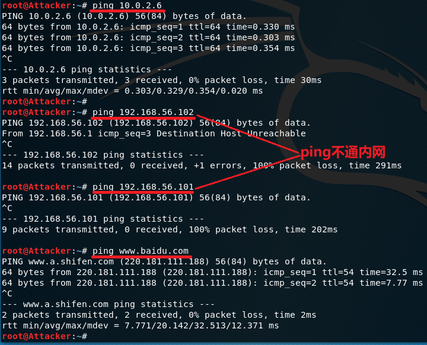
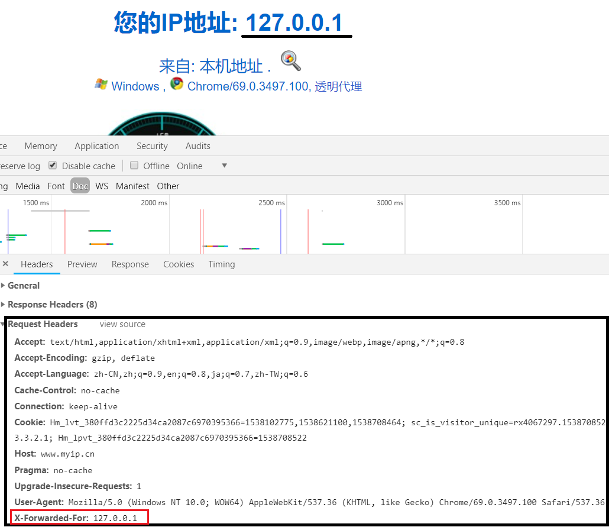

## 课后习题
### 代理技术在网络攻防中的意义
#### 对攻方的意义
隐藏攻击者身份，使其攻击无法溯源

#### 对守方的意义
隐藏使用者身份，使攻击者无法确定攻击对象

### 常规代理技术和高级代理技术的设计思想区别与联系
- 区别
    - 高级代理技术更强调匿名性，可以实现三个方面的匿名性：发送者匿名、接受者匿名、收发双方无关联
- 联系
    - 可以通过常用代理技术实现高级代理，而且实现起来相对简单，具有高效性。但要求代理必须是可信任的，因此安全性有所不足。

## HTTP正向代理实验
### 实验环境
#### 拓扑结构
和[ns-0x01](https://github.com/CUCCS/2018-NS-Public-jckling/blob/ns-0x01/ns-0x01/topology.png)的拓扑结构相同，在网关上配置了[tinyproxy](https://github.com/tinyproxy/tinyproxy)


#### 连通测试
回顾之前的实验要求（按行看）

||攻击者|网关|靶机|
|-|:-:|:-:|:-:|
|攻击者|-|√|x|
|网关|√|-|√|
|靶机|√|√|-|

攻击者可以ping通网关，不能ping通靶机，可以上网



网关可以ping通攻击者，可以ping通靶机，可以上网


靶机可以ping通攻击者，可以ping通网关，可以上网


### 访问靶机Apache页面
查找进程发现靶机的Apache服务是关闭的，使用命令`service apache2 start`开启服务，再次查找进程证明开启


网关通过浏览器访问靶机IP`192.168.56.101`，出现apache默认页面，访问成功


攻击者也通过浏览器访问靶机，浏览器一直处于加载中，访问失败


上述访问过程中，在靶机上持续进行抓包，抓包结果如下，同时访问日志增加了一条访问记录（网关访问靶机）


### 使用tinyproxy
#### 配置tinyproxy
在网关上下载tinyproxy，并进行配置，之后开启tinyproxy服务

```
apt update && apt install tinyproxy
gedit /etc/tinyproxy/tinyproxy.conf
service tinyproxy start
```

默认端口8888可以不作修改（暂且这么认为），允许网段需要使用攻击者所在网段，这样才能使攻击者使用代理服务器


在攻击者主机上打开firefox，依次点击`Preferences-Advanced-Network-Connection Settings`进入代理设置，填写网关IP及端口号


#### 使用tinyproxy访问靶机
在攻击者的firefox上配置并选择启用代理服务器后，同时在攻击者、网关、靶机开启抓包

**1.攻击者**

使用firefox访问靶机`192.168.56.101`和`192.168.56.101/hack`，分别显示Apache默认页面和404页面，没有直接给出代理服务器信息


用wireshark打开抓到的包，过滤掉不必要的信息后，可以发现HTTP响应里含有`Via: 1.1 tinyproxy (tinyproxy/1.8.4)`字段


**2.网关**

部分HTTP包是没有必要展示出来的，找出这些数据包的相同字段，并右键选择`and not Selected`过滤数据包


过滤后得到的结果比较清爽，可以看到tinyproxy的字段


**3.靶机**

开启抓包的同时，也打开了日志文件进行实时查看，可以看到攻击者访问靶机时新增了两条访问日志，同时从wireshark中也能看到数据包的tinyproxy字段


#### 使用tinyproxy访问https页面
在攻击者主机上用firefox访问[https://www.baidu.com](https://www.baidu.com)，同时在网关上进行抓包

之前使用http协议访问靶机时，代理服务器（即网关）可以直接看到用户访问的网址，HTTP请求和响应的信息都是以明文形式展现


使用https，代理服务器（即网关）能看到用户访问的网址，但是传输的数据被加密了。从抓到的数据包来看，在TLS协议前还有一个和代理服务器建立连接的的过程，经过密钥交换和密钥协商后，用户和目标网站的通信都进行了加密


数据被加密


### 总结
- 通过代理服务器可以绕过某些访问限制
- 代理服务器可以看到用户访问的网址
- 代理服务器无法看到https通信数据，但是存在实现中间人攻击的可能

### 参阅
- [Transport Layer Security](https://en.wikipedia.org/wiki/Transport_Layer_Security)

## XFF实验
### 实验环境
- 操作系统：Windows 10 家庭版
- 浏览器：Google Chrome 69.0.3497.100（正式版本）
- 浏览器插件：Modify Headers

这小实验是直接在我个人的笔记本上操作的，不是在虚拟机里

### 实验过程
访问[myip.cn](myip.cn)查看当前主机的IP地址，请求头如下


用插件**Modify Headers**在添加请求头中添加X-Forward-For字段


访问[myip.cn](myip.cn)查看当前主机的IP地址，请求头中多了X-Forward-For字段，而且显示的IP就是设置的127.0.0.1


### 总结
- 通过IP地址进行过滤和统计不是一个明智的选择
- 浏览器插件真是一个易用而神奇的工具

### 参阅
- [X-Forwarded-For](https://en.wikipedia.org/wiki/X-Forwarded-For)