## 检测局域网中的异常终端
### 实验环境
#### 拓扑结构

实验使用[ns-0x01](https://github.com/CUCCS/2018-NS-Public-jckling/blob/ns-0x01/ns-0x01/topology.png)中的两台虚拟机：

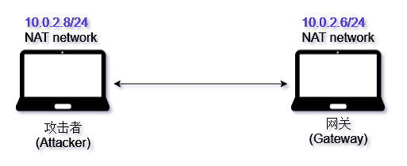

#### 网络配置及arp表
**1.攻击者**

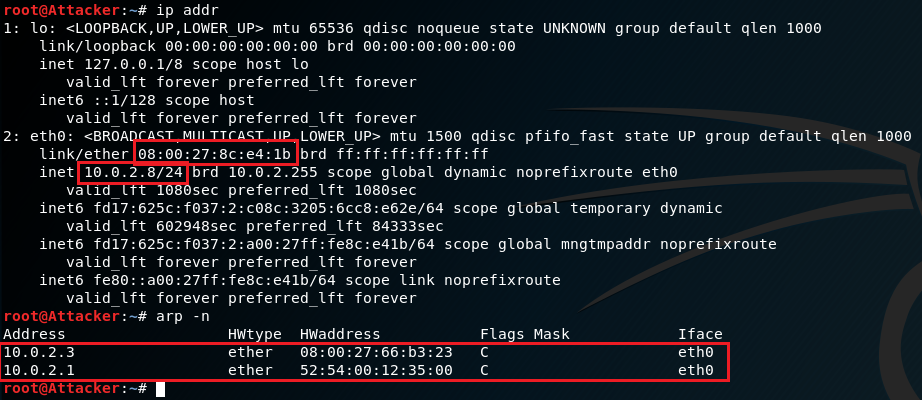

**2.网关**

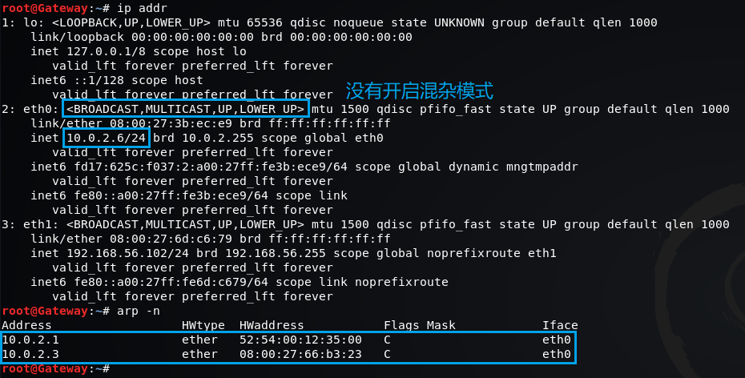

### ICMP-ping
**1.攻击者**

攻击者向网关发送ping包，并进行抓包

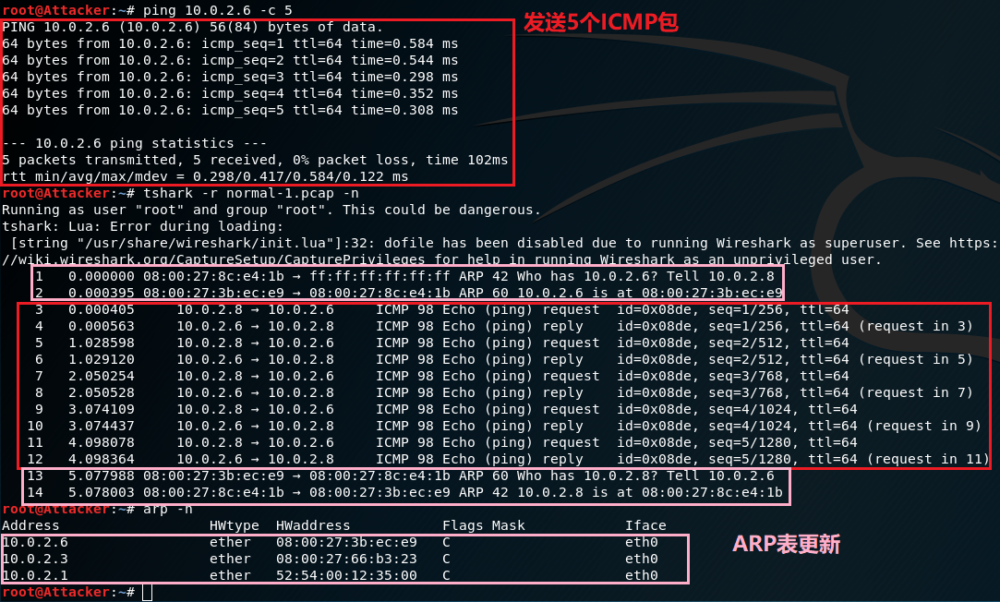

**2.网关**

网关同时进行抓包

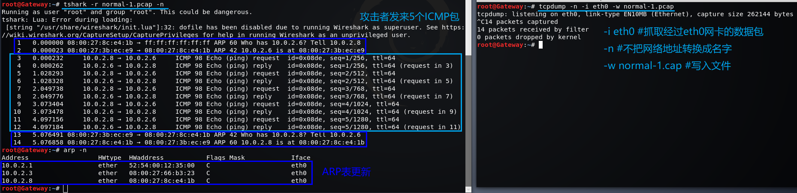

### ARP请求
#### 正常模式

**注意：使用tcpdump抓包时，会开启网卡的混杂模式，因此只在攻击者主机上进行抓包**

攻击者使用`promiscping`进行探测，同时进行抓包

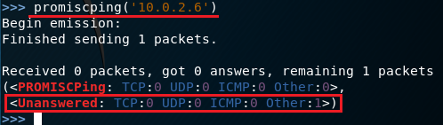

抓包结果如下，只有arp请求没有响应

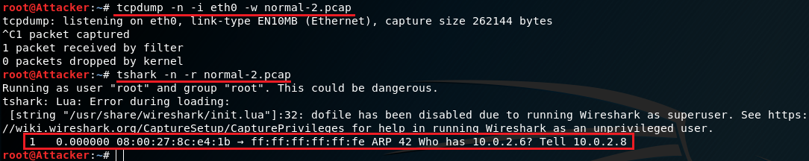

攻击者构造ICMP数据包，源MAC地址是必须的，因为如果有响应的话需要根据MAC地址转发数据包，*实验发现源MAC地址不会自动填充为本机网卡的MAC地址，需要手动填充*，源IP地址会自动填充

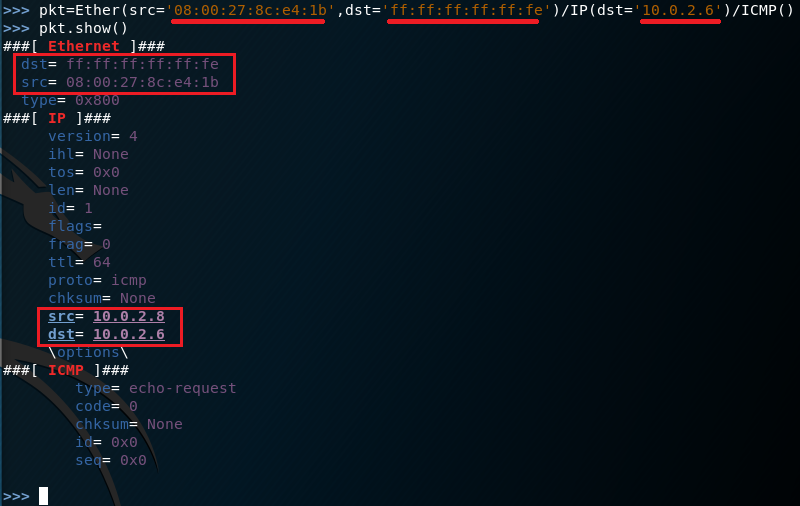

攻击者发送构造的数据包进行探测,同时进行抓包

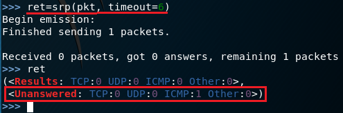

抓包结果如下，只有发送出去的数据包，没有响应

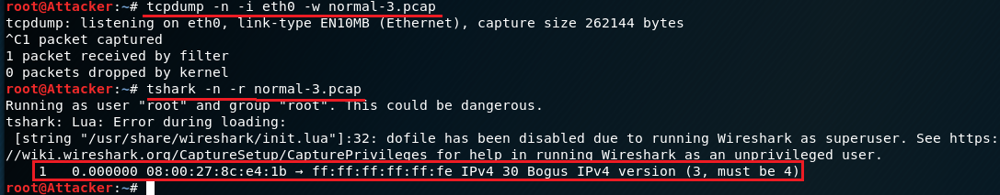


#### 混杂模式
网关网卡开启混杂模式

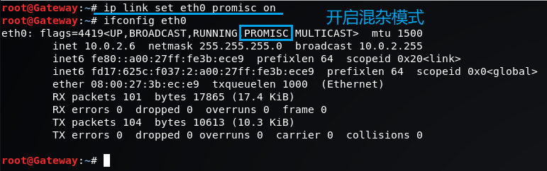

攻击者使用`promiscping`进行探测，同时进行抓包

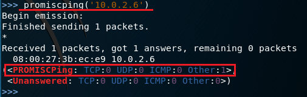

抓包结果如下，有arp响应了

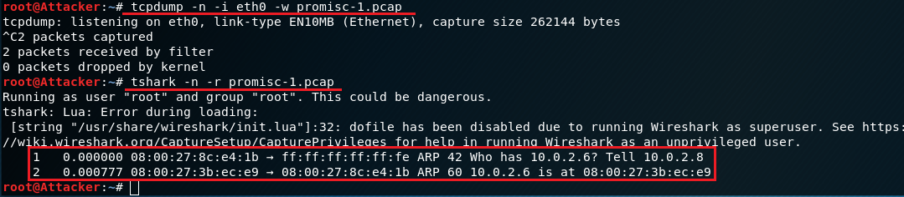

攻击者再次发送构造数据包进行探测，同时进行抓包

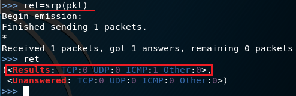

抓包结果如下，ICMP也有响应了

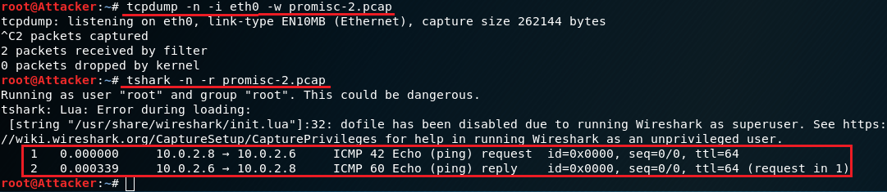

使用wireshark对抓到的两个包进行查看和比较
- 创建数据包的时候使用的是`ICMP()`，因此抓到的包自然是ICMP
- `promiscping`自动构建数据包发送，利用的是ARP协议

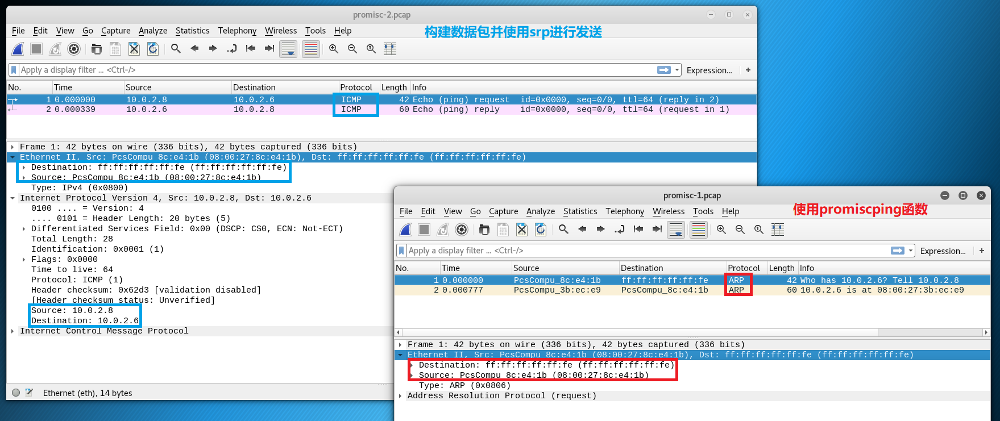

### 总结
- 通过发送虚假的广播包对局域网中的终端进行探测，根据接收到的响应可以判断哪些网卡开启了混杂模式


## ARP欺骗实验
### 实验环境
#### 拓扑结构
三台主机在一个内网中，网关有一块NAT network网卡用于实现连网

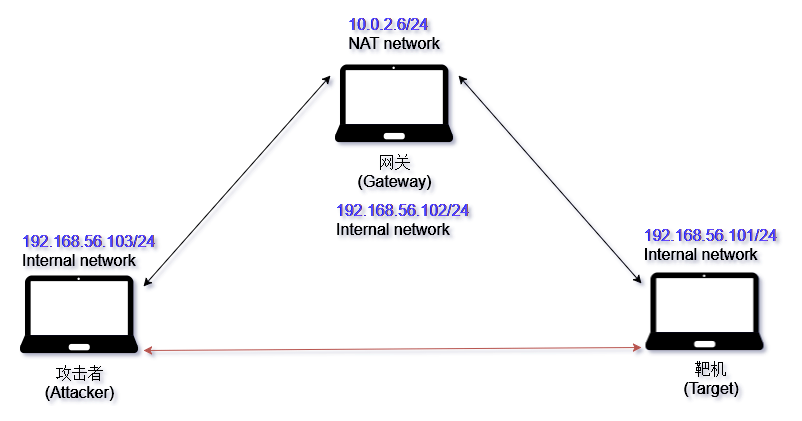

#### 初始arp表
**1.攻击者**

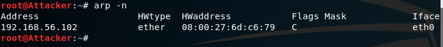

**2.网关**

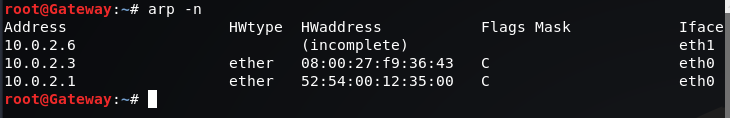

**3.靶机**

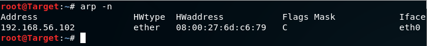

#### 网络连通测试
**1.攻击者**

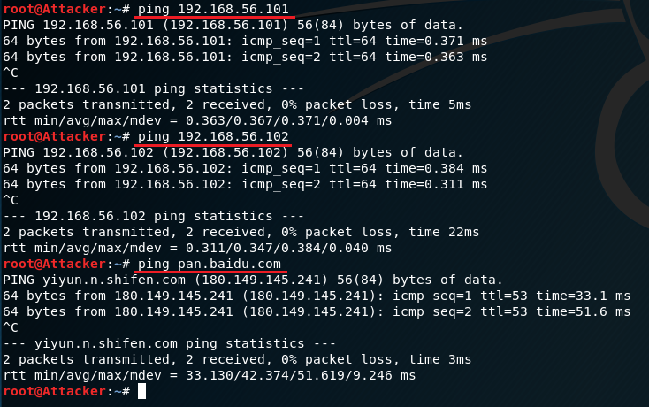

arp表更新

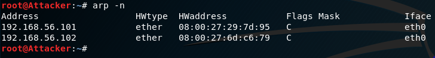


**2.网关**

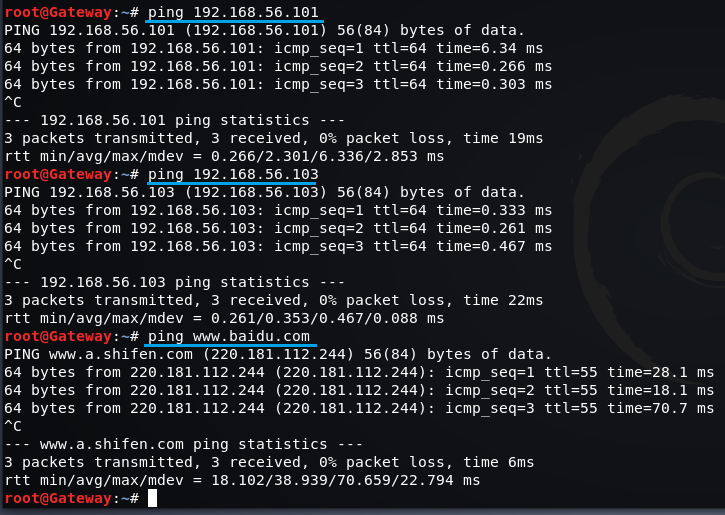

arp表更新

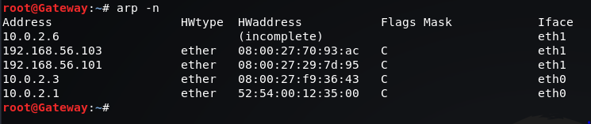


**3.靶机**

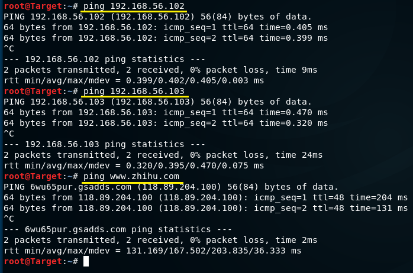

arp表更新

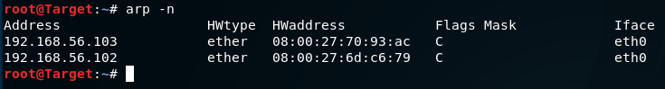

### 实现arp欺骗
#### arpspoof
`arpspoof`的说明非常简洁明了

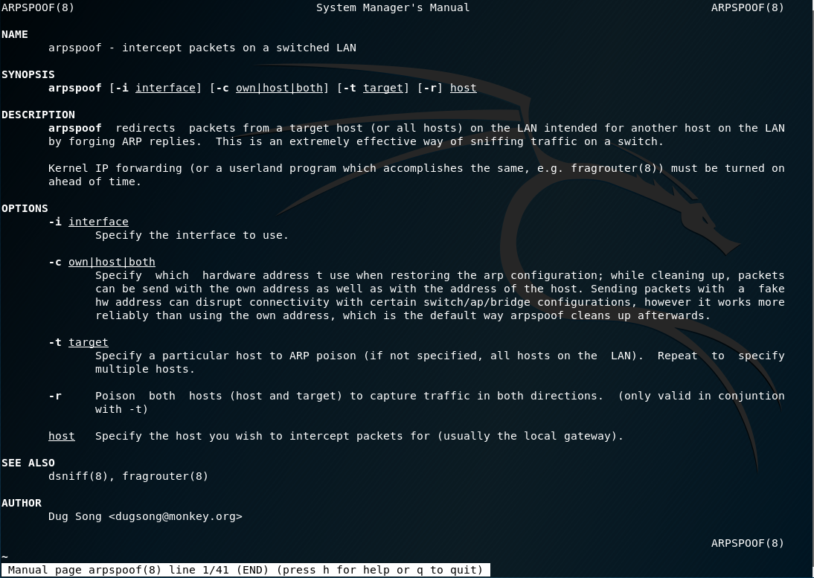

#### 攻击
**攻击者**

使用工具`arpspoof`对靶机arp表进行污染，对IP地址为192.168.56.101发送arp响应，声称192.168.56.102（网关）的MAC地址是攻击者的MAC地址

```bash
arpspoof -i eth0 -t 192.168.56.101 192.168.56.102
```

同时进行arp表污染和抓包，抓包结果如下

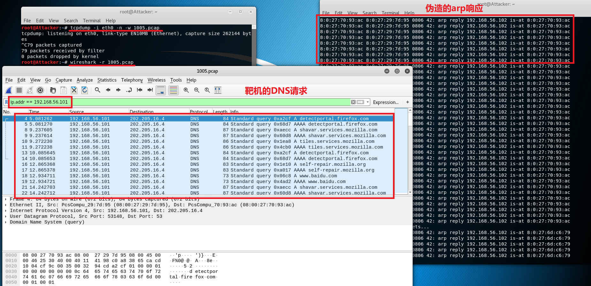

**靶机**

arp表被污染，无法正常上网

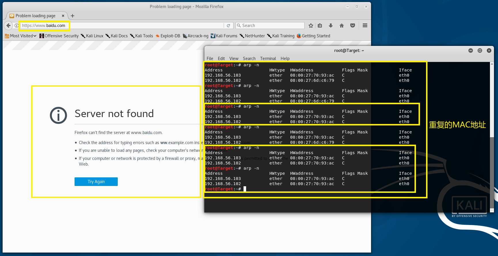

### 总结
- 通过`arpspoof`可以污染靶机的arp表，使其无法正常上网
- arp缓存表定时更新，被污染的arp一会儿就变正常了，因此实验时是一边发送arp响应一边进行抓包
- 如果要实现中间人攻击还需要将靶机的数据包进行转发