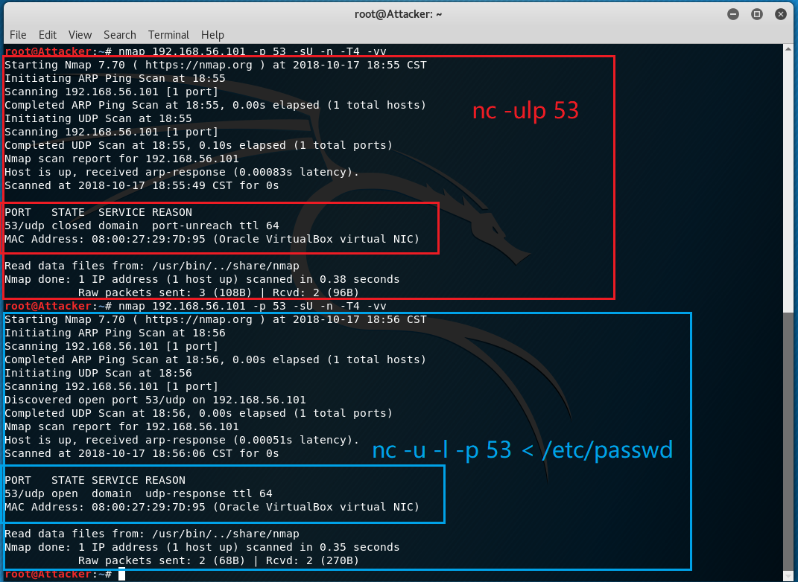

## netcat

### 选项
- `nmap 192.168.56.101 -p 53 -sU -n -T4 -vv`
    - `-p`  指定端口
    - `-sU` 扫描UDP端口
    - `-n`  不解析域名
    - `-T4` 设置速度
    - `-vv` 显示详细信息

- `nc -ulp 53`
- `nc -u -l -p 53 < /etc/passwd` 
    - `-u`  UDP
    - `-l`  监听
    - `-p`  端口

### 作用
`nc -ulp 53` 监听udp/53端口，但不建立连接
> Used to specify that nc should listen for an incoming connection rather than initiate a connection to a remote host. 

`nc -u -l -p 53 < /etc/passwd` 开启文件传输，发送`/etc/passwd`文件，因此端口是“打开”状态

端口关闭时，返回了一个ICMP数据包；端口开启后，有了UDP响应

## 关于`/etc/passwd`文件

看起来是一个记录用户信息的文件
> /etc/passwd 文件以冒号分隔，它包含以下信息：
> - 用户名
> - 已加密密码
> - 用户标识号 (UID)
> - 用户的组标识号 (GID)
> - 用户全名 (GECOS)
> - 用户主目录
> - 登录 shell

- [IBM 使用 /etc/passwd 文件](https://www.ibm.com/support/knowledgecenter/zh/ssw_aix_71/com.ibm.aix.security/passwords_etc_passwd_file.htm)

#### putty

多块网卡的dhcp服务器似乎是杠上了，暂时还没给虚拟机配好