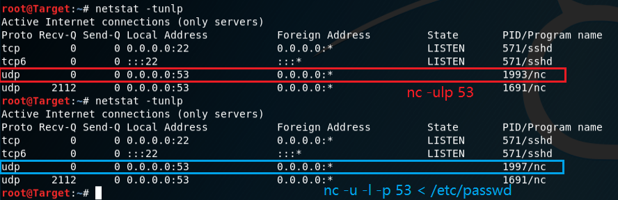
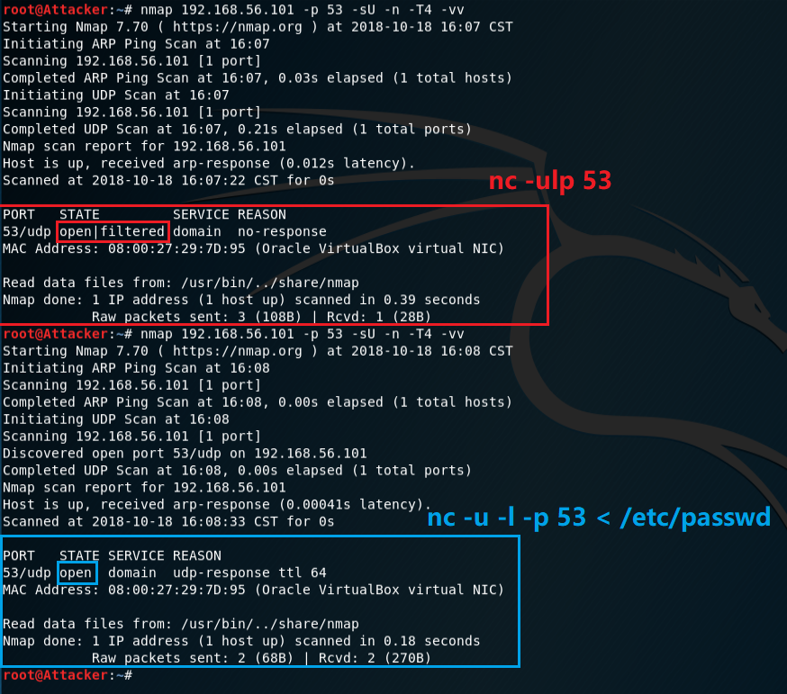
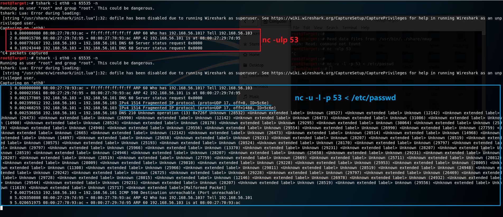
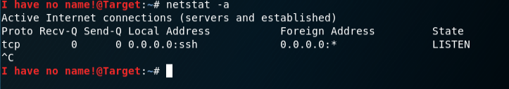
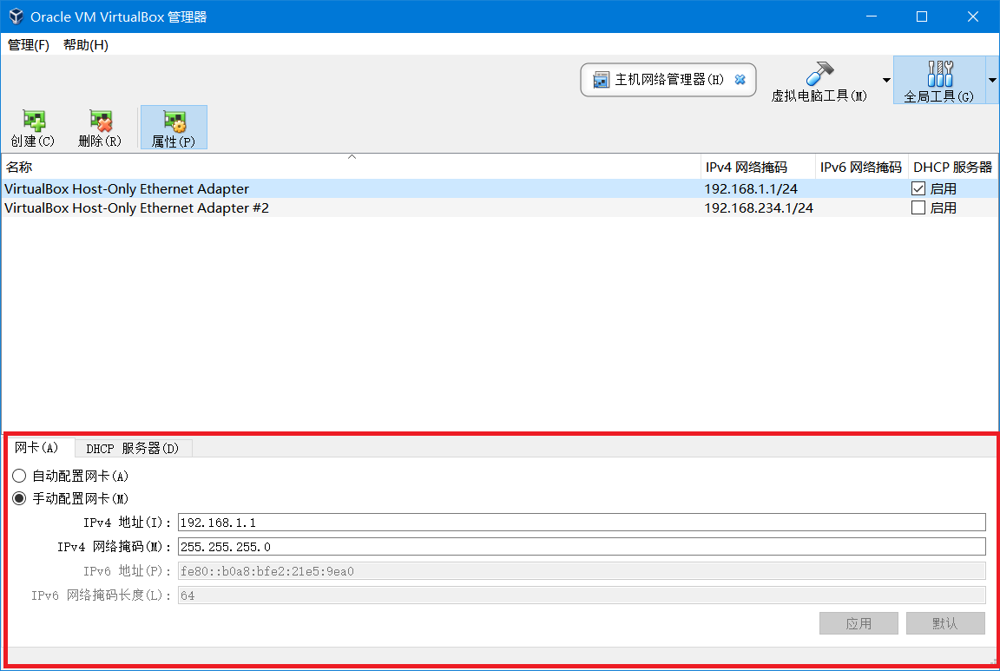
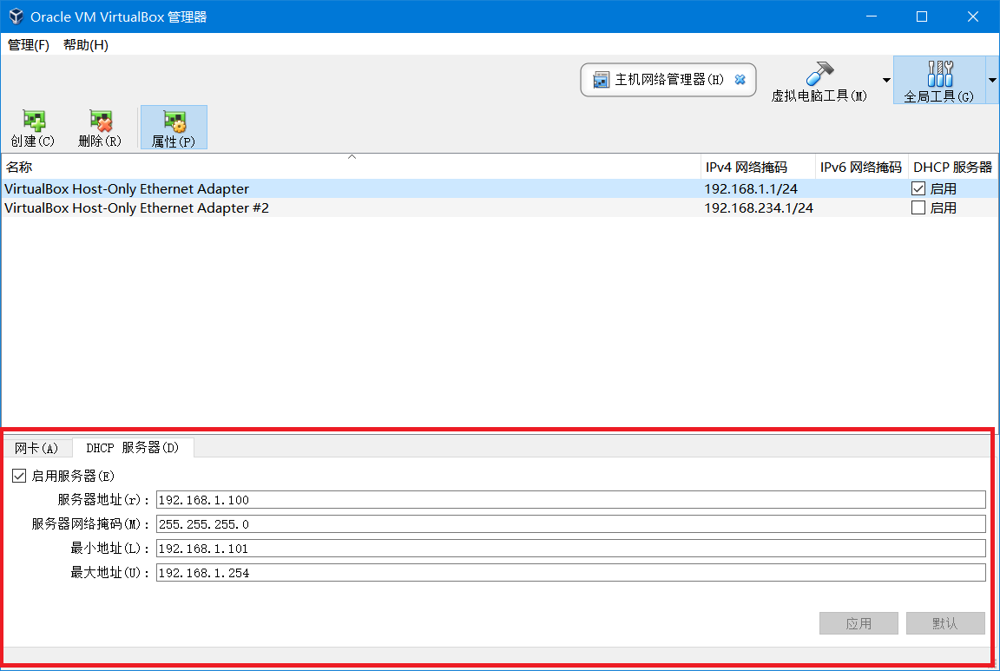
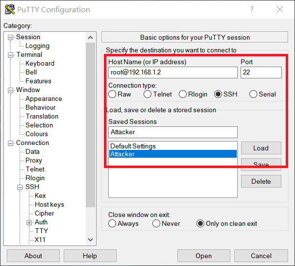

## netcat

### 选项
```bash
nmap 192.168.56.101 -p 53 -sU -n -T4 -vv
# -p    指定端口
# -sU   扫描UDP端口
# -n    不解析域名
# -T4   设置速度
# -vv   显示详细信息
```

```bash
nc -ulp 53
nc -u -l -p 53 < /etc/passwd
# -u    UDP
# -l    监听
# -p    端口
```

### 第一次实验结果
`nc -ulp 53` 监听udp/53端口，但不建立连接
> Used to specify that nc should listen for an incoming connection rather than initiate a connection to a remote host. 

`nc -u -l -p 53 < /etc/passwd` 开启文件传输，发送 `/etc/passwd` 文件，因此端口是“打开”状态

端口关闭时，返回了一个ICMP数据包；端口开启后，有了UDP响应


### 第二次实验结果
#### 端口状态
从图中看不出两个指令的差别，都是开启了53端口，但是状态未知



#### 扫描结果
本次试验的结果是 open|filtered 和 open
- 经过nmap扫描后，显示的结果是 no-response 而不是 port-unreach
- 不使用 `nc` 监听时也显示 open|filtered



#### 抓包结果
从这里可以看出通过UDP数据包发送 `/etc/passwd` 中的内容，至于那一长串的未定义操作和标签，是因为在这里使用了DNS的53端口来发送UDP数据包，所以 tshark 没能正确解析数据包的格式

> Malformed packet means that the protocol dissector can't dissect the contents of the packet any further. There can be various reasons: Wrong dissector: Wireshark erroneously has chosen the wrong protocol dissector for this packet. This will happen e.g. if you are using a protocol not on its well known TCP or UDP port.
> 
> Refer: [Appendix A. Wireshark Messages](https://www.wireshark.org/docs/wsug_html_chunked/AppMessages.html)



## 关于 `/etc/passwd` 文件

看起来是一个记录用户信息的文件，内容对应以下结构进行理解即可
> /etc/passwd 文件以冒号分隔，它包含以下信息：
> - 用户名
> - 已加密密码
> - 用户标识号 (UID)
> - 用户的组标识号 (GID)
> - 用户全名 (GECOS)
> - 用户主目录
> - 登录 shell

- 参阅：[IBM 使用 /etc/passwd 文件](https://www.ibm.com/support/knowledgecenter/zh/ssw_aix_71/com.ibm.aix.security/passwords_etc_passwd_file.htm)

#### 实验
当我把 `/etc/passwd` 中的内容愉快地改成了 `hello world` 之后，就会有一个很有意思的信息。

*ps: 做备份√*



## putty

多块网卡的dhcp服务器会杠上！我今天给一台虚拟机配置了一块Host-Only网卡、一块内网网卡，但是它们的ip地址自动配置成了一个网段的，也就是说，Host-Only的DHCP服务器没给虚拟机的Host-Only网卡分配IP等信息。然后我就手动配置了静态IP地址和掩码，putty就可以远程连接了，但是又遇到了Access Denied的问题，经过一番折腾发现是ssh配置没有开启允许root连接。

**注意**：配置网卡时候一定要看仔细清楚网卡的类型

##### 配置
- 手动配置网卡



- 启用服务器



- 配置静态IP地址

```bash
vi /etc/network/interfaces  # 添加Host-Only网卡配置
auto eth0
iface eth0 inet static      # 静态配置
address 192.168.1.2         # IP地址
netmask 255.255.255.0       # 网关
```

- 配置ssh

```bash
systemctl start ssh.service     # 开启服务
systemctl enable ssh.service    # 允许ssh连接
netstat -tulnp | grep 22        # 查看是否开启端口监听
vi /etc/ssh/sshd_config         # 编辑配置文件
Port 22                         # 开放22端口
PermitRootLogin yes             # 添加允许远程使用root登录
service sshd restart            # 重启sshd服务
```

- 配置putty



- 问题

发现的不方便之处就是连接一个虚拟机就得开一个窗口，以及，想要为同一个虚拟机开启多个终端好像是不行的？