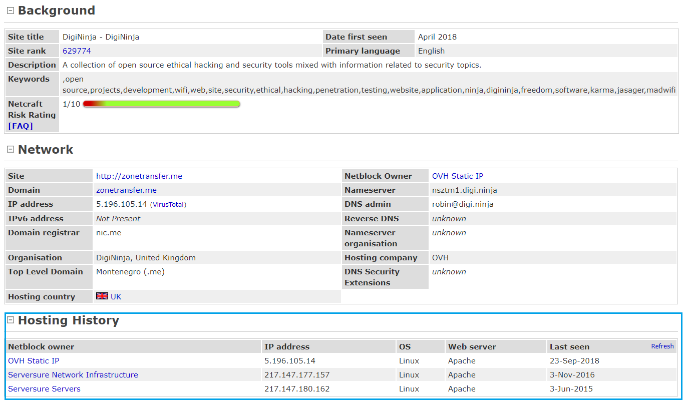
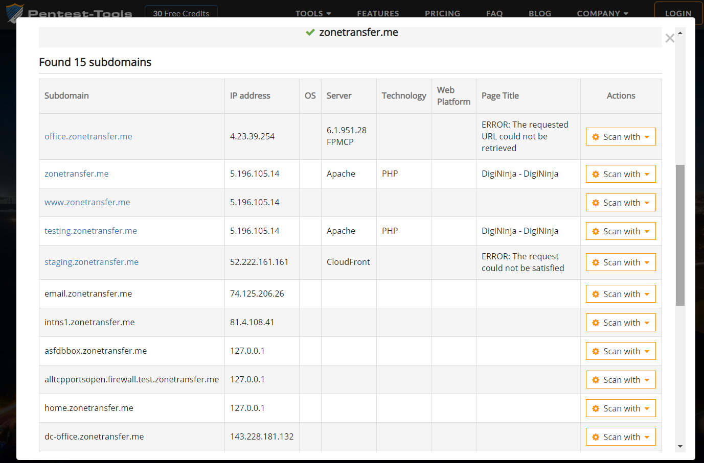

## DNS域传送漏洞及DNS信息收集实例

#### DNS域传送漏洞分析

使用在线域传送漏洞扫描工具 [Zone Transfer Online Test](https://hackertarget.com/zone-transfer/) 对 zonetransfer.me 进行DNS域传输漏洞扫描，返回结果如下
- 其实也就是使用命令 `dig axfr @nsztm2.digi.ninja zonetransfer.me`
    - nsztm2.digi.ninja 是名称服务器（NS）
    - zonetransfer.me 是带扫描的目标域名

```bash
; <<>> DiG 9.10.3-P4-Ubuntu <<>> axfr @nsztm2.digi.ninja zonetransfer.me
; (1 server found)
;; global options: +cmd
zonetransfer.me.	7200	IN	SOA	nsztm1.digi.ninja. robin.digi.ninja. 2017103001 172800 900 1209600 3600
zonetransfer.me.	300	IN	HINFO	"Casio fx-700G" "Windows XP"
zonetransfer.me.	301	IN	TXT	"google-site-verification=tyP28J7JAUHA9fw2sHXMgcCC0I6XBmmoVi04VlMewxA"
zonetransfer.me.	7200	IN	MX	0 ASPMX.L.GOOGLE.COM.
zonetransfer.me.	7200	IN	MX	10 ALT1.ASPMX.L.GOOGLE.COM.
zonetransfer.me.	7200	IN	MX	10 ALT2.ASPMX.L.GOOGLE.COM.
zonetransfer.me.	7200	IN	MX	20 ASPMX2.GOOGLEMAIL.COM.
zonetransfer.me.	7200	IN	MX	20 ASPMX3.GOOGLEMAIL.COM.
zonetransfer.me.	7200	IN	MX	20 ASPMX4.GOOGLEMAIL.COM.
zonetransfer.me.	7200	IN	MX	20 ASPMX5.GOOGLEMAIL.COM.
zonetransfer.me.	7200	IN	A	217.147.177.157
zonetransfer.me.	7200	IN	NS	nsztm1.digi.ninja.
zonetransfer.me.	7200	IN	NS	nsztm2.digi.ninja.
_sip._tcp.zonetransfer.me. 14000 IN	SRV	0 0 5060 www.zonetransfer.me.
157.177.147.217.IN-ADDR.ARPA.zonetransfer.me. 7200 IN PTR www.zonetransfer.me.
asfdbauthdns.zonetransfer.me. 7900 IN	AFSDB	1 asfdbbox.zonetransfer.me.
asfdbbox.zonetransfer.me. 7200	IN	A	127.0.0.1
asfdbvolume.zonetransfer.me. 7800 IN	AFSDB	1 asfdbbox.zonetransfer.me.
canberra-office.zonetransfer.me. 7200 IN A	202.14.81.230
cmdexec.zonetransfer.me. 300	IN	TXT	"; ls"
contact.zonetransfer.me. 2592000 IN	TXT	"Remember to call or email Pippa on +44 123 4567890 or pippa@zonetransfer.me when making DNS changes"
dc-office.zonetransfer.me. 7200	IN	A	143.228.181.132
deadbeef.zonetransfer.me. 7201	IN	AAAA	dead:beaf::
dr.zonetransfer.me.	300	IN	LOC	53 20 56.558 N 1 38 33.526 W 0.00m 1m 10000m 10m
DZC.zonetransfer.me.	7200	IN	TXT	"AbCdEfG"
email.zonetransfer.me.	2222	IN	NAPTR	1 1 "P" "E2U+email" "" email.zonetransfer.me.zonetransfer.me.
email.zonetransfer.me.	7200	IN	A	74.125.206.26
home.zonetransfer.me.	7200	IN	A	127.0.0.1
Info.zonetransfer.me.	7200	IN	TXT	"ZoneTransfer.me service provided by Robin Wood - robin@digi.ninja. See http://digi.ninja/projects/zonetransferme.php for more information."
internal.zonetransfer.me. 300	IN	NS	intns1.zonetransfer.me.
internal.zonetransfer.me. 300	IN	NS	intns2.zonetransfer.me.
intns1.zonetransfer.me.	300	IN	A	81.4.108.41
intns2.zonetransfer.me.	300	IN	A	52.91.28.78
office.zonetransfer.me.	7200	IN	A	4.23.39.254
ipv6actnow.org.zonetransfer.me.	7200 IN	AAAA	2001:67c:2e8:11::c100:1332
owa.zonetransfer.me.	7200	IN	A	207.46.197.32
robinwood.zonetransfer.me. 302	IN	TXT	"Robin Wood"
rp.zonetransfer.me.	321	IN	RP	robin.zonetransfer.me. robinwood.zonetransfer.me.
sip.zonetransfer.me.	3333	IN	NAPTR	2 3 "P" "E2U+sip" "!^.*$!sip:customer-service@zonetransfer.me!" .
sqli.zonetransfer.me.	300	IN	TXT	"' or 1=1 --"
sshock.zonetransfer.me.	7200	IN	TXT	"() { :]}; echo ShellShocked"
staging.zonetransfer.me. 7200	IN	CNAME	www.sydneyoperahouse.com.
alltcpportsopen.firewall.test.zonetransfer.me. 301 IN A	127.0.0.1
testing.zonetransfer.me. 301	IN	CNAME	www.zonetransfer.me.
vpn.zonetransfer.me.	4000	IN	A	174.36.59.154
www.zonetransfer.me.	7200	IN	A	217.147.177.157
xss.zonetransfer.me.	300	IN	TXT	"'>alert('Boo')"
zonetransfer.me.	7200	IN	SOA	nsztm1.digi.ninja. robin.digi.ninja. 2017103001 172800 900 1209600 3600
;; Query time: 2 msec
;; SERVER: 52.91.28.78#53(52.91.28.78)
;; WHEN: Mon Oct 22 02:26:35 UTC 2018
;; XFR size: 48 records (messages 1, bytes 1878)

```

对结果进行如下整理和分析

<br>

```bash
zonetransfer.me.	7200	IN	SOA	nsztm1.digi.ninja. robin.digi.ninja. 2017103001 172800 900 1209600 3600
```
- 指定有关DNS区域的权威信息，包括主名称服务器，域管理员的电子邮件，域序列号以及与刷新区域相关的多个计时器。
    - nsztm1.digi.ninja 主名称服务器
    - robin.digi.ninja 域管理员的电子邮件
    - 2017103001 域序列号
    - 172800 辅助名称服务器在获取主名称服务器数据的请求时间间隔（秒）
    - 900 - 主名称服务器如果无法正确刷新，等待重试的时间间隔（秒）
    - 1209600 - 辅助名称服务器可声明的具有权威信息的时间
    - 3600 - 该域的最小TTL

<br>

```bash
zonetransfer.me.	300	IN	HINFO	"Casio fx-700G" "Windows XP"
```
- 记录并提供计算机或操作系统的类型
    - CPU: Casio fx-700G
    - OS: Windows XP

<br>

```bash
zonetransfer.me.	301	IN	TXT	"google-site-verification=tyP28J7JAUHA9fw2sHXMgcCC0I6XBmmoVi04VlMewxA"
contact.zonetransfer.me. 2592000 IN	TXT	"Remember to call or email Pippa on +44 123 4567890 or pippa@zonetransfer.me when making DNS changes"
DZC.zonetransfer.me.	7200	IN	TXT	"AbCdEfG"
Info.zonetransfer.me.	7200	IN	TXT	"ZoneTransfer.me service provided by Robin Wood - robin@digi.ninja. See http://digi.ninja/projects/zonetransferme.php for more 
information."
robinwood.zonetransfer.me. 302	IN	TXT	"Robin Wood"
cmdexec.zonetransfer.me. 300	IN	TXT	"; ls"
sqli.zonetransfer.me.	300	IN	TXT	"' or 1=1 --"
sshock.zonetransfer.me.	7200	IN	TXT	"() { :]}; echo ShellShocked"
xss.zonetransfer.me.	300	IN	TXT	"'>alert('Boo')"
```
- 文本记录，可能包含最多255个字符的任何信息
    - `google-site-verification` 表示经过google验证
    - 第二个泄露了似乎是管理的员电子邮件/电话
    - 第三个据说是GoDaddy用来检查申请SSL证书的人拥有域的方式
    - 第四个显然是提供了网站的Info信息
    - 最后几个合起来像是一个bash指令

<br>

```bash
zonetransfer.me.	7200	IN	MX	0 ASPMX.L.GOOGLE.COM.
zonetransfer.me.	7200	IN	MX	10 ALT1.ASPMX.L.GOOGLE.COM.
zonetransfer.me.	7200	IN	MX	10 ALT2.ASPMX.L.GOOGLE.COM.
zonetransfer.me.	7200	IN	MX	20 ASPMX2.GOOGLEMAIL.COM.
zonetransfer.me.	7200	IN	MX	20 ASPMX3.GOOGLEMAIL.COM.
zonetransfer.me.	7200	IN	MX	20 ASPMX4.GOOGLEMAIL.COM.
zonetransfer.me.	7200	IN	MX	20 ASPMX5.GOOGLEMAIL.COM.
```
- MX记录表明应该将邮件的发送到那儿，引导到该域名的邮件传输代理（MTA, Message Transfer Agents）列表
    - 这些是Google的标准邮件服务器，表明公司使用GMail或Google Apps来处理他们的电子邮件

<br>

```bash
zonetransfer.me.	7200	IN	NS	nsztm1.digi.ninja.
zonetransfer.me.	7200	IN	NS	nsztm2.digi.ninja.
internal.zonetransfer.me. 300	IN	NS	intns1.zonetransfer.me.
internal.zonetransfer.me. 300	IN	NS	intns2.zonetransfer.me.
```
- 名称服务器保存域的所有其他DNS记录，并告知连接到Internet的所有其他计算机该域所拥有的记录
    - 前两个是我们要扫描的域名的名称服务器
    - 后两个从域名看出是内网的域名和名称服务器

<br>

```bash
asfdbauthdns.zonetransfer.me. 7900 IN	AFSDB	1 asfdbbox.zonetransfer.me.
asfdbvolume.zonetransfer.me. 7800 IN	AFSDB	1 asfdbbox.zonetransfer.me.
_sip._tcp.zonetransfer.me. 14000 IN	SRV	0 0 5060 www.zonetransfer.me.
```
- AFSDB记录用于将域名连接到AFS服务器，提供了数据库位置
    - AFS是网络文件系统，类似于NFS，但更适合处理广域网（如Internet）和本地缓存文件
    - 注意：此记录是实验性的，并未被所有服务识别，并且并非所有名称服务器都能识别或实现它。AFSDB记录类型已弃用，已被SRV记录替换
    - 显然数据库的位置在 asfdbbox.zonetransfer.me 这个域名
- SRV记录是一种使用DNS查找特定域的服务的方法。SRV记录允许使用记录中的优先级和权重值对多个服务器进行内置负载平衡
    - 服务 SIP，协议 tcp，域名 zonetransfer.me
    - TTL 14000，优先级 0 ，服务的权重 0 ，正在监听的端口 5060
    - 提供服务的主机 www.zonetransfer.me

<br>

```bash
zonetransfer.me.	7200	IN	A	217.147.177.157
asfdbbox.zonetransfer.me. 7200	IN	A	127.0.0.1
canberra-office.zonetransfer.me. 7200 IN A	202.14.81.230
dc-office.zonetransfer.me. 7200	IN	A	143.228.181.132
office.zonetransfer.me.	7200	IN	A	4.23.39.254
email.zonetransfer.me.	7200	IN	A	74.125.206.26
home.zonetransfer.me.	7200	IN	A	127.0.0.1
intns1.zonetransfer.me.	300	IN	A	81.4.108.41
intns2.zonetransfer.me.	300	IN	A	52.91.28.78
owa.zonetransfer.me.	7200	IN	A	207.46.197.32
alltcpportsopen.firewall.test.zonetransfer.me. 301 IN A	127.0.0.1
vpn.zonetransfer.me.	4000	IN	A	174.36.59.154
www.zonetransfer.me.	7200	IN	A	217.147.177.157
```
- A记录只是将主机名映射到IPv4地址
    - zonetransfer.me 是我们扫描的域名
    - asfdbbox 域名表示数据库的IP地址
    - 含有office字段的域名显然指的是办公地点，可以从域名推测出地址，其中就有Canberra和DC
    - email 邮件域名服务器
    - home 可能是主页
    - intns 内网名称服务器地址
    - owa 通常代表Outlook Web Access，上面MX记录表示使用google邮箱，这就有矛盾了
    - firewall.test 可能是用于防火墙测试
    - vpn 可能公司人员使用vpn进行连接
    - www 主站点

<br>

```bash
deadbeef.zonetransfer.me. 7201	IN	AAAA	dead:beaf::
ipv6actnow.org.zonetransfer.me.	7200 IN	AAAA	2001:67c:2e8:11::c100:1332
```
- 与A记录完全相同的方式，指向IPv6地址

<br>

```bash
157.177.147.217.IN-ADDR.ARPA.zonetransfer.me. 7200 IN PTR www.zonetransfer.me.

```
- 和A记录的作用相反，IP地址映射回域。通常用作某些电子邮件程序的垃圾邮件验证，以确认邮件服务器确实有权使用该电子邮件来自的域。PTR记录通常必须由服务器（通常是服务器主机）的IP地址所有者定义
    - 可以用于反向DNS查找

<br>

```bash
email.zonetransfer.me.	2222	IN	NAPTR	1 1 "P" "E2U+email" "" email.zonetransfer.me.zonetransfer.me.
sip.zonetransfer.me.	3333	IN	NAPTR	2 3 "P" "E2U+sip" "!^.*$!sip:customer-service@zonetransfer.me!" .
```
- 常用于Internet电话（或VoIP）服务，可用于通过SRV记录将VoIP用户的电话号码和电子邮件地址映射到SIP服务器以发起呼叫
    - email服务
    - sip服务

<br>

```bash
dr.zonetransfer.me.	300	IN	LOC	53 20 56.558 N 1 38 33.526 W 0.00m 1m 10000m 10m
```
- 记录了域名的地理信息
    - 经纬度

<br>

```bash
staging.zonetransfer.me. 7200	IN	CNAME	www.sydneyoperahouse.com.
testing.zonetransfer.me. 301	IN	CNAME	www.zonetransfer.me.
```
- 主机名字的别名
    - staging 看起来像是个登录站点
    - testing 似乎是个测试站点

<br>

```bash
rp.zonetransfer.me.	321	IN	RP	robin.zonetransfer.me. robinwood.zonetransfer.me.
```
- 记录了有关域名负责人的信息；也可能被用于指定有关的主机、子网或其他域级别标签的不同联系点的信息
    - 负责人可能叫robinwood

#### 信息收集

针对刚才的站点进行信息收集

##### WHOIS信息

使用 [域名信息查询（WHOIS）](https://whois.aliyun.com) 查询目标站点


##### 站点信息

使用 netcraft 的 [Lookup another URL:](https://toolbar.netcraft.com/site_report) 对目标站点进行扫描


使用 [微步在线威胁情报社区工具](https://x.threatbook.cn/) 对目标站点进行扫描

 

##### DNS信息
从WHOIS信息中就可以看出该站点有两个NS服务器，分别是 nsztm1.digi.ninja 和 nsztm2.digi.ninja ，当然也可以使用 `dig` 或者 `nklookup` 来查看该站点的名称服务器

接下来使用在线的站点分析工具对目标站点进行分析，还可以将得到的不同结果进行对比

采集了部分信息之后，针对主域名进行其子域名的枚举，可以使用 `dnsenum` 、 `fierce` 之类的工具，也可以直接使用在线工具 [Pentest Tools](https://pentest-tools.com/information-gathering/find-subdomains-of-domain#)
- 同时进行了反向地址解析，甚至提供了不同方式的端口扫描



#### 总结
- 信息收集并不一定要自己使用各种命令进行，如果自己进行扫描收集的话，一是不清楚是否触犯了某些规则条例，二是自己的技术不一定保证能够获得想要的信息
- 现在可能不容易找到DNS域传送漏洞，但是 zonetransfer.me 提供开放漏洞值得用来学习和测试

#### 参阅
- [ZoneTransfer.me](https://digi.ninja/projects/zonetransferme.php)
- [DNS record types](https://en.wikipedia.org/wiki/List_of_DNS_record_types)