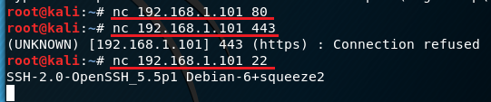

## SQL注入 Webshell

整个实验根据在线教程的流程走就能顺利进行√ WebGoat上也包含一些SQL注入实验√

### 环境配置
虚拟机1（受害者/服务器） Debian SQL - Host-only网卡

虚拟机2（攻击者） Kali - Host-only网卡

### 端口/系统信息采集

查看网卡信息 `ifconfig`


扫描网段 `netdiscover -r 192.168.1.0/24`


获取服务器开放端口及系统信息


尝试远程连接
- 这里的80端口其实是开启的，但是始终无法连上


再次进行尝试
- 端口协议不匹配
    - `telnet` 明文传输数据
    - `ssh` 加密


使用 `nc` 获得的连接结果相同



### 网站信息采集

访问目标网址


对网页源码进行分析，这里令人感兴趣的是各个链接，显然后台使用的是php


尝试访问链接


猜测其他图片，发现错误信息返回的还不少


暴力检测 Web 服务器上的目录和页面（使用 wfuzz）


```bash
wfuzz -c -z file,wordlist/general/big.txt --hc 404 http://192.168.1.101/FUZZ
# -c    高亮
# -z file,wordlist/general/big.txt  爆破字典
# --hc 404  忽略404响应
# http://192.168.1.101/FUZZ 用字典值替换FUZZ
```


### SQL注入

#### 测试

对 cat.php 进行SQL注入测试，显示了所有图片，说明存在漏洞


使用 UNION ，枚举字段数（列数）


使用ORDER BY ，枚举字段数（列数）


#### 信息获取

尝试后发现只有在UNION的第二列才能显示信息

数据库版本信息


当前用户信息


当前使用的数据库信息


MYSQL5 开始包含数据库、表、列的[元信息 (meta information)](https://www.google.com/search?q=mysql+meta+information&oq=mysql+meta+information)

所有的表名称


所有的列名称


表和对应的列名称


查找是否有密码字段


 users 表信息


### 登录后台

在线破解MD5


使用john破解
- 查看支持的模式，准备必要的密码文件


找一个密码字典尝试破解


未果，尝试使用Kali内置的其他字典
- 截图前已爆破成功，这里就直接进行展示


获取用户名、密码后，尝试登录后台
- 这里的 `new.php` 可以用来上传Webshell


### Webshell

构建Webshell文件，执行 GET 请求中 cmd 参数的值 


尝试上传php文件


上传失败，说明该网站禁止了直接上传php


修改文件名，尝试绕过检测


上传成功，点击 Home 查看最新图片


测试 Webshell


系统用户信息


系统版本信息


列出目录下的文件


php信息


php配置文件中特定的设置


### 参阅
- [模糊测试 Fuzz ](https://en.wikipedia.org/wiki/Fuzzing)
- [From SQL Injection to Shell](https://pentesterlab.com/exercises/from_sqli_to_shell/course)
- [使用 /etc/passwd 文件](https://www.ibm.com/support/knowledgecenter/zh/ssw_aix_71/com.ibm.aix.security/passwords_etc_passwd_file.htm)