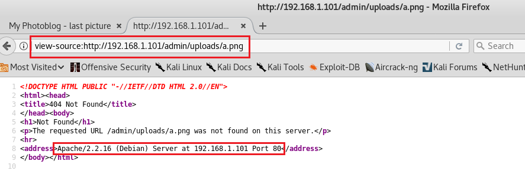
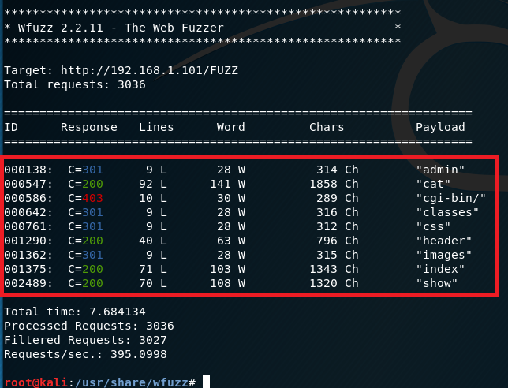
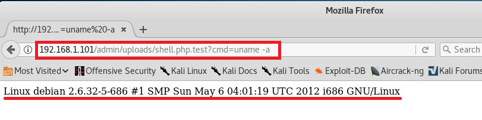

## SQL注入 Webshell

整个实验根据在线教程的流程走就能顺利进行√ WebGoat上也包含一些SQL注入实验√

### 环境配置


虚拟机1（受害者/服务器） Debian SQL - Host-only网卡

虚拟机2（攻击者） Kali - Host-only网卡

准备一台Kali虚拟机用作攻击者，Kali自带的攻击工具足够丰富

下载 ISO 镜像，实际上是一个 Debian 服务器，然后用该镜像新建虚拟机
- 安装完毕后长这样，不用疑惑，就是一个控制台↓
- 用 `clear` 命令清了个屏


### 端口/系统信息采集

查看网卡信息 `ifconfig`


扫描网段 `netdiscover -r 192.168.1.0/24`


获取服务器开放端口及系统信息


尝试远程连接
- 这里连接80端口的时候忘记发送请求


使用 `telnet` 和 `nc` 进行连接
- 获得的结果相同√


再次进行尝试
- 端口协议不匹配
    - `telnet` 明文传输数据
    - `ssh` 加密


使用 `openssl` 进行连接
- 似乎是版本不匹配


### 网站信息采集

访问目标网址


对网页源码进行分析，这里令人感兴趣的是各个链接，显然后台使用的是php


尝试访问链接


猜测其他图片，发现错误信息返回的还不少



暴力检测 Web 服务器上的目录和页面（使用 wfuzz）


```bash
wfuzz -c -z file,wordlist/general/big.txt --hc 404 http://192.168.1.101/FUZZ
# -c    高亮
# -z file,wordlist/general/big.txt  爆破字典
# --hc 404  忽略404响应
# http://192.168.1.101/FUZZ 用字典值替换FUZZ
```



### SQL注入

#### 测试

对 cat.php 进行SQL注入测试，显示了所有图片，说明存在漏洞


使用 UNION ，枚举字段数（列数）


使用ORDER BY ，枚举字段数（列数）


#### 信息获取

尝试后发现只有在UNION的第二列才能显示信息

数据库版本信息


当前用户信息


当前使用的数据库信息


MYSQL5 开始包含数据库、表、列的[元信息 (meta information)](https://www.google.com/search?q=mysql+meta+information&oq=mysql+meta+information)

所有的表名称


所有的列名称


表和对应的列名称


查找是否有密码字段


 users 表信息


### 登录后台

在线破解MD5


使用john破解
- 查看支持的模式，准备必要的密码文件


找一个密码字典尝试破解


未果，尝试使用Kali内置的其他字典
- 截图前已爆破成功，这里就直接进行展示


获取用户名、密码后，尝试登录后台
- 这里的 `new.php` 可以用来上传Webshell


### Webshell

构建Webshell文件，执行 GET 请求中 cmd 参数的值 


尝试上传php文件


上传失败，说明该网站禁止了直接上传php


修改文件名，尝试绕过检测


上传成功，点击 Home 查看最新图片


测试 Webshell


系统用户信息


系统版本信息



列出目录下的文件


php信息


php配置文件中特定的设置


查看网卡信息
- 直接使用 `cmd=ifconfig` 是没有结果的，需要到安装路径下调用(←不知道说法是否妥当)

Google搜索


Bingo


### sqlmap
打开 Kali 内置的 sqlmap


根据帮助信息尝试使用
- 找一下 sqlmap 在哪里


输出结果，包含服务器信息以及SQL注入点


使用 `Enumeration` 中的选项进行信息获取
- 我就是一看有all选项就用 `-a` 的人，输出特别多多多多多
- **请大家按需选择参数选项**

```bash
        ___
       __H__
 ___ ___[.]_____ ___ ___  {1.2.9#stable}
|_ -| . ["]     | .'| . |
|___|_  [(]_|_|_|__,|  _|
      |_|V          |_|   http://sqlmap.org

Usage: python sqlmap [options]

Options:
  -h, --help            Show basic help message and exit
  -hh                   Show advanced help message and exit
  --version             Show program's version number and exit
  -v VERBOSE            Verbosity level: 0-6 (default 1)

  Target:
    At least one of these options has to be provided to define the
    target(s)

    -u URL, --url=URL   Target URL (e.g. "http://www.site.com/vuln.php?id=1")
    -g GOOGLEDORK       Process Google dork results as target URLs

  Request:
    These options can be used to specify how to connect to the target URL

    --data=DATA         Data string to be sent through POST
    --cookie=COOKIE     HTTP Cookie header value
    --random-agent      Use randomly selected HTTP User-Agent header value
    --proxy=PROXY       Use a proxy to connect to the target URL
    --tor               Use Tor anonymity network
    --check-tor         Check to see if Tor is used properly

  Injection:
    These options can be used to specify which parameters to test for,
    provide custom injection payloads and optional tampering scripts

    -p TESTPARAMETER    Testable parameter(s)
    --dbms=DBMS         Force back-end DBMS to provided value

  Detection:
    These options can be used to customize the detection phase

    --level=LEVEL       Level of tests to perform (1-5, default 1)
    --risk=RISK         Risk of tests to perform (1-3, default 1)

  Techniques:
    These options can be used to tweak testing of specific SQL injection
    techniques

    --technique=TECH    SQL injection techniques to use (default "BEUSTQ")

  Enumeration:
    These options can be used to enumerate the back-end database
    management system information, structure and data contained in the
    tables. Moreover you can run your own SQL statements

    -a, --all           Retrieve everything
    -b, --banner        Retrieve DBMS banner
    --current-user      Retrieve DBMS current user
    --current-db        Retrieve DBMS current database
    --passwords         Enumerate DBMS users password hashes
    --tables            Enumerate DBMS database tables
    --columns           Enumerate DBMS database table columns
    --schema            Enumerate DBMS schema
    --dump              Dump DBMS database table entries
    --dump-all          Dump all DBMS databases tables entries
    -D DB               DBMS database to enumerate
    -T TBL              DBMS database table(s) to enumerate
    -C COL              DBMS database table column(s) to enumerate

  Operating system access:
    These options can be used to access the back-end database management
    system underlying operating system

    --os-shell          Prompt for an interactive operating system shell
    --os-pwn            Prompt for an OOB shell, Meterpreter or VNC

  General:
    These options can be used to set some general working parameters

    --batch             Never ask for user input, use the default behavior
    --flush-session     Flush session files for current target

  Miscellaneous:
    --sqlmap-shell      Prompt for an interactive sqlmap shell
    --wizard            Simple wizard interface for beginner users

[!] to see full list of options run with '-hh'
```

虽然用 `-a` 参数跑了好一会儿，但是顺手就爆破了一下密码，而且收获非常丰厚
- 在当前权限下，爬取所有数据表（包含字段设定，各个表项）
- 检测到哈希字段，提供爆破


### 参阅
- [模糊测试 Fuzz ](https://en.wikipedia.org/wiki/Fuzzing)
- [From SQL Injection to Shell](https://pentesterlab.com/exercises/from_sqli_to_shell/course)
- [使用 /etc/passwd 文件](https://www.ibm.com/support/knowledgecenter/zh/ssw_aix_71/com.ibm.aix.security/passwords_etc_passwd_file.htm)
- [2018-NS-Public-tclhh/ns-exp7/实验七 从SQL注入到Shell.md](https://github.com/CUCCS/2018-NS-Public-tclhh/blob/ns-exp7/ns-exp7/%E5%AE%9E%E9%AA%8C%E4%B8%83%20%E4%BB%8ESQL%E6%B3%A8%E5%85%A5%E5%88%B0Shell.md)