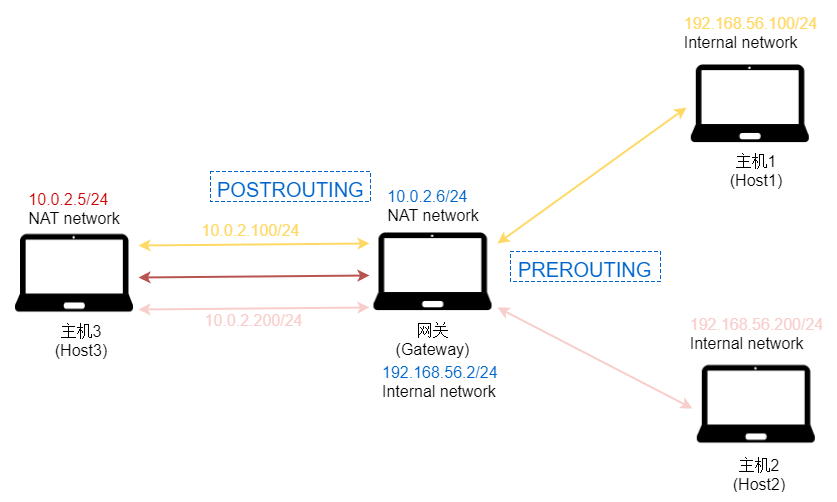
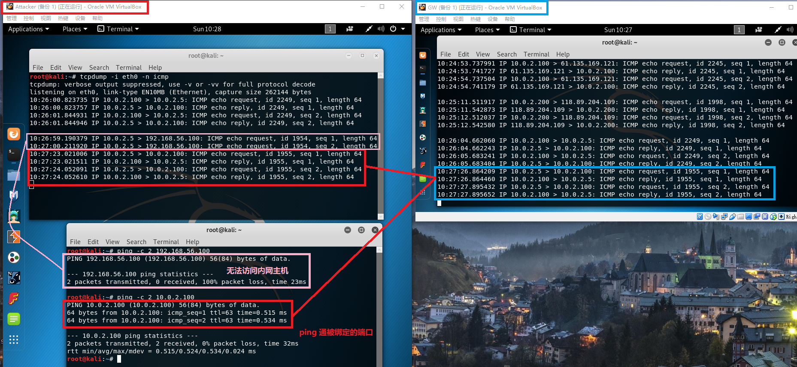
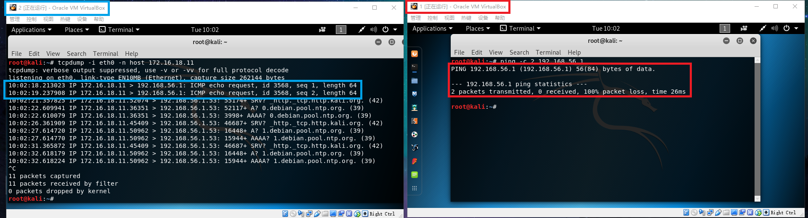

## iptables

日常回顾 VirtualBox 网络连接方式


### 实验一：使用 ufw 配置单机防火墙

#### 实验拓扑结构

实验一至实验四都是在该实验环境（拓扑结构）下完成


网关的 ip 地址，可以 ping 通攻击者


攻击者的 ip 地址，可以 ping 通网关


#### 下载并启用 ufw

```bash
# 安装 ufw
sudo apt-get install ufw

# 开启防火墙
sudo ufw enable

# 关闭外部对主机的所有访问，本机访问外部正常
sudo ufw default deny
```
查看防火墙（默认 filter 表） `iptables -L -n`
- 可以看到 ufw 在表中自定义了许多条链

[](ufw/iptables)

开启 apache 服务 `service apache2 start`

#### 端口开放与关闭

在网关没有使用防火墙前，80端口正常访问


22端口也可以访问
- 因为之前在宿主机上使用 putty （胡乱）配置过 ssh ，参见 [putty](https://github.com/CUCCS/2018-NS-Public-jckling/blob/ns-0x05/ns-0x05/nc.md#putty)


##### 网关防火墙设置

禁止入站 `sudo ufw default deny`


允许外部访问80端口 `sudo ufw allow 80`


禁止外部访问80端口 `sudo ufw delete 80`


允许特定IP访问本机所有端口 `sudo ufw allow from 192.168.1.6`


拒绝所有 TCP 协议的流量从 192.168.1.0/24 到 192.168.1.3 的 22 端口，即对此网段关闭 22 端口
- 先删除 `allow from 192.168.1.3` 规则，再添加此规则

```bash
sudo ufw deny proto from 192.168.1.0/24 to 192.168.1.3 port 22
```


#### 配置 proftpd

参考[示例配置](https://sec.cuc.edu.cn/huangwei/textbook/ns/chap0x08/exp.html#%E9%99%84%EF%BC%9Aproftpd-%E7%9A%84%E4%B8%80%E4%B8%AA%E7%A4%BA%E4%BE%8B%E9%85%8D%E7%BD%AE%E6%96%87%E4%BB%B6)，以及官方给出的[匿名访问配置](http://www.proftpd.org/docs/configs/anonymous.conf)，对默认配置文件进行修改

```bash
<Anonymous ~ftp>
    User            ftp
    Group           ftp

......

<Directory *>
    <Limit WRITE>
        DenyAll
    </Limit>
</Directory>
<Directory download/*>
    <Limit Read>
        AllowAll
    </Limit>
</Directory>

</Anonymous>
```

详细的操作步骤如下

```bash
# 添加组
groupadd ftp

# 修改配置文件
vi /etc/proftpd/proftpd.conf

# 启动 proftpd
service proftpd restart

# ftp默认路径
cd /srv/ftp

# 新建文件夹
mkdir dowmload

# 修改文件夹权限（权限有待考究）
chomd -R 777 dowmload
```

此时，已经可以在攻击者主机上访问网关的ftp： `ftp://192.168.1.103` 以及相应的 download 目录


因为使用 Host-only 网卡，也可以直接用宿主机进行访问


### 实验二：iptables 基本使用

#### 还原配置

关闭 ufw 清空 iptables

```bash
# 关闭 ufw
sudo ufw disable

# 删除规则、表，即重置 iptables
iptables --delete-chain
iptables --flush
```

当前攻击者与网关之间的网络连接情况
- 攻击者可以 ping 通网关
- 攻击者可以访问网关
- 攻击者可以使用网关 ftp


#### iptables 配置

##### 传输层

禁止其它机器通过ssh连接自己

```bash
# 丢弃协议为 tcp 目标端口为 22 的数据包
iptables -t filter -A INPUT -p tcp --dport 22 -j DROP
```


防止各种端口扫描

```bash
# 限制 tcp 协议的 SYN 数据包每秒一次
iptables -A FORWARD -p tcp --tcp-flags SYN,ACK,FIN,RST RST -m limit --limit 1/s -j ACCEPT

# --limit 1/s 表示每秒一次; 1/m 则为每分钟一次
```


使用 namp 扫描照样扫(?)
- TCP Connect 扫描


禁止使用FTP协议下载（即封闭TCP协议的21端口）

```bash
# 丢弃协议为 tcp 源端口为 21 的数据包
iptables -I OUTPUT -p tcp --sprot 21 -j DROP
```


针对 tcp 数据包的 payload 字段进行字符串匹配
- 因为忘记截图所以就直接给出设置和结果

```bash
# 匹配字符串 hello
iptables -p tcp -string bm --string-match hello -j REJECT --reject-with tcp-reset
```


##### 网络层

拒绝特定源 ip 地址的 icmp 请求数据包

```bash
# 限制ping的并发数，每秒一次（防止 ping 洪水攻击）
# 未使用
iptables -A FORWARD -p icmp --icmp-type echo-request -m limit --limit 1/s -j ACCEPT

# 拒绝特定 ip 的 icmp 请求数据包，并返回响应信息
iptables -I INPUT -p icmp --icmp-type echo-request -j REJECT
```


攻击者可以访问网关（apache服务、ftp服务），无法 ping 通网关（收到 unreachable 响应）


禁止特定源 ip 访问
- 网关无法接收到该特定 ip 的 icmp 响应数据包，因为在 filter 表的 INPUT 链已经被丢弃

```bash
# 限制特定ip的访问，即丢弃源ip地址为特定ip的数据包
iptables -A INPUT -s 192.168.56.106 -j DROP
```


攻击者无法访问网关，也无法 ping 通网关


##### 数据链路层

阻断来自某个mac地址的数据包

```bash
# 限制特定mac地址的访问，丢弃源mac地址为特定mac地址的数据包
iptables -A INPUT -m mac --mac-source 00:1e:ec:f0:ae:77 -j DROP
```


攻击者无法访问网关，也无法 ping 通网关


##### iptables配置清单

```bash
#!/bin/bash

# iptables script generated 2011-10-13
# http://www.mista.nu/iptables

IPT="/sbin/iptables"

# Flush old rules, old custom tables
$IPT --flush
$IPT --delete-chain

# Set default policies for all three default chains
$IPT -P INPUT DROP
$IPT -P FORWARD DROP
$IPT -P OUTPUT ACCEPT

# Enable free use of loopback interfaces
$IPT -A INPUT -i lo -j ACCEPT
$IPT -A OUTPUT -o lo -j ACCEPT

# All TCP sessions should begin with SYN
$IPT -A INPUT -p tcp ! --syn -m state --state NEW -s 0.0.0.0/0 -j DROP

# Block 'Bad String'
$IPT -A INPUT -p tcp -m string --algo bm --string 'cnssisbad' -j REJECT --reject-with tcp-reset

# Accept inbound TCP packets
$IPT -A INPUT -m state --state ESTABLISHED,RELATED -j ACCEPT
$IPT -A INPUT -p tcp --dport 22 -m state --state NEW -s 0.0.0.0/0 -j ACCEPT
$IPT -A INPUT -p tcp --dport 80 -m state --state NEW -s 0.0.0.0/0 -j ACCEPT

# Accept inbound TCP packets
$IPT -A INPUT -m state --state ESTABLISHED,RELATED -j ACCEPT
$IPT -A INPUT -p tcp --dport 22 -m state --state NEW -s 0.0.0.0/0 -j DROP
# 通过在源和目的主机(防火墙所在主机)上抓包，对比DROP和REJECT指令在防火墙响应行为上的差异
# DROP无响应，REJECT返回响应（可自定义回复--reject-with icmp-port-unreachable）

# Block a specific IP address
$IPT -A INPUT -p IP -s 192.168.56.1 -j DROP

# Allow FTP connection and transfer
$IPT -A INPUT -p tcp --dport 21 -m state --state NEW -s 0.0.0.0/0 -j ACCEPT
$IPT -A INPUT -p tcp --sport 49152:65534 --dport 49152:65534 -m state --state NEW -j ACCEPT

# DROP inbound ICMP messages
$IPT -A INPUT -p ICMP --icmp-type 8 -s 0.0.0.0/0 -j DROP
```

### 实验三：iptables 实现 NAT

#### SNAT 与 DNAT
在网关上配置 SNAT 规则

```bash
# 对从本机发出的数据包，如果源地址为 192.168.1.0/24 网段，则改为 1.2.3.4
iptables -t nat -A POSTROUTING -s 192.168.1.0/24 -j SNAT --to 1.2.3.4
```


在攻击者主机上抓包查看，从网关发来的 icmp 数据包的源 ip 地址被改为 1.2.3.4
- 网关没有接收到响应，因为攻击者不知道 ip 地址为 1.2.3.4 的主机在哪（数据包被丢弃）


继续在网关上添加 DNAT 规则
- 此时依然 ping 不通攻击者，因为攻击者仍然不知道 ip 地址为 1.2.3.4 的主机在哪（数据包被丢弃）

```bash
# 对从 eth2 网卡接收到的数据包，如果目标地址为 1.2.3.4/24 则改为 192.168.1.3
iptables -t nat -A PREROUTING -d 1.2.3.4/24 -i eth2 -j DNAT --to 192.168.1.3
```


将攻击者主机的默认网关设置为这里的网关 `route add default gateway 192.168.1.3`
- 现在网关可以 ping 通攻击者了


为什么会有 **1.2.3.5** 这个地址的响应，而且可以通过浏览器访问 **1.2.3.0/24** 网段（icmp 同样） 
- 按照配置的 DNAT 规则，所有目标地址为 1.2.3.0/24 网段的数据包，目标地址将被改为 192.168.1.3
- 按照配置的 SNAT 规则，所有源地址为 1.2.3.0/24 网段的数据包，源地址将被改为 1.2.3.4


我猜测是因为接收到的数据包被 DNAT 修改目标地址，被认为是发往本机（网关）的数据包，因此网关做出了响应，但响应的 ip 数据包的源地址是 192.168.1.3 ，并没有被 SNAT 规则改变。而 ICMP 的请求与响应是不看 IP的，只看 Sequence 和 ID的。综上，攻击者就能获得各种响应，但其实都是来自网关的。

#### 实现NAT
##### 实验环境

拓扑结构如图，使用4台虚拟机



##### 实验步骤

各个虚拟机的网卡配置


此时的连通情况，相同连接方式的网卡实现互 ping ，NAT Network 网卡实现上网


在网关上进行 NAT 配置，绑定内网主机到外网接口

```bash
# 添加外网接口
ifconfig eth0 add 10.0.2.100 netmask 255.255.255.0
ifconfig eth0 add 10.0.2.200 netmask 255.255.255.0

# 开启转发
echo 1 > /proc/sys/net/ipv4/ip_forward

# SNAT
iptables -t nat -A POSTROUTING -o eth0 -s 192.168.56.100 -j SNAT --to 10.0.2.100
iptables -t nat -A POSTROUTING -o eth0 -s 192.168.56.200 -j SNAT --to 10.0.2.200

# DNAT
iptables -t nat -A PREROUTING -d 10.0.2.100 -i eth0 -j DNAT --to 192.168.56.100
iptables -t nat -A PREROUTING -d 10.0.2.200 -i eth0 -j DNAT --to 192.168.56.200
```


此时已经实现了 NAT
- 内网主机1、主机2可以访问攻击者所在外网，也可以正常上网
- 攻击者可以通过网关上的【外网接口】访问内网主机


攻击者无法通过内网 ip 地址访问内网主机



### 实验四：防火墙规则调试

#### 网关配置

开启的服务
- apache
- ssh

以下是用于配置 iptables 的脚本文件

```bash
#!/bin/bash

IPT="/sbin/iptables"

$IPT --flush
$IPT --delete-chain

# 自定义链
$IPT -N log_demo

# 使用自定义链
$IPT -A INPUT -j log_demo

# 记录日志
$IPT -A log_demo -j LOG --log-prefix DEBUG_IPT

# 丢弃 payload 字段包含 youbadbad 字符串的数据包
$IPT -A log_demo -p tcp --dport 80 -m string --algo bm --string 'joke' -j DROP

# 拒绝 ICMP 请求（默认--reject-with icmp-port-unreachable）
$IPT -A log_demo -p icmp --icmp-type 8 -s 0.0.0.0/0 -j REJECT

# 数据包跟踪
# PREROUTING (for packets arriving via any network interface)
# OUTPUT (for packets generated by local processes)
$IPT -t raw -A PREROUTING -j TRACE
$IPT -t raw -A OUTPUT -j TRACE
```

iptables 规则备份方法

```bash
# 备份当前防火墙规则到文件
iptables-save > iptables.rules

# 从文件恢复防火墙规则
iptables-restore < iptables.rules
```

配置完毕后，iptables 规则如下


#### 访问网关

攻击者无法 ping 通网关


攻击者可以访问网关(192.168.1.3)，而访问 192.168.1.3/joke 无响应


在攻击者主机上使用 nmap 进行扫描
- [终端的输入输出](firewall/scan)
- [tcpdump 抓包](firewall/tcpdump)

```bash
# 无结果打印，Ctrl+c切断
# List Scan - simply liist targets to scan
nmap -sL 192.168.1.0/24

# Ping Scan
nmap -sn 192.168.1.0/24

# TCP SYN Scan
nmap -sS 192.168.1.3

# TCP Connect() Scan
nmap -sT 192.168.1.3

# 无结果打印，Ctrl+c切断
# UDP Scan
nmap -sU 192.168.1.3

# Enable OS detection
# Probe open ports to determine service/version info
nmap -O -sV 192.168.1.3

# equivalent to --script=default
nmap -sC 192.168.1.3 -p 21

# Enable OS detection, version detection, script scanning, and traceroute
nmap -A 192.168.1.3
```

#### 获取日志

```bash
# 查看概要统计数据
iptables -L -v 
iptables -t raw -L -v

# 将日志文件导出
# Binary file (standard input) matches报错
cat /var/log/syslog | grep -a DEBUG_IPT > DEBUG_IPT
cat /var/log/kern.log | grep -a TRACE > TRACE
```

概要统计如下


无意中发现两个日志文件中的记录有重复，两处的 TRACE 记录相同
- /var/log/syslog ：[DEBUG_IPT](firewall/DEBUG_IPT)、[TRACE](firewall/TRACE)
- /var/log/kern.log ：[TRACE](firewall/TRACE)


### 课外实验

#### 实验拓扑结构

局域网拓扑

```
+----------------------+          +-------------------------+       +----------------------+     
|     host-1           |          |   host-2                |       |     host-3           |  
|     172.16.18.11     |          |   eth0:0 172.16.18.1    |       |     172.16.18.12     |  
|                      |          |   eth0: 192.168.1.123   |       |                      |  
+-------------+--------+          +----------+--------------+       +-------------+--------+  
              |                              |                                    |
              |                              |                                    |
     +--------+------------------------------+--+                                 |
     |                交换机                     |---------------------------------+
     +-----------------+------------------------+
                       |
                       |
                 +-----+-----------+
                 |   eth0          |   `
                 |   192.168.1.1   |
              +--+-----------------+---------+
              |                              |
              |        host-gw / dns-svr     |
              |                              |
              +------------------+----------++
                                 |  eth1    |
                                 +----------+

```

- host-gw 指的是该局域网的网关，已经配置为 NAT 方式，局域网内的主机 host-2 可以正常无障碍访问互联网；
- dns-svr 指的是该局域网中的 DNS 解析服务器，可以正常提供域名解析服务；
- 交换机没有设置 VLAN，所有端口正常工作；
- host-2上配置了 iptables规则；
- host-1上配置了默认网关指向 IP 地址：172.16.18.1，域名解析服务器配置为 IP：192.168.1.1
- host-3上配置了默认网关指向 IP 地址：172.16.18.1，域名解析服务器配置为 IP：192.168.1.1

host2 iptables

```bash
#!/bin/bash

IPT="/sbin/iptables"

# 清空 iptables
$IPT --flush
$IPT --delete-chain

# 定义默认策略
$IPT -P INPUT DROP      # 丢弃输入
$IPT -P FORWARD DROP    # 丢弃转发
$IPT -P OUTPUT ACCEPT   # 允许输出

# 自定义链
$IPT -N forward_demo    # 转发
$IPT -N icmp_demo       # icmp

# 本地回环
$IPT -A INPUT -i lo -j ACCEPT   # 允许本地输入
$IPT -A OUTPUT -o lo -j ACCEPT  # 允许本地输出

# TCP 连接必须从 SYN 包开始
$IPT -A INPUT -p tcp ! --syn -m state --state NEW -s 0.0.0.0/0 -j DROP

# 接受连接建立后的数据包和相关数据包
$IPT -A INPUT -m state --state ESTABLISHED,RELATED -j ACCEPT

# 对 icmp 协议使用 icmp_demo 链规则
$IPT -A INPUT -p icmp -j icmp_demo

# 接受来自 eth0 网卡的 icmp 数据包
$IPT -A icmp_demo -p icmp -i eth0 -j ACCEPT
$IPT -A icmp_demo -j RETURN                 # 停止遍历 icmp_demo 链并返回 INPUT 链

# 对转发数据使用 forward_demo 链
$IPT -A FORWARD -j forward_demo

# 记录日志，名为 FORWARD_DEMO
$IPT -A forward_demo -j LOG --log-prefix FORWARD_DEMO
# 丢弃 payload 字段包含 baidu 字符串的数据包
$IPT -A forward_demo -p tcp --dport 80 -m string --algo bm --string 'baidu' -j DROP
# 接受源/目标地址为 172.16.18.11 的 tcp 数据包
$IPT -A forward_demo -p tcp -s 172.16.18.11 -j ACCEPT
$IPT -A forward_demo -p tcp -d 172.16.18.11 -j ACCEPT
# 接受源地址为 172.16.18.11 或 172.16.18.1 且目标端口为 53 的 udp 数据包
$IPT -A forward_demo -p udp -s 172.16.18.11 --dport 53 -j ACCEPT
$IPT -A forward_demo -p udp -s 172.16.18.1  --dport 53 -j ACCEPT
# 接受源地址为 192.168.1.1 且源端口为 53 的 udp 数据包
$IPT -A forward_demo -p udp -s 192.168.1.1  --sport 53 -j ACCEPT
# 接受源地址为 172.16.18.1 的 tcp 数据包
$IPT -A forward_demo -p tcp -s 172.16.18.1 -j ACCEPT
# 停止遍历 forward_demo 链并返回 FORWARD 链
$IPT -A forward_demo -s 172.16.18.1 -j RETURN

# 开启 NAT 转发，动态分配 IP 地址
$IPT -t nat -A POSTROUTING -s 172.16.18.1/24 -o eth0 -j MASQUERADE
```

#### 对问题的直接回答

根据拓扑结构、iptables配置以及下图，对问题进行回答


- [x] host-1可以ping通ip: 172.16.18.1吗？
    - 输入链 → icmp_demo链
- [x] host-1可以ping通ip: 192.168.1.1吗？
    - 转发链 → forward_demo链
- [x] host-1可以ping通域名: www.baidu.com吗？
    - 转发链 → forward_demo链
- [ ] host-1可以访问： http://www.baidu.com 吗？
    - 转发链 → forward_demo链
- [x] host-1可以访问：http://61.135.169.121 吗？
    - 转发链 → forward_demo链
- [x] host-3可以ping通ip: 172.16.18.1吗？
    - 输入链 → icmp_demo链
- [ ] host-3可以ping通ip: 192.168.1.1吗？
    - 转发链 → forward_demo链
- [ ] host-3可以访问互联网吗？
    - 转发链 → forward_demo链

#### 实验验证
##### 实验环境配置


- 因为 192.168.1.1 和宿主机地址相同，因此用 192.168.56.1 和 192.168.56.123 替换
- 网关配置ip、netmask、gateway
    - 开启 ipv4 转发，配置 NAT
- Host1、Host3 配置ip、netmask、gateway、dns
- Host2 配置ip、netmask、gateway、ipv4_forward、iptables
    - 开启 ipv4 转发，默认设置使用以下 bash 脚本（注意网卡名称）
    - 添加虚拟网卡 `ifconfig eth0 add 172.16.18.1`

```bash
#!/bin/bash

IPT="/sbin/iptables"

$IPT --flush
$IPT --delete-chain
$IPT -t nat --flush

$IPT -P INPUT DROP
$IPT -P FORWARD DROP
$IPT -P OUTPUT ACCEPT

$IPT -N forward_demo
$IPT -N icmp_demo

$IPT -A INPUT -i lo -j ACCEPT
$IPT -A OUTPUT -o lo -j ACCEPT

$IPT -A INPUT -p tcp ! --syn -m state --state NEW -s 0.0.0.0/0 -j DROP

$IPT -A INPUT -m state --state ESTABLISHED,RELATED -j ACCEPT

$IPT -A INPUT -p icmp -j icmp_demo

$IPT -A icmp_demo -p icmp -i eth0 -j ACCEPT
$IPT -A icmp_demo -j RETURN

$IPT -A FORWARD -j forward_demo

$IPT -A forward_demo -j LOG --log-prefix FORWARD_DEMO
$IPT -A forward_demo -p tcp --dport 80 -m string --algo bm --string 'baidu' -j DROP
$IPT -A forward_demo -p tcp -s 172.16.18.11 -j ACCEPT
$IPT -A forward_demo -p tcp -d 172.16.18.11 -j ACCEPT
$IPT -A forward_demo -p udp -s 172.16.18.11 --dport 53 -j ACCEPT
$IPT -A forward_demo -p udp -s 172.16.18.1  --dport 53 -j ACCEPT
$IPT -A forward_demo -p udp -s 192.168.56.1  --sport 53 -j ACCEPT
$IPT -A forward_demo -p tcp -s 172.16.18.1 -j ACCEPT
$IPT -A forward_demo -s 172.16.18.1 -j RETURN

$IPT -t nat -A POSTROUTING -s 172.16.18.1/24 -o eth0 -j MASQUERADE
```

配置完毕后各主机的网卡信息如下


Host2 当前的防火墙规则如下

```bash
## Filter Table
Chain INPUT (policy DROP)
target     prot opt source               destination         
ACCEPT     all  --  0.0.0.0/0            0.0.0.0/0           
DROP       tcp  --  0.0.0.0/0            0.0.0.0/0            tcp flags:!0x17/0x02 state NEW
ACCEPT     all  --  0.0.0.0/0            0.0.0.0/0            state RELATED,ESTABLISHED
icmp_demo  icmp --  0.0.0.0/0            0.0.0.0/0           

Chain FORWARD (policy DROP)
target     prot opt source               destination         
forward_demo  all  --  0.0.0.0/0            0.0.0.0/0           

Chain OUTPUT (policy ACCEPT)
target     prot opt source               destination         
ACCEPT     all  --  0.0.0.0/0            0.0.0.0/0           

Chain forward_demo (1 references)
target     prot opt source               destination         
LOG        all  --  0.0.0.0/0            0.0.0.0/0            LOG flags 0 level 4 prefix "FORWARD_DEMO"
DROP       tcp  --  0.0.0.0/0            0.0.0.0/0            tcp dpt:80 STRING match  "baidu" ALGO name bm TO 65535
ACCEPT     tcp  --  172.16.18.11         0.0.0.0/0           
ACCEPT     tcp  --  0.0.0.0/0            172.16.18.11        
ACCEPT     udp  --  172.16.18.11         0.0.0.0/0            udp dpt:53
ACCEPT     udp  --  172.16.18.1          0.0.0.0/0            udp dpt:53
ACCEPT     udp  --  192.168.56.1         0.0.0.0/0            udp spt:53
ACCEPT     tcp  --  172.16.18.1          0.0.0.0/0           
RETURN     all  --  172.16.18.1          0.0.0.0/0           

Chain icmp_demo (1 references)
target     prot opt source               destination         
ACCEPT     icmp --  0.0.0.0/0            0.0.0.0/0           
RETURN     all  --  0.0.0.0/0            0.0.0.0/0                  

## NAT Table
Chain PREROUTING (policy ACCEPT)
target     prot opt source               destination         

Chain INPUT (policy ACCEPT)
target     prot opt source               destination         

Chain OUTPUT (policy ACCEPT)
target     prot opt source               destination         

Chain POSTROUTING (policy ACCEPT)
target     prot opt source               destination         
MASQUERADE  all  --  172.16.18.0/24       0.0.0.0/0           
```

##### 实验结果与分析
- [x] host-1可以ping通ip: 172.16.18.1吗？
    - host-1发送icmp数据包 → INPUT链 → icmp_demo链 → 接受并响应


- [ ] host-1可以ping通ip: 192.168.1.1吗？
    - host-1发送icmp数据包 → FORWARD链 → forward_demo链 → 丢弃



- [ ] host-1可以ping通域名: www.baidu.com吗？
    - host-1发送udp数据包(DNS) → FORWARD链 → forward_demo链 → udp 目标端口53 → 接受并转发
    - 网关响应udp数据包(DNS) → FORWARD链 → forward_demo链 → udp 源端口53 → 接受并转发
    - host-1发送icmp数据包 → FORWARD链 → forward_demo链 → 丢弃


- [ ] host-1可以访问： http://www.baidu.com 吗？
    - host-1发送udp数据包(DNS) → FORWARD链 → forward_demo链 → udp 目标端口53 → 接受并转发
    - 网关响应udp数据包(DNS) → FORWARD链 → forward_demo链 → udp 源端口53 → 接受并转发
    - host-1发送tcp数据包 → FORWARD链 → forward_demo链 → payload中包含"baidu"字段 → 丢弃


- [x] host-1可以访问：http://61.135.169.121 吗？
    - host-1发送tcp数据包 → FORWARD链 → forward_demo链 → 接受并转发
    - 网关请求目标网址 → 目标网址响应tcp数据包 → 网关转发至host-2 → FORWARD链 → forward_demo链 → 接受并转发
    - *注意：网关配置了 NAT 转发，因此转发回 host-2 的数据包的源地址将会被改写为网关内网 IP*


- [x] host-3可以ping通ip: 172.16.18.1吗？
- [ ] host-3可以ping通ip: 192.168.1.1吗？
    - host-3发送icmp数据包 → INPUT链 → icmp_demo链 → 接受并响应
    - host-3发送icmp数据包 → FORWARD链 → forward_demo链 → 丢弃


- [ ] host-3可以访问互联网吗？
    - host-3发送udp数据包(DNS) → FORWARD链 → forward_demo链 → udp 源ip地址172.16.18.12 目标端口53 → 丢弃


关于 dns 解析的流程
> Client server communications:
> Request: client (libresolv) random above 1023 -> server (named) port 53
> Response: server port 53 -> client same port that request was sent from

查看记录的日志文件 `cat /var/log/syslog | grep FORWARD_DEMO`
- [Here is log_file](think/FORWARD_DEMO)
- 该日志文件包括网关开启 ipv4 转发前后的记录，混杂在一起

### 参阅
- [iptables详解（6）：iptables扩展匹配条件之’–tcp-flags’](http://www.zsythink.net/archives/1578)
- [互联网控制消息协议](https://zh.wikipedia.org/wiki/%E4%BA%92%E8%81%94%E7%BD%91%E6%8E%A7%E5%88%B6%E6%B6%88%E6%81%AF%E5%8D%8F%E8%AE%AE)
- [Chapter 11. iptables firewall](http://linux-training.be/security/ch11.html)
- [Archlinux iptables](https://wiki.archlinux.org/index.php/iptables)