## chap0x10 fail2band 防止口令爆破

### 拓扑结构

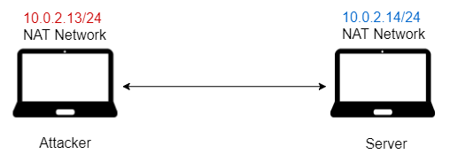

```bash
# 修改主机名
gedit /etc/hosts
gedit /etc/hostname
reboot
```

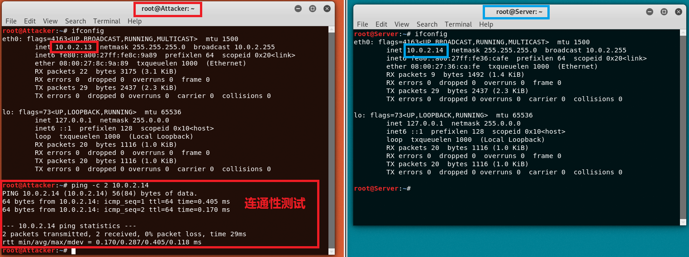

### Apache内置独立防火墙

```bash
# 查看是启用/存在该模块
ls -l /etc/apache2/mods-enabled/

# 搜索软件包
apt search apache | grep security
```

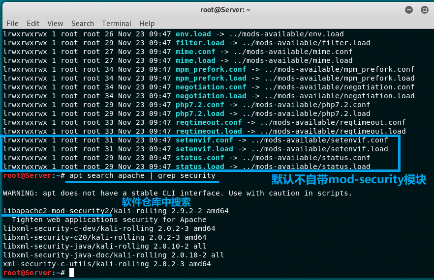

```bash
# 安装
sudo apt-get install libapache2-mod-security2

# 可用模块
/etc/apache2/mods-available

# 启用模块
/etc/apache2/mods-enabled

# 模块配置      *.conf
# 模块加载      *.load
# 配置文件拆分  *.d
```	

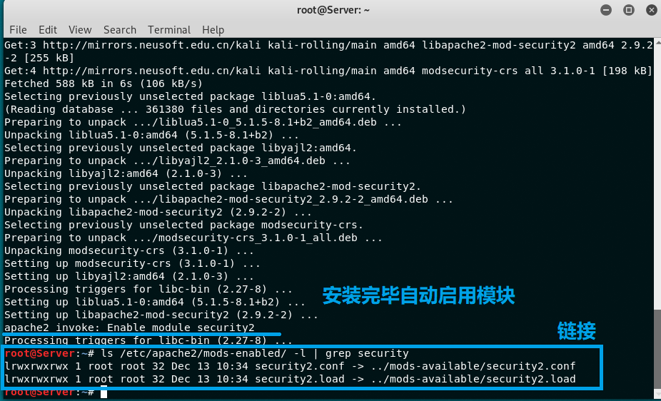

安装时一并下载了一些规则

```bash
# 默认下载好的规则
ls -l /usr/share/modsecurity-crs/rules/
```

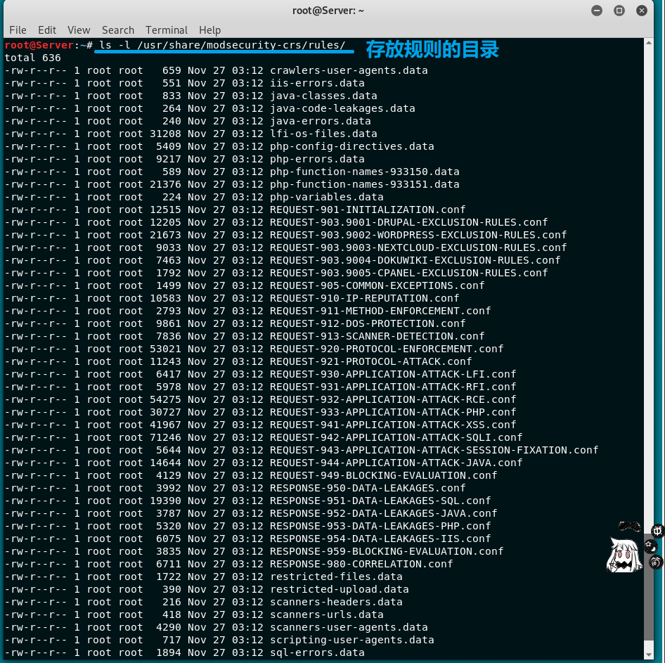

配置 OWASP Core Rule Set （核心规则集合）

```bash
# 备份规则
mv /usr/share/modsecurity-crs /usr/share/modsecurity-crs.bk

# 下载 OWASP ModSecurity Core Rule Set
git clone https://github.com/SpiderLabs/owasp-modsecurity-crs.git /usr/share/modsecurity-crs

# 启用配置文件
cd /usr/share/modsecurity-crs
mv crs-setup.conf.example crs-setup.conf

# 修改配置
vi /etc/apache2/mods-enabled/security2.conf

# 在文件中添加规则路径
<IfModule security2_module> 
     SecDataDir /var/cache/modsecurity 
     IncludeOptional /etc/modsecurity/*.conf 
     IncludeOptional /usr/share/modsecurity-crs/*.conf 
     IncludeOptional /usr/share/modsecurity-crs/rules/*.conf 
 </IfModule>

# 启用引擎
vi /etc/modsecurity/modsecurity.conf

# 将 DectionOnly 改为 On
SecRuleEngine On

# 重启以生效
systemctl restart apache2
```

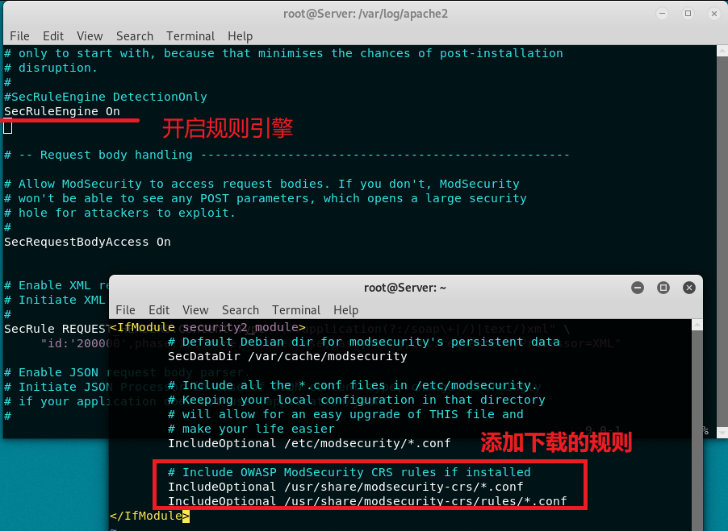


在攻击者主机上测试规则是否被启用
- 返回 403 响应

```bash
# XSS Attack
curl 'http://10.0.2.14/?q="><script>alert(1)</script>'

# Shell Code
curl 'http://10.0.2.14/index.html?exec=/bin/bash'
```
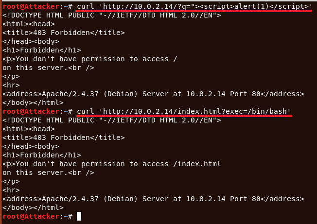

查看日志文件，记录了全部的信息

```bash
# 查看日志文件
# 默认显示最后10行
tail /var/log/apache2/modsec_audit.log
```

以下日志信息摘自 [modsec_audit](modsec_audit.log)
- 对数据包内容进行正则匹配，记录相关信息并返回 403 响应

```
# XSS Attack
Message: Warning. Pattern match "^[\\d.:]+$" at REQUEST_HEADERS:Host. [file "/usr/share/modsecurity-crs/rules/REQUEST-920-PROTOCOL-ENFORCEMENT.conf"] [line "798"] [id "920350"] [msg "Host header is a numeric IP address"] [data "10.0.2.14"] [severity "WARNING"] [ver "OWASP_CRS/3.1.0"] [tag "application-multi"] [tag "language-multi"] [tag "platform-multi"] [tag "attack-protocol"] [tag "OWASP_CRS/PROTOCOL_VIOLATION/IP_HOST"] [tag "WASCTC/WASC-21"] [tag "OWASP_TOP_10/A7"] [tag "PCI/6.5.10"]
Message: Warning. detected XSS using libinjection. [file "/usr/share/modsecurity-crs/rules/REQUEST-941-APPLICATION-ATTACK-XSS.conf"] [line "60"] [id "941100"] [msg "XSS Attack Detected via libinjection"] [data "Matched Data: XSS data found within ARGS:q: \x22><script>alert(1)</script>"] [severity "CRITICAL"] [ver "OWASP_CRS/3.1.0"] [tag "application-multi"] [tag "language-multi"] [tag "platform-multi"] [tag "attack-xss"] [tag "OWASP_CRS/WEB_ATTACK/XSS"] [tag "WASCTC/WASC-8"] [tag "WASCTC/WASC-22"] [tag "OWASP_TOP_10/A3"] [tag "OWASP_AppSensor/IE1"] [tag "CAPEC-242"]
Message: Warning. Pattern match "(?i)[<\xef\xbc\x9c]script[^>\xef\xbc\x9e]*[>\xef\xbc\x9e][\\s\\S]*?" at ARGS:q. [file "/usr/share/modsecurity-crs/rules/REQUEST-941-APPLICATION-ATTACK-XSS.conf"] [line "92"] [id "941110"] [msg "XSS Filter - Category 1: Script Tag Vector"] [data "Matched Data: <script> found within ARGS:q: \x22><script>alert(1)</script>"] [severity "CRITICAL"] [ver "OWASP_CRS/3.1.0"] [tag "application-multi"] [tag "language-multi"] [tag "platform-multi"] [tag "attack-xss"] [tag "OWASP_CRS/WEB_ATTACK/XSS"] [tag "WASCTC/WASC-8"] [tag "WASCTC/WASC-22"] [tag "OWASP_TOP_10/A3"] [tag "OWASP_AppSensor/IE1"] [tag "CAPEC-242"]
Message: Warning. Pattern match "(?i)<[^\\w<>]*(?:[^<>\"'\\s]*:)?[^\\w<>]*(?:\\W*?s\\W*?c\\W*?r\\W*?i\\W*?p\\W*?t|\\W*?f\\W*?o\\W*?r\\W*?m|\\W*?s\\W*?t\\W*?y\\W*?l\\W*?e|\\W*?s\\W*?v\\W*?g|\\W*?m\\W*?a\\W*?r\\W*?q\\W*?u\\W*?e\\W*?e|(?:\\W*?l\\W*?i\\W*?n\\W*?k|\\W*?o\\W*?b\\W*?j\\W*?e\ ..." at ARGS:q. [file "/usr/share/modsecurity-crs/rules/REQUEST-941-APPLICATION-ATTACK-XSS.conf"] [line "219"] [id "941160"] [msg "NoScript XSS InjectionChecker: HTML Injection"] [data "Matched Data: <script found within ARGS:q: \x22><script>alert(1)</script>"] [severity "CRITICAL"] [ver "OWASP_CRS/3.1.0"] [tag "application-multi"] [tag "language-multi"] [tag "platform-multi"] [tag "attack-xss"] [tag "OWASP_CRS/WEB_ATTACK/XSS"] [tag "WASCTC/WASC-8"] [tag "WASCTC/WASC-22"] [tag "OWASP_TOP_10/A3"] [tag "OWASP_AppSensor/IE1"] [tag "CAPEC-242"]
Message: Access denied with code 403 (phase 2). Operator GE matched 5 at TX:anomaly_score. [file "/usr/share/modsecurity-crs/rules/REQUEST-949-BLOCKING-EVALUATION.conf"] [line "93"] [id "949110"] [msg "Inbound Anomaly Score Exceeded (Total Score: 18)"] [severity "CRITICAL"] [tag "application-multi"] [tag "language-multi"] [tag "platform-multi"] [tag "attack-generic"]

# Shell Code
Message: Warning. Pattern match "^[\\d.:]+$" at REQUEST_HEADERS:Host. [file "/usr/share/modsecurity-crs/rules/REQUEST-920-PROTOCOL-ENFORCEMENT.conf"] [line "798"] [id "920350"] [msg "Host header is a numeric IP address"] [data "10.0.2.14"] [severity "WARNING"] [ver "OWASP_CRS/3.1.0"] [tag "application-multi"] [tag "language-multi"] [tag "platform-multi"] [tag "attack-protocol"] [tag "OWASP_CRS/PROTOCOL_VIOLATION/IP_HOST"] [tag "WASCTC/WASC-21"] [tag "OWASP_TOP_10/A7"] [tag "PCI/6.5.10"]
Message: Warning. Matched phrase "bin/bash" at ARGS:exec. [file "/usr/share/modsecurity-crs/rules/REQUEST-932-APPLICATION-ATTACK-RCE.conf"] [line "518"] [id "932160"] [msg "Remote Command Execution: Unix Shell Code Found"] [data "Matched Data: bin/bash found within ARGS:exec: /bin/bash"] [severity "CRITICAL"] [ver "OWASP_CRS/3.1.0"] [tag "application-multi"] [tag "language-shell"] [tag "platform-unix"] [tag "attack-rce"] [tag "OWASP_CRS/WEB_ATTACK/COMMAND_INJECTION"] [tag "WASCTC/WASC-31"] [tag "OWASP_TOP_10/A1"] [tag "PCI/6.5.2"]
Message: Access denied with code 403 (phase 2). Operator GE matched 5 at TX:anomaly_score. [file "/usr/share/modsecurity-crs/rules/REQUEST-949-BLOCKING-EVALUATION.conf"] [line "93"] [id "949110"] [msg "Inbound Anomaly Score Exceeded (Total Score: 8)"] [severity "CRITICAL"] [tag "application-multi"] [tag "language-multi"] [tag "platform-multi"] [tag "attack-generic"]
Message: Warning. Operator GE matched 5 at TX:inbound_anomaly_score. [file "/usr/share/modsecurity-crs/rules/RESPONSE-980-CORRELATION.conf"] [line "86"] [id "980130"] [msg "Inbound Anomaly Score Exceeded (Total Inbound Score: 8 - SQLI=0,XSS=0,RFI=0,LFI=0,RCE=5,PHPI=0,HTTP=0,SESS=0): Remote Command Execution: Unix Shell Code Found; individual paranoia level scores: 8, 0, 0, 0"] [tag "event-correlation"]
```


### fail2band

#### ssh
```bash
# 启动服务
systemctl start ssh

# 修改配置文件，允许Root用户使用ssh登录
vi /etc/ssh/sshd_config
PermitRootLogin	yes		    # 在Authentication部分添加

# 重启ssh服务
systemctl restart ssh
```

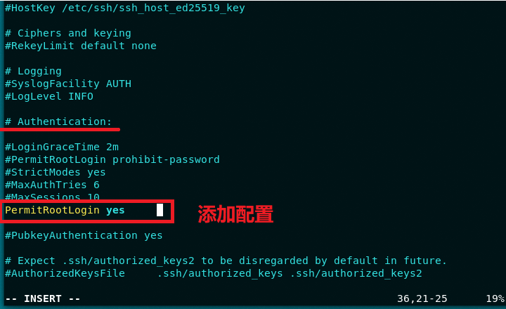

攻击者主机上能够正常连接服务器

```bash
# 连接
ssh root@10.0.2.14
```

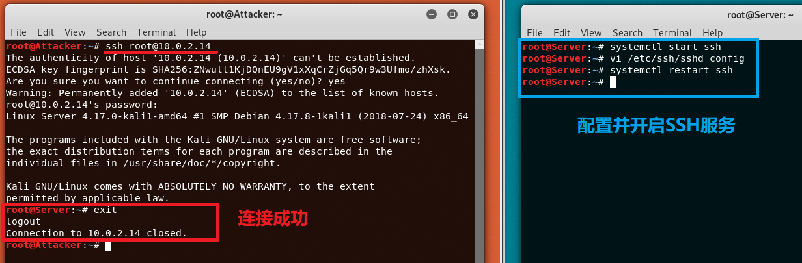

#### 爆破ssh

并没有等到爆破结束（嫌弃它慢）

```bash
# 解压爆破字典
gzip -d /usr/share/wordlists/rockyou.txt.gz

# 类似的爆破工具还有：medusa/ncrack
hydra -l root -P /usr/share/wordlists/rockyou.txt -v 10.0.2.14 ssh

# 查看ssh登录信息
# ESC → G : 跳转到最底部
vi /var/log/auth.log
```

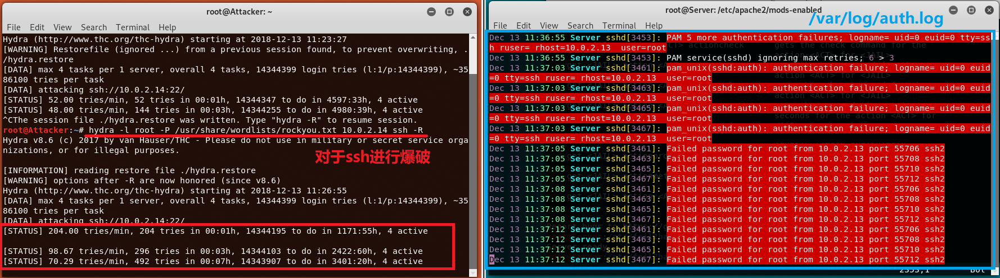

#### fail2ban

安装并启动后，并没有开启任何一个 **jail** ，需要手动设置开启

```bash
# 安装
git clone https://github.com/fail2ban/fail2ban.git
cd fail2ban
sudo python setup.py install

# 查看是否安装成功
fail2ban-client -h

# 启动 fail2ban
fail2ban-client start

# 预置的jail
ls /etc/fail2ban/filter.d/
```

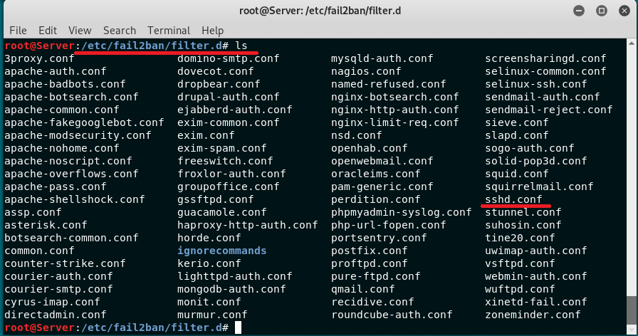

看了一下官方的 Q&A ，推荐新建 custom.local 文件进行配置
- 可对 jail.conf fail2ban.conf 等配置文件中的配置项进行自定义配置（需要注意格式）

```bash
# 拷贝配置文件并重命名为 `jail.local`
cp /etc/fail2ban/fail2ban.conf /etc/fail2ban/jail.local
vi /etc/fail2ban/jail.local

# 添加以下内容开启sshd jail
[sshd]
enabled = true

# 查看相关的配置信息
# 默认禁止时间为 10 min ，可在 `jail.local` 文件中自定义（而无需修改当前默认的配置文件）
vi /etc/fail2ban/jail.local
```

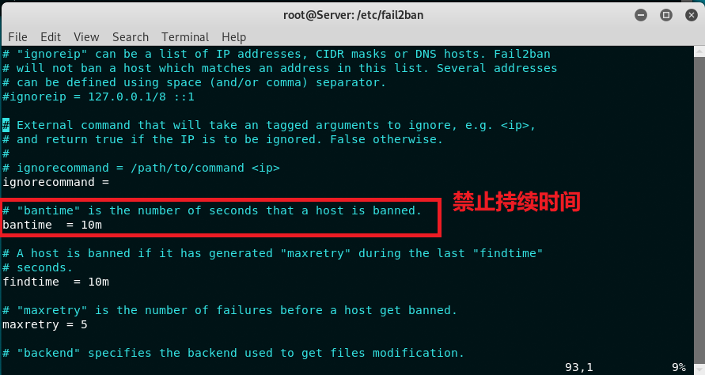


启用 sshd jail 后，发现攻击者的 ip 被 ban 掉了，而此时攻击者已经停止了 hydra 的口令爆破，且没有针对服务器进行任何请求等操作
- 推测是根据 auth.log 文件进行了禁止动作

```bash
# 查看jail信息
fail2ban-client status

# 查看 sshd jail 信息
fail2ban-client status ssh
```

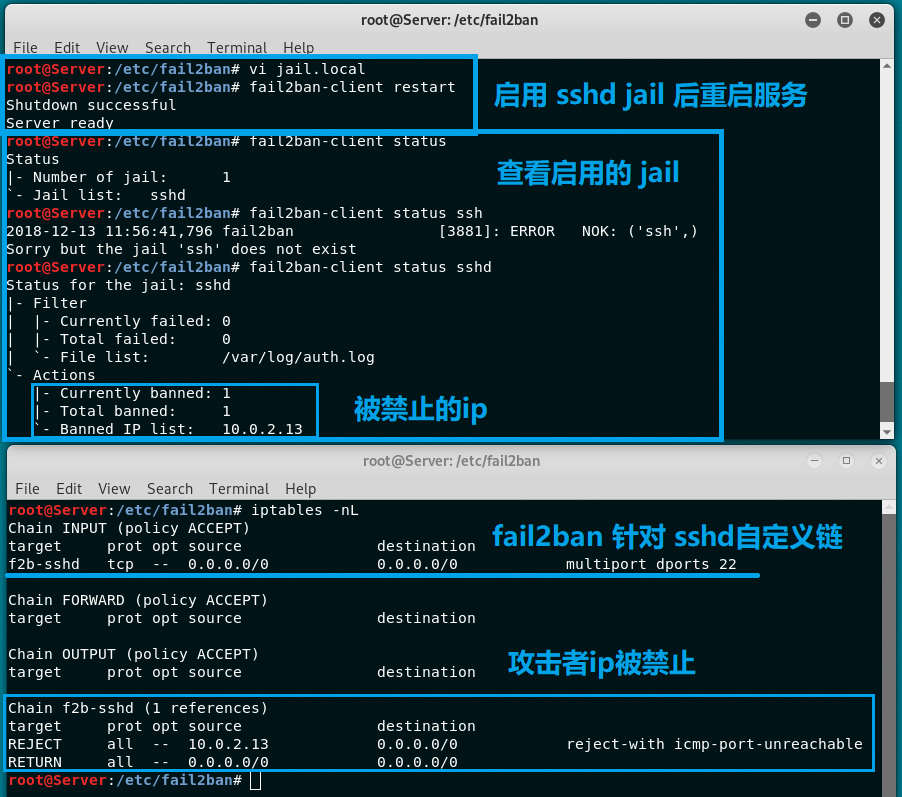

当启用了 sshd jail ，会去检查 auth.log 日志文件，刚才攻击者爆破时留下了大量尝试失败的日志信息，sshd jail 会根据 actions 中定义的动作，进行相应的“关小黑屋”操作
- 默认配置文件 `paths-common.conf`

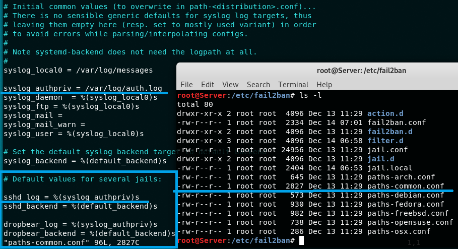

```bash
# 查看日志，默认显示最后10行
tail /var/log/fail2ban.log
```

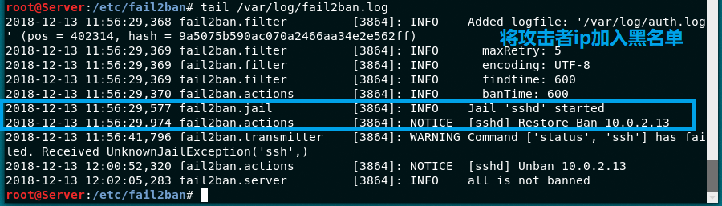


```bash
# 清空jail，无需重启fail2ban服务
fail2ban-client unban all
```

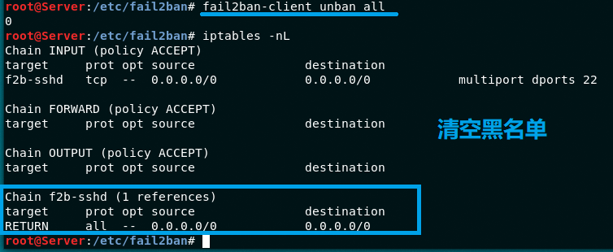

### 参阅
- [网络安全 第⼗章 应用程序安全加固](https://sec.cuc.edu.cn/huangwei/course/2014_2/nsLecture0x10.pdf)
- [How to Configure ModSecurity with Apache on Ubuntu Linux](https://blog.rapid7.com/2017/04/09/how-to-configure-modsecurity-with-apache-on-ubuntu-linux/)
- [OWASP ModSecurity Core Rule Set (CRS)](https://github.com/SpiderLabs/owasp-modsecurity-crs)
- [Enable SSH Server on Debian](https://linuxhint.com/enable-ssh-server-debian/)
- [Fail2Ban: ban hosts that cause multiple authentication errors](https://github.com/fail2ban/fail2ban)
- [Proper fail2ban configuration](https://github.com/fail2ban/fail2ban/wiki/Proper-fail2ban-configuration)