## chap0x11 SSH 蜜罐应用实验

### 环境配置

#### 拓扑结构

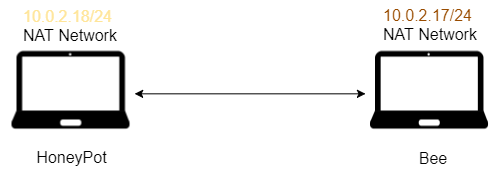


日常测试连通性

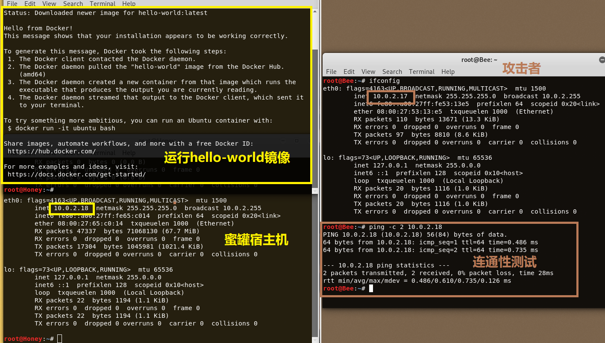

#### 安装 Docker

根据[官方教程](https://docs.docker.com/install/linux/docker-ce/debian/)安装 Docker（注意避开某坑）

```bash
# 更新源
sudo apt-get update

# 安装必要的包
sudo apt-get install \
     apt-transport-https \
     ca-certificates \
     curl \
     gnupg2 \
     software-properties-common

# 添加 Docker 官方 GPG 密钥
curl -fsSL https://download.docker.com/linux/debian/gpg | sudo apt-key add -

# 验证密钥
sudo apt-key fingerprint 0EBFCD88

# 报错
sudo add-apt-repository \
   "deb [arch=amd64] https://download.docker.com/linux/debian \
   $(lsb_release -cs) \
   stable"

# 使用此命令
echo 'deb https://download.docker.com/linux/debian stretch stable' > /etc/apt/sources.list.d/docker.list

# 更新
sudo apt-get update

# 安装 Docker
sudo apt-get install docker-ce

# 开启 docker 服务
service docker start

# 运行镜像测试是否安装成功
sudo docker run hello-world
```

本次实验使用到的镜像

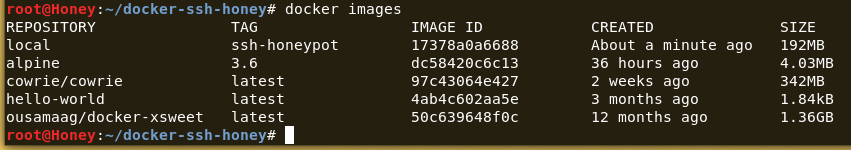


### SSH 蜜罐的使用

#### 测试命令清单
```bash
# 显示目录列表，用单列格式输出
ls -l

# 以绝对路径的方式显示用户当前工作目录
pwd

# 打印当前系统相关信息（内核版本号、硬件架构、主机名称和操作系统类型等）
uname -a

# 打印系统运行时间和系统的平均负载
uptime

# 输出环境变量
echo $PATH

# 显示真实有效的用户 ID(UID) 和组 ID(GID)
id

# 显示网络接口信息
ifconfig

# 网络系统的状态信息
netstat

# 显示规则链（不进行反向解析）
iptables -nL

# 测试网络的连通性
ping www.baidu.com

# 下载网页
curl www.baidu.com

# 编辑域名解析服务器配置文件
vi /etc/resolv.conf

# 查看 CPU 信息
cat /proc/cpuinfo

# 用户标识信息
cat /etc/passwd

# 查看登陆日志文件
tail -F /var/log/auth.log

# 安装文本编辑器 nano
apt-get install nano
```

#### Docker 相关命令

时常把端口映射写反的我 :sweat_smile:

```bash
# 运行容器
docker run -p local_port:container_port image_name

# 进入正在执行的容器
docker exec -i -t container_id bash

# 拷贝到容器中
docker cp local_path container_id:path

# 从容器拷贝到主机
docker cp container_id:path local_path
```

#### docker-ssh-honey
```bash
# 克隆仓库
git clone https://github.com/random-robbie/docker-ssh-honey

# 进入文件夹
cd docker-ssh-honey/

# 构建镜像
docker build . -t local:ssh-honeypot

# 运行镜像
# 本地端口:容器端口
docker run -p 2444:22 local:ssh-honeypot

# 进入容器 bash
docker exec -i -t id bash

# 查看日志
tail -F ssh-honeypot.log
```

测试发现这个蜜罐只是单纯用来记录 ssh 连接
-  ip地址，用户名，密码

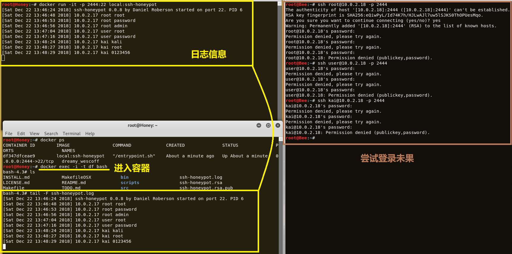

#### docker-xsweet
这个镜像文件比较大，有 1.36 GB 那么大
- 运行前的初始化很可能卡住（等吧！）

```bash
# 下载并运行镜像
docker run -p 2333:2222 ousamaag/docker-xsweet
```

经测试发现
- 没有历史命令记录
- 没有 Tab 键补全
- 不支持光标左右移动
- 没有echo
- 没有iptables
- ......

一个很不走心的 `ping` ，输出信息都一样

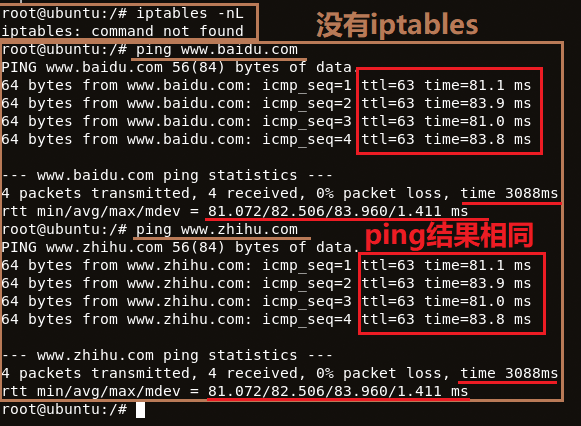

日常翻一翻日志文件，目录中有显示的文件夹却不能进入（摆设型目录输出）
- 许多命令都不支持

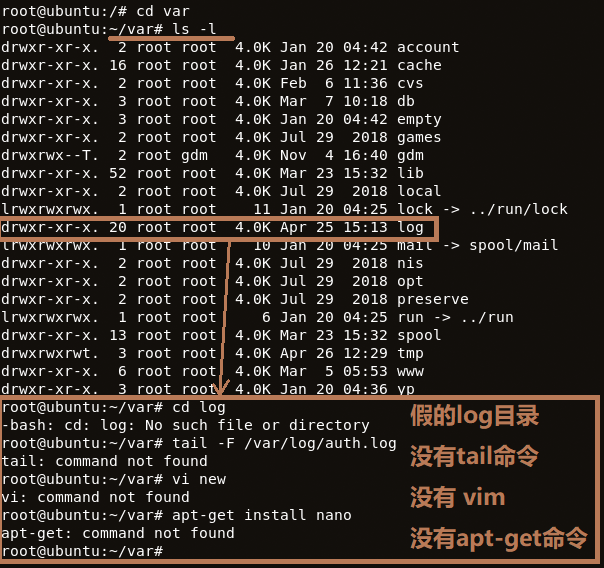

查看日志信息

```bash
# 将日志文件复制到本机/目录下
# 蜜罐运行日志
docker cp container_id:/xsweet/xsweet/xsweet.log /

# 尝试登录记录
attempts.txt

# 操作命令记录
victim-ip_address.txt
```

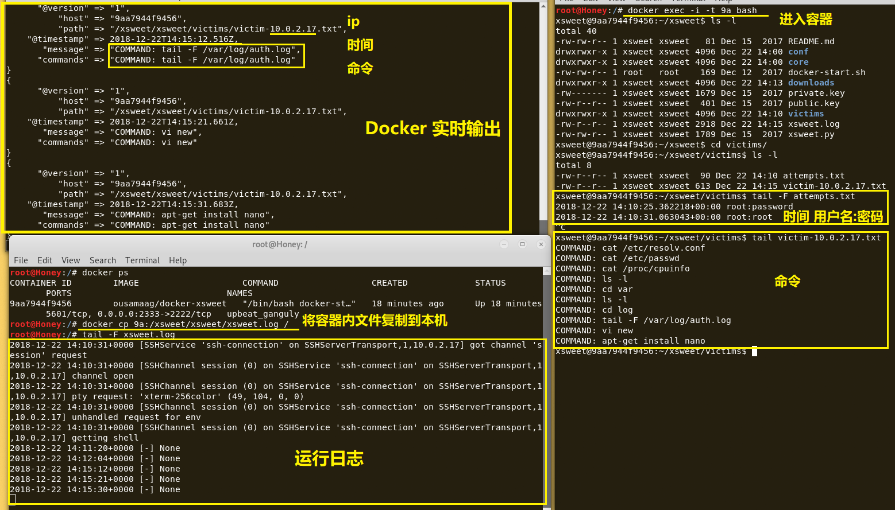

#### cowrie
```bash
# 下载镜像
docker pull cowrie/cowrie

# 运行镜像
docker run -p 2222:2222 cowrie/cowrie
```

用户名必须是root，随意什么密码都能进入
- ssh 连接关闭得很快

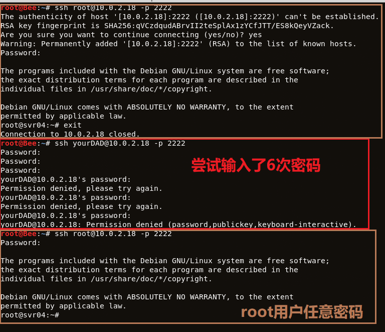


ping 只能接受 ip 作为参数，不能解析域名，curl 是不是暴露了什么
- ping 域名的截图忘了 :sweat:

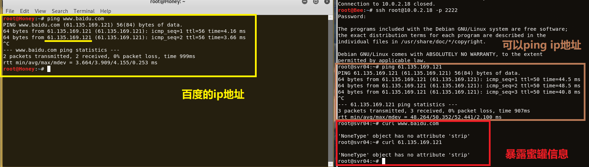


使用 tail 查看 /var/log/auth.log
- 用户组的问题？

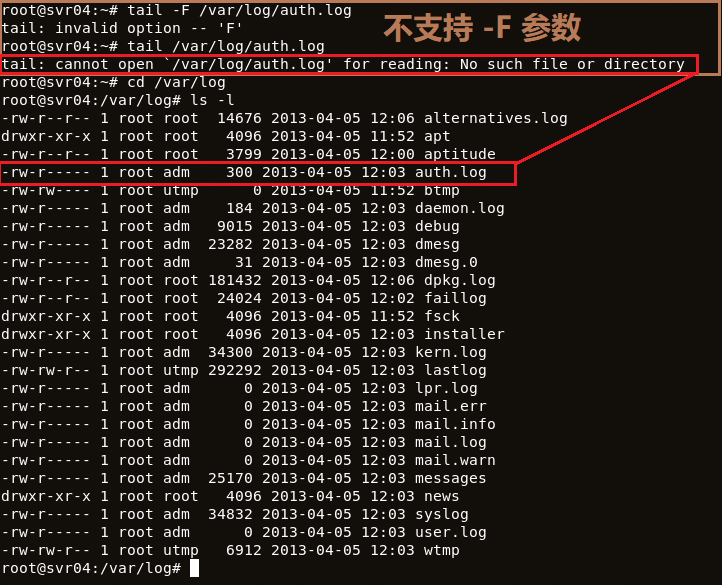


尝试安装软件
- 假装安装，安装极快但不能用
- 部分输出信息相同
- vim 比 docker-ce 还大

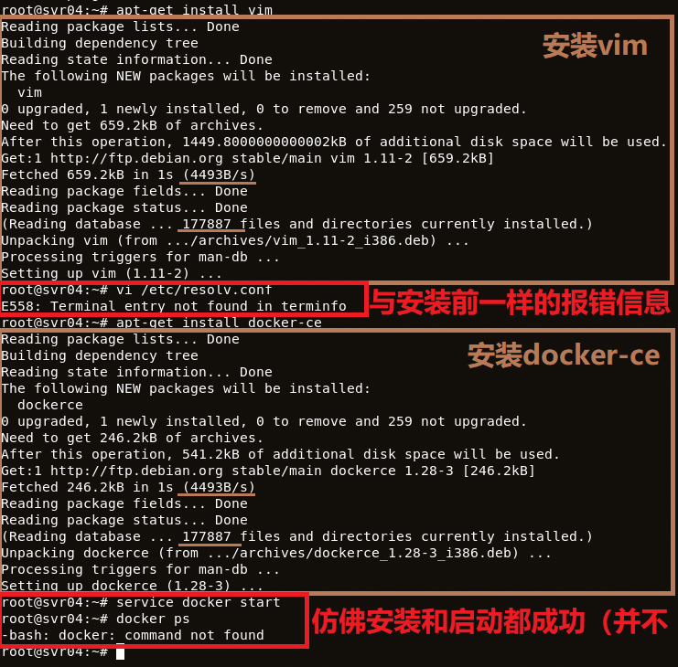


查看日志文件
- json 格式看起来不是很美观（其实是懒得捣腾）

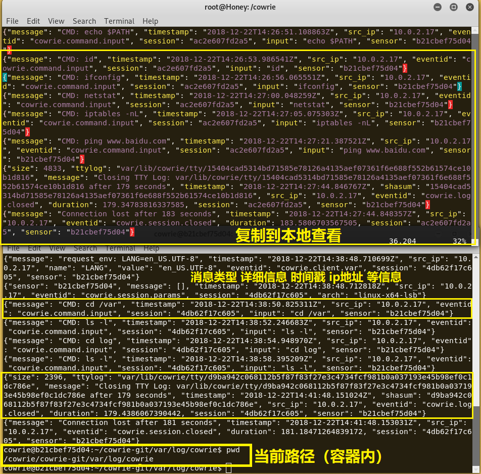

查看 cowrie 配置文件
- 日志路径，公私钥，输出信息

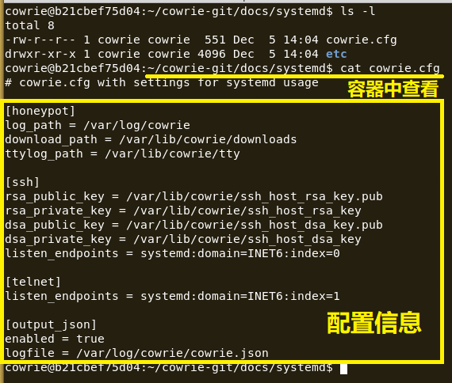


查看预定义的一些命令和信息
- 预设挺全面的 √

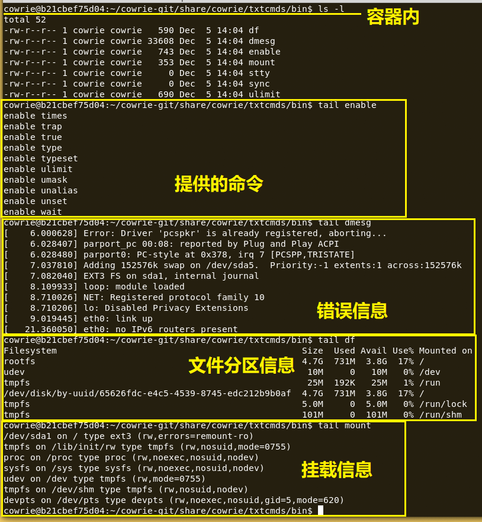

```bash
# 将日志复制到本地查看
docker cp container_id:/cowrie/cowrie-git/var/log/cowrie /

# 配置文件
/cowrie/cowrie-git/docs/systemd/cowrie.cfg

# file contents for simple fake commands
/cowrie/cowrie-git/share/cowrie/txtcmds/
```

对比攻击者进入的 bash 和在本地进入 Docker 容器的 bash

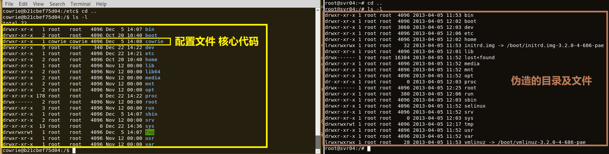


### 总结

ssh-honeypot 就是一个一点交互能力都没有的蜜罐
- 只有少量的信息记录功能
- 没有模拟操作系统

xsweet 是一个交互型蜜罐
- 镜像那么大，提供的命令却不全面
- 命令输出信息是固定的
- 有目录项却无法进入（只是摆设？）

cowrie 是一个高交互型蜜罐
- 提供的命令、错误提示等比较全面
- 每次命令的打印输出还不一样
- 部分命令的错误输出暴露了这是个 python 蜜罐

### 参阅
- [Get Docker CE for Debian](https://docs.docker.com/install/linux/docker-ce/debian/)
- [Installing Docker in Kali Linux 2018.1](https://medium.com/@calypso_bronte/installing-docker-in-kali-linux-2018-1-ef3a8ce3648)
- [Docker cp 命令](http://www.runoob.com/docker/docker-cp-command.html)
- [如何进入正在执行的 docker container](https://github.com/ma6174/blog/issues/8)
- [Capturing 54 Million Passwords With a Docker SSH Honeypot](https://blog.ruanbekker.com/blog/2018/10/11/capturing-54-million-passwords-with-a-docker-ssh-honeypot/)
- [random-robbie/docker-ssh-honey](https://github.com/random-robbie/docker-ssh-honey)
- [droberson/ssh-honeypot](https://github.com/droberson/ssh-honeypot)
- [使用 Dockerfile 定制镜像](https://yeasy.gitbooks.io/docker_practice/image/build.html)
- [techouss/xsweet](https://github.com/techouss/xsweet)
- [cowrie/cowrie](https://github.com/cowrie/cowrie)
- [DockerHub cowrie/cowrie](https://hub.docker.com/r/cowrie/cowrie)