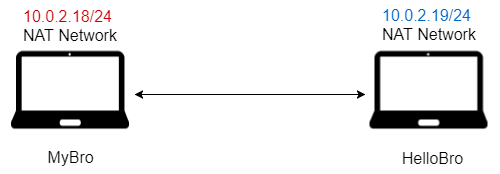
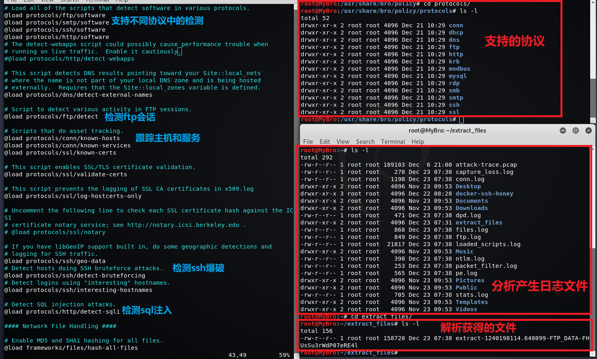

## chap0x12 利用 Bro 进行取证/实时分析

### 环境配置

#### 拓扑结构



#### 安装 Bro

```bash
# Linux Standard Base
# 显示LSB和特定版本的相关信息
lsb_release -a

# 打印当前系统相关信息（内核版本号、硬件架构、主机名称和操作系统类型等）
uname -a

# 查看 bro 版本信息
apt policy bro

# 禁止交互
export DEBIAN_FRONTEND=noninteractive

# 安装 Bro
apt-get install bro bro-aux

# 查看 bro 版本
bro -v
```


翻阅官方文档的时候发现了可以在线编写运行 Bro 脚本


### 对 pcap 包进行取证分析

#### Bro 基本配置

配置信息：`/etc/bro/site/`

规则信息：`/usr/share/bro`
- 包含配置信息（软链接 `->` 符号链接文件 此时 @操作系统）

```bash
# Bro 引擎默认丢弃没有校验和的数据包
# 策略脚本层(policy script layer) 定义忽略校验和
# /etc/bro/site/mytuning.bro
redef ignore_checksums = T;

# 显示 ftp 的密码
redef FTP::default_capture_password = T;

# 启用配置
# /etc/bro/site/local.bro
@load frameworks/files/extract-all-files
@load mytuning.bro

# 识别 SMB 协议
@load policy/protocols/smb
```


#### 自动化分析 pcap 
```bash
# 下载 pacp 
wget https://sec.cuc.edu.cn/huangwei/textbook/ns/chap0x12/attack-trace.pcap

# 使用 bro 规则文件进行自动化分析
bro -r attack-trace.pcap /etc/bro/site/local.bro
```




实不相瞒我把文件传到本机 Windows Defender 就顺手给我删了
- 我当时可能忘了那是个 Windows 平台的恶意软件

10 个日志文件，1 个 ftp 上传文件 `extract-1240198114.648099-FTP_DATA-FHUsSu3rWdP07eRE4l`

##### 打印输出
```bash
# 从头开始查看日志文件，显示前 9 行
head -n9 conn.log

# 查看该 ASCII 码对应的可打印字符
# -n 不在最后自动换行
# -e 激活转义字符
# -c 单字节字符显示
echo -n -e '\x09' | hexdump -c

# 查看日志文件
# -S 在单行显示较长的内容，不换行显示
less -S conn.log

# 打印第 9 列数据
# -F 指定分隔符
# '{print $9}' 操作
awk -F '\t' '{print $9}' conn.log
```


将日志记录中的时间戳进行转换
- 带小数点的时间戳


使用 `bro-cut` 读取日志并进行格式化输出

```bash
# 查看 conn.log 中所有可用的列名
grep ^#fields conn.log | tr '\t' '\n'

# 选择部分列名输出
# awk '/^[^#]/ {print $1, $3, $4, $5, $7}' conn.log
bro-cut ts id.orig_h id.orig_p id.resp_h id_resp_p proto < conn.log

# 将 UNIX 时间戳格式转换成人类可读的时间
bro-cut -d < conn.log
```


##### 文件分析

将文件上传至 virustotal.com 进行查看
- 各分析引擎对其进行检测的结果
- 文件的内容和描述
- 文件的具体行为


可以确定这是用户通过 ftp 上传的恶意的可执行文件，根据文件标识 (files.log) 找到会话标识 (conn.log)，进而找到该恶意用户的 ip 地址


##### 使用 BAT 进行分析

读取日志文件并针对感兴趣的字段进行查看：[Jupyter Notebook: just_print](https://nbviewer.jupyter.org/github/CUCCS/2018-NS-Public-jckling/tree/ns-0x12/ns-0x12/just_print.ipynb)

### 实时流量分析

#### 初始配置
开启 apache 和 ssh 服务


#### 产生流量

服务器端 (MyBro 10.0.2.18) 开启实时监测 `bro -i eth0 /etc/bro/site/local.bro`


客户端 (HelloBro 10.0.2.19) 进行 ssh 连接尝试、ping 连通测试、nmap扫描，xss 攻击

```bash
# ping 测试
ping -c 2 10.0.2.18

# 端口扫描
nmap -sT 10.0.2.18 -T4 -n -v

# XSS攻击
curl 'http://10.0.2.18/?q="><script>alert(1)</script>'

# 故意输错密码
ssh root@10.0.2.18
```

收集流量后停止实时检测，发现 Bro 解析出文件，查看发现是 Web 页面


#### 日志文件分析

可以看到 ssh 尝试了 2 次，http 请求中包含恶意脚本字段


可以推断该用户是恶意的，用相同的方法找出这个恶意用户（走个流程 :smirk:）


#### 使用 BAT 对日志文件进行分析

这次稍微折腾了下 ：[Jupyter Notebook: analyze](https://nbviewer.jupyter.org/github/CUCCS/2018-NS-Public-jckling/tree/ns-0x12/ns-0x12/analyze.ipynb)

### 参阅
- [policy/frameworks/files/extract-all-files.bro](https://www.bro.org/sphinx/scripts/policy/frameworks/files/extract-all-files.bro.html)
- [base/files/extract/main.bro](https://www.bro.org/sphinx/scripts/base/files/extract/main.bro.html)
- [恶意软件分析报告](https://www.virustotal.com/#/file/b14ccb3786af7553f7c251623499a7fe67974dde69d3dffd65733871cddf6b6d/detection)
- [awk 命令](http://man.linuxde.net/awk)
- [Bro Logging](https://www.bro.org/sphinx/logs/index.html)
- [Try.Bro Tutorial](http://try.bro.org/#/trybro/saved/288184)
- [network-forensics](https://www.bro.org/bro-workshop-2011/slides/network-forensics.pdf)
- [配置并启用 ssh](https://github.com/CUCCS/2018-NS-Public-jckling/blob/ns-0x10/ns-0x10/chap0x10%E5%AE%9E%E9%AA%8C.md#ssh)
- [Monitoring Live Traffic](https://www.bro.org/sphinx/quickstart/index.html#monitoring-live-traffic)
- [TCP/UDP端口列表](https://zh.wikipedia.org/wiki/TCP/UDP%E7%AB%AF%E5%8F%A3%E5%88%97%E8%A1%A8)
- [Log Files](https://www.bro.org/sphinx-git/script-reference/log-files.html)